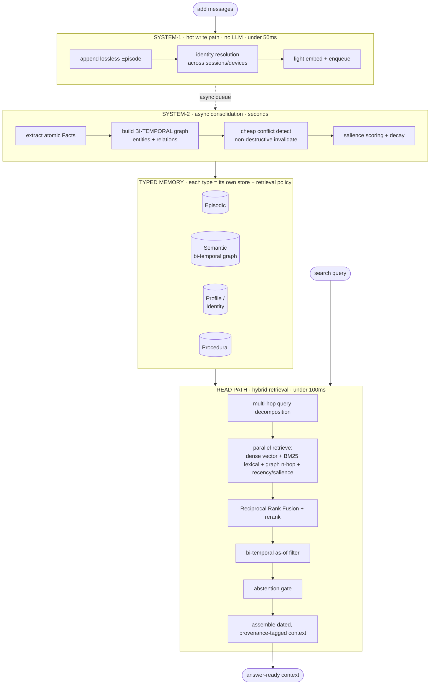

# Engram

**🌐 English | [中文](README.zh-CN.md)**

**An open-source long-term memory engine for LLM agents — built around one principle: every number we
publish, you can reproduce.**

Engram gives LLM agents durable, queryable memory across sessions: it stores what happened, distills
atomic facts, tracks how they change over time (bi-temporal), resolves contradictions without losing
history, and retrieves the right context with a hybrid semantic + lexical + graph + recency search.

> Status: **alpha**. The end-to-end loop runs with **zero setup** (no API keys, no services). The
> benchmark numbers below run on real models and are reproducible with one command. See
> [`CLAUDE.md`](CLAUDE.md) for the full project charter and [`RESULTS.md`](RESULTS.md) for the complete
> methodology and raw logs.

## Why another memory system?

The field has two real gaps, and we target both:

1. **Most memory systems lose to the dumb "full-context" baseline on accuracy** — they win on cost, not
   correctness. We always report full-context in the same table, so you can see exactly where we stand.
2. **Every vendor reports benchmark numbers on a different, non-reproducible harness.** Mem0 appears as
   58% / 66% / 92% across sources; three papers give three contradictory orderings. We ship **one neutral
   harness**, in-repo, with the official judge baked in — and publish the raw per-question logs.

In a field where every number is contested, *being the scoreboard everyone can verify* is the point.

## Results — LongMemEval_S (500 questions, official judge)

Measured on the real [LongMemEval_S](https://github.com/xiaowu0162/LongMemEval) benchmark (500 questions,
~50 sessions / ~115k tokens of haystack per question), graded by the **official category-specific
LongMemEval judge prompts** so the number is leaderboard-comparable.

| System | Overall | How |
|---|---|---|
| **Engram** (`engram_full`, gemini-2.5-pro answerer) | **86.0%** | full 500, official judge, 0 errors |
| Hunyuan Hy-Memory (closed; self-reported) | 85.2% | — |
| Mem0-2026 (self-reported) | 94.4% | — |
| OMEGA (self-reported) | 95.4% | — |

Per-category (Engram, full 500, 0 errors):

| Category | Score | n |
|---|---|---|
| single-session-assistant | 96.4% | 56 |
| single-session-user | 95.3% | 64 |
| knowledge-update | 93.1% | 72 |
| temporal-reasoning | 87.4% | 127 |
| multi-session | 83.5% | 121 |
| abstention | 70.0% | 30 |
| single-session-preference | 50.0% | 30 |

**Honest standing:** Engram clears the closest open baseline (Hunyuan, 85.2) and is genuinely competitive,
but it is **not** at the top of the leaderboard — OMEGA (95.4) and Mem0-2026 (94.4) are ahead. The gap is
concentrated in two known-hard categories (preference and multi-session reasoning); preference is hard
*industry-wide* (frontier LLMs score 37–48% on comparable PersonaMem tasks). We report this openly rather
than cherry-picking a slice or a friendlier judge. Closing that gap is the active roadmap — in public,
with reproducible updates.

> Comparability note: the self-reported competitor numbers use their own answer/judge pipelines. Our
> number uses a gemini-2.5-pro answerer + the official LongMemEval judge prompts. The harness applies the
> *same* answerer and judge to every system it runs (including the full-context baseline), so comparisons
> *within* this repo are apples-to-apples; cross-paper comparisons carry the usual caveats.

## Quickstart (zero setup, no API keys)

```bash
python examples/quickstart.py
```

Runs the full pipeline — ingest → consolidate → retrieve — using offline deterministic fallbacks (hashing
embedder, rule-based extractor, in-memory stores). Real backends (LanceDB, Kuzu, LiteLLM, BGE) plug in
behind the same interfaces via `pip install "engram-memory[all]"`.

```python
from engram import Memory

mem = Memory()
mem.add("My name is Wei and I work at Tencent.", user_id="u1")
mem.add("Actually I just switched jobs — I now work at Moonshot AI.", user_id="u1")
mem.consolidate()                      # System-2: extract facts, build graph, resolve conflicts

print(mem.search("Where does Wei work?", user_id="u1").answer())
# -> "Moonshot AI"  (the contradicted fact is invalidated, not deleted — history is preserved)
```

## How it works

Engram is a **dual-process** memory system, modeled on the human System-1 / System-2 split: a fast write
path that never blocks on an LLM, and a slow consolidation path that does the heavy structuring offline.



**The write path (System-1)** appends a lossless episode, resolves identity across sessions/devices, embeds
and enqueues — no LLM on the critical path, so it stays under ~50ms. **The consolidation path (System-2)**
runs asynchronously: it extracts atomic `(subject, predicate, object)` facts, builds a knowledge graph, and
resolves contradictions. **The read path** decomposes the question, retrieves through four complementary
channels in parallel, fuses and re-ranks them, applies a point-in-time temporal filter, and assembles a
dated, provenance-tagged context.

### What makes it different

| # | Design choice | Why it matters |
|---|---|---|
| 1 | **Bi-temporal facts** — every fact carries *valid time* (true in the world) **and** *transaction time* (when we learned it) | Makes "what did we know on date T?" (`as_of`) and knowledge-updates **first-class**, not bolted-on. This is why knowledge-update scores 93% and temporal 87%. |
| 2 | **Non-destructive conflict resolution** — a contradicted fact is *invalidated* (`invalid_at` + `supersedes` chain), never deleted | No silent memory corruption. Every fact answers "where did this come from?" and "what did it replace?" — full provenance + audit trail. |
| 3 | **Cheap conflict detection** — slot-match + embedding/NLI heuristics, escalate to an LLM **only** when ambiguous | Zep/Mem0-class temporal correctness **without** an LLM call per fact — the cost win at scale. |
| 4 | **Hybrid retrieval** — dense semantic + BM25 lexical + graph proximity + recency/salience, fused with RRF | No single retriever wins everywhere. The *validated* finding: **facts + raw chunks beats either alone** — facts add conflict-resolved/temporal signal, chunks restore lost detail. |
| 5 | **Dual-process split** — fast write, async consolidation | Read path stays sub-100ms while graph-building, dedup, and conflict resolution happen off the critical path. |
| 6 | **Pluggable everything** — LLM / embedder / vector store / graph store all sit behind interfaces with **zero-dep offline fallbacks** | `quickstart.py` and `pytest` run with **no API keys, no services**. Swap in BGE / LanceDB / Kuzu / any LLM via one config line. |
| 7 | **The reproducible harness** — one neutral eval, official judge baked in, full-context baseline in every table, raw logs published | In a field where every vendor's number is contested, *being the scoreboard anyone can verify* is the real moat. |

See [`CLAUDE.md`](CLAUDE.md) §3 for the full data model and conflict-resolution rules.

## Reproduce the benchmark

```bash
# 1. zero-dep smoke test + unit tests
pytest

# 2. retrieval recall on the real haystack (no LLM needed)
python eval/longmemeval.py --mode recall --data s --limit 500

# 3. full QA benchmark with the official judge (needs model access; see RESULTS.md for provider setup)
python eval/bench.py --data s --limit 500 --systems engram_full,full_context \
    --answerer univibe:gemini-2.5-pro --judge univibe:gpt-5.5 --reasoning
```

Raw per-question logs for the headline number live in [`RESULTS.md`](RESULTS.md). If you can't reproduce a
number we published, that's a bug — open an issue.

## License

Apache-2.0.
