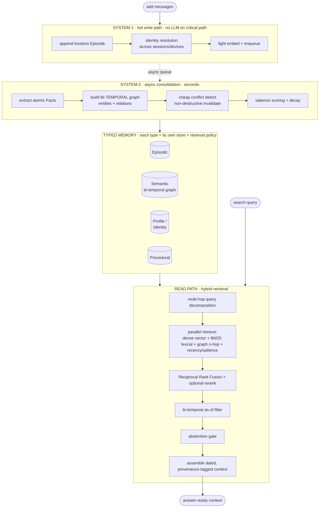

# Engram

**🌐 English | [中文](README.zh-CN.md)**

**An open-source long-term memory engine for LLM agents — built around one principle: every number we
publish, you can reproduce.**

**📄 [Paper — arXiv:2606.09900 →](https://arxiv.org/abs/2606.09900)** — *Less Context, More Accuracy: A Bi-Temporal Memory Engine for LLM Agents Where a Lean Retrieved Context Beats the Full History.*

**🎬 [Live demo / 在线动画演示 →](https://ly-wang19.github.io/engram/)** — see how it works in 60 seconds.

**🔌 [Try the live console →](http://42.193.220.197:8456/ui)** — open it, enter the demo key `1`, and browse a fully-loaded public memory end-to-end (profile, facts, timeline, graph, Q&A). It is a public demo; do not submit private data.

Engram gives LLM agents durable, queryable memory across sessions: it stores what happened, distills
atomic facts, tracks how they change over time (bi-temporal), resolves contradictions without losing
history, and retrieves the right context with a hybrid semantic + lexical + graph + recency search.

> Status: **0.1.0 beta — self-hosted release**. The end-to-end loop runs with **zero setup** (no API
> keys, no services), while the production deployment fails closed without configured credentials.
> See the [0.1.0 delivery scope](docs/commercial-release-0.1.0.zh-CN.md), [security policy](SECURITY.md),
> and [`RESULTS.md`](RESULTS.md) for benchmark methodology and raw logs.

## Why another memory system?

The field has two real gaps, and we target both:

1. **Most memory systems lose to the dumb "full-context" baseline on accuracy** — they win on cost, not
   correctness. We always report full-context in the same table, so you can see exactly where we stand.
2. **Every vendor reports benchmark numbers on a different, non-reproducible harness.** The same system can
   appear as 58% / 66% / 92% across sources; different papers give contradictory orderings. We ship **one
   neutral harness**, in-repo, with the official judge baked in — and publish the raw per-question logs.

In a field where every number is contested, *being the scoreboard everyone can verify* is the point.

## Results — LongMemEval_S (500 questions, official judge)

Measured on the real [LongMemEval_S](https://github.com/xiaowu0162/LongMemEval) benchmark (500 questions,
~50 sessions / ~115k tokens of haystack per question), graded by the **official category-specific
LongMemEval judge prompts**. Answerer **doubao-seed-2.0-pro**, judge **DeepSeek-V3.2** — a strict,
standard judge, so this is a fair number, not a friendly one.

**The headline system is `engram_lean`: it answers from a small *retrieved* slice, never the full history.**
This is the real test of a memory system — and the project's core thesis (beat full-context on accuracy at
a fraction of the tokens):

| System | Overall | Avg context tokens | End-to-end latency (p50 / p95) | Errors |
|---|---:|---:|---:|---:|
| **Engram** (`engram_lean`) | **79.0%** | **7,283** | 93.6s / 173.7s | 0 / 500 |
| full-context baseline (same run, answerer, and judge) | 76.0% | 79,241 | 14.5s / 60.1s | 0 / 500 |

In the canonical joint run, **Engram's accuracy point estimate is +3.0 points while using 10.9×
fewer context tokens** (7,283 vs 79,241). It did not win on end-to-end latency in this run; latency includes
the remote answer call and is reported without attributing the difference to retrieval. Per-category
(`engram_lean`, full 500):

| Category | Score | n |
|---|---|---|
| single-session-assistant | 100.0% | 56 |
| abstention | 90.0% | 30 |
| knowledge-update | 91.7% | 72 |
| single-session-user | 84.4% | 64 |
| temporal-reasoning | 70.9% | 127 |
| multi-session | 70.2% | 121 |
| single-session-preference | 56.7% | 30 |

**Where it stands:** this paired full-500 run supports the token-efficiency result and a positive accuracy
point estimate, but not a statistically decisive accuracy claim (paired McNemar `p=0.195`; bootstrap 95% CI
for the gap `[-1.2, +7.2]` points). Same answerer, same strict judge, every question logged, no
cherry-picked slice. **This does not establish a world-#1 or field-leading result.** See [`RESULTS.md`](RESULTS.md) for the
canonical log and historical independent runs.

## Quickstart (zero setup, no API keys)

```bash
python examples/quickstart.py
# or, after pip install:
engram-quickstart
```

Runs the full pipeline — ingest → consolidate → retrieve — using offline deterministic fallbacks (hashing
embedder, rule-based extractor, in-memory stores). Real backends (LanceDB, Kuzu, LiteLLM, BGE) plug in
behind the same interfaces via `pip install "engram-memory[all]"`.

To use the embedded LanceDB vector backend explicitly:

```python
from engram import Config, Memory

cfg = Config(storage="lancedb", data_path="./engram-vectors")
mem = Memory.open("./engram-store", config=cfg)
```

`data_path` is a private base: Engram derives one owner-only Lance namespace per canonical snapshot and
rejects unsafe directory reuse. File permissions are not encryption, and Lance logical deletion is not a
physical-erasure guarantee; see the [storage/privacy boundary](docs/storage-privacy-boundary.zh-CN.md).

Existing trusted legacy pickle snapshots can be migrated explicitly:

```bash
engram-migrate-pickle --from old-memory.pkl --to ./engram-store --dry-run
engram-migrate-pickle --from old-memory.pkl --to ./engram-store
```

```python
from engram import Memory

mem = Memory()
mem.add("My name is Wei and I work at Tencent.", user_id="u1")
mem.add("Actually I just switched jobs — I now work at Moonshot AI.", user_id="u1")
mem.consolidate()                      # System-2: extract facts, build graph, resolve conflicts

print(mem.search("Where does Wei work?", user_id="u1").answer())
# -> "Moonshot AI"  (the contradicted fact is invalidated, not deleted — history is preserved)
```

## Personal-twin foundation (owner controlled)

Engram now carries more than recall: it provides a governance foundation for an owner's personal AI
twin. A versioned **Twin Contract** stores owner-approved goals, principles, and boundaries; a
default-deny **Capability Registry** grants only explicit `observe`, `draft`, or `execute` authority over
canonical segment scopes. Credential fields store only keychain/vault lookup references; deployments must
keep actual secret bytes out of the contract, memory text, provenance, and prompts.

The trust split is deliberate:

- A normal agent key can read only prompt-safe guidance and redacted grant metadata, request an
  authorization, re-check its live status, and record an executor outcome. Authorization never executes.
- Contract edits, grants, revocations, and high-risk/external-write confirmation require a separate
  `ENGRAM_OWNER_KEYS="tenant:<different-strong-key>"` credential. Owner and agent keys cannot be reused.
- The agent cannot submit `human_confirmed=true`. Owner confirmation upgrades one pending decision; the
  resulting one-shot decision expires after five minutes and is invalidated by contract/grant changes.
- Fact/session erasure follows provenance through raw source episodes and sibling derivations, commits the
  canonical SQLite store, then verifies through a fresh reopen. This is logical/canonical verification,
  not a claim about SSD, APFS snapshots, backups, cloud history, or old Lance fragments.

Run `python eval/twin_eval.py` for the 16 deterministic control-plane invariants. Its 16/16 result is an
offline safety regression suite, **not** public benchmark evidence. See the
[personal-twin guide](docs/personal-twin.zh-CN.md), [`API.md`](API.md), and the
[storage/privacy boundary](docs/storage-privacy-boundary.zh-CN.md).

This release is the memory and authorization substrate, not a finished autonomous clone: Engram does not
ship a tool executor, credential vault, voice/avatar model, or background autonomy. A trusted executor must
check `executable=true` immediately before each action and report the outcome afterward.

## Connect it to your agent

Engram ships a full **access layer** so any agent or app can use it — all backed by one multi-tenant
service (`MemoryService`). In production, configured API keys map to stable isolated tenant namespaces;
the key text itself is used as a namespace only in explicitly enabled development open mode.
The bundled console at `/ui` exposes the same product loop for humans: content-free session status,
session-scoped writes with `scope=auto|long|working`, close-session, session report, paged memory
management, safe export, and confirmed erase.
For the recommended lifecycle across Claude Code, Codex, Cursor, and custom agents, see
[`docs/cross-agent-memory.md`](docs/cross-agent-memory.md) and the copy-paste adapter recipes in
[`docs/agent-adapters.md`](docs/agent-adapters.md). A one-session lifecycle smoke test (local zero-server
or HTTP, including `agent_status`, `remember`, `close_session`, and `session_report`) is available at
[`examples/cross_agent_lifecycle.py`](examples/cross_agent_lifecycle.py), and a two-agent handoff smoke
test is available at
[`examples/cross_agent_handoff.py`](examples/cross_agent_handoff.py).
You can also generate client-specific setup snippets with
`engram-agent-setup --client codex --local --namespace me` (zero-server local MCP) or
`engram-agent-setup --client codex --api-url http://localhost:8000 --api-key me` (HTTP service).
Add `--python /path/to/python` when the agent should launch a specific environment with
`engram-memory[mcp]` installed. The fast local path is
`engram-agent-bootstrap --local --dry-run --namespace me --python /path/to/python` followed by
`engram-agent-bootstrap --local --namespace me --python /path/to/python`; it installs Codex + project
`.mcp.json`, runs the doctor against the installed config files, and prints a ready-to-paste AGENTS.md
policy. Add
`--install-policy` to write that policy into a managed AGENTS.md block with backup/uninstall support.
For Codex, `engram-agent-setup --install-codex --dry-run ...` previews
the exact `~/.codex/config.toml` change, `--install-codex --doctor` applies it with a backup and verifies
the actual MCP stdio launch path, and `--uninstall-codex` removes only Engram's MCP block. For Claude
Code, Cursor, and project-level MCP clients, `engram-agent-setup --install-mcp-json --doctor ...` manages
`.mcp.json` with the same dry-run, backup, and uninstall flow.

### Call it right now — hosted API, zero setup

Your Bearer key **is** your private memory namespace (pick anything). Full reference: [`API.md`](API.md);
browse a loaded memory in the console at **http://42.193.220.197:8456/ui** (demo key `1`).

```bash
B=http://42.193.220.197:8456 ; K=my-app          # any key = your own isolated namespace

# 1) remember — auto-extracts atomic, bi-temporal facts (records in your input's language)
curl -s -X POST $B/v1/remember -H "Authorization: Bearer $K" -H "Content-Type: application/json" \
  -d '{"content":"我在字节跳动做后端，最喜欢周杰伦。"}'

# 2) recall — a small grounded slice + an answer + the token saving vs full-context
curl -s -X POST $B/v1/recall -H "Authorization: Bearer $K" -H "Content-Type: application/json" \
  -d '{"query":"我最喜欢哪个歌手"}'
# -> {"answer":"你最喜欢周杰伦。","context":"…","tokens_est":120,"full_tokens":1400}
```

### Or self-host (your data, your machine)

```bash
cp deploy/.env.example deploy/.env              # replace the sample key with a strong random key
docker compose --env-file deploy/.env -f deploy/docker-compose.yml up -d --build
curl -fsS http://127.0.0.1:8000/ready
```

The standard container is non-root, uses a read-only root filesystem and persistent `/data` volume,
binds only to localhost, and does not enable open mode. See [`deploy/README.md`](deploy/README.md) for
TLS gateway, backup, restore, upgrade, rollback, and key rotation. `GET /health` is liveness/diagnostics;
`GET /ready` returns 503 until auth and storage are ready. Neither exposes keys, paths, or user data.

For a direct Python deployment, install `engram-memory[serve]`, set
`ENGRAM_API_KEYS="tenant-a:<strong-random-key>"`, and run Uvicorn. `ENGRAM_OPEN=1` remains available only
for explicit local development.

**1. MCP server** — give Claude Desktop / Claude Code / Cursor a persistent memory (`engram_recall`,
`engram_remember`, `engram_close_session`, `engram_agent_status`, `engram_list_facts`,
`engram_list_sessions`, `engram_update_fact`, `engram_delete_fact`, `engram_get_focus`,
`engram_set_focus`, `engram_get_twin_contract`, `engram_list_capabilities`,
`engram_authorize_twin_action`, `engram_record_twin_action`, `engram_search`, `engram_stats`,
`engram_import`, `engram_export`, …):

```bash
pip install "engram-memory[mcp]"
python -m engram.mcp                 # local memory at ~/.engram/data (zero external service)
# or proxy a running server (hosted or self-hosted):
#   python -m engram.mcp --api-url http://42.193.220.197:8456 --api-key my-app
```
```jsonc
// claude_desktop_config.json
{ "mcpServers": { "engram": { "command": "python", "args": ["-m", "engram.mcp"] } } }
```

`engram_recall` and `engram_search` also accept `as_of` (epoch seconds) for point-in-time memory views and
`redact_sensitive=true` for shared/safe contexts.

For agent clients, the intended lifecycle is: call `engram_agent_status` at startup when you need a
content-free wiring check, recall before work that may depend on prior sessions, remember durable
user/project facts with `scope="long"` or `scope="auto"`, use `scope="working"` for short-lived
current-task state, then call `engram_close_session` when a thread ends or switches tasks. The close
step does not delete the transcript; it finishes consolidation, creates missing session summaries,
clears ephemeral working memory, and persists the namespace.
When the user asks to correct or remove one memory, use `engram_list_facts` to find the fact id, then
`engram_update_fact` for a precise edit or preview and explicitly confirm `engram_delete_fact`; deletion
also removes that fact's raw source and sibling derivations. This is still narrower than wiping the whole
namespace. When the user asks the agent to emphasize or suppress a topic class, use
`engram_set_focus` instead of rewriting facts.

**2. JS/TS SDK + OpenAI-compatible API** — change one URL and your existing OpenAI code gets memory:
recall + inject before the model answers, remember the turn after.

```ts
import { EngramClient } from 'engram-memory'                  // npm i engram-memory
const engram = new EngramClient({ baseUrl: 'http://42.193.220.197:8456', apiKey: 'my-app' })  // or your own host
await engram.agentStatus({ sessionId: 'app:my-product:conversation-123' }) // content-free wiring check
await engram.remember('I live in Shenzhen and work at Tencent.')
const { context } = await engram.recall('where do I live?')
await engram.closeSession('app:my-product:conversation-123')
const report = await engram.sessionReport('app:my-product:conversation-123') // what this session saved

// drop-in OpenAI compatibility (works with the official `openai` SDK too — just set base_url):
const out = await engram.chat.completions.create({ model: 'engram', messages: [
  { role: 'user', content: 'Remind me where I work.' } ] })
```

For OpenAI-compatible chat, the Engram extension also accepts
`memory: { session_id: "codex:repo:thread", scope: "auto" }` to attach the turn to an agent thread,
`memory: { as_of: <epoch seconds> }` for a point-in-time memory view, and
`memory: { redact_sensitive: true }` to omit sensitive facts from injected memory (redacted contexts are
structured-facts-only: no profile, summaries, or raw chunks).

For data portability, `/v1/export?include_sensitive=false` returns the same kind of share-safe structured
view: non-sensitive facts plus their graph, with profile, summaries, and raw episodes omitted.
The TypeScript SDK's `engram.export()` uses that share-safe export by default; pass
`{ includeSensitive: true }` only for an explicit private export.
For a user-facing "my memory" page, the SDK also exposes paged inspection:
`engram.memories({ factsLimit, factsOffset, episodesLimit, status, query, includeSensitive })`.
The standalone graph endpoint is share-safe by default; pass `/v1/graph?include_sensitive=true` only for
an explicit private graph inspection.

**3. Batch import** — bring your whole history (ChatGPT export, OpenAI messages, JSONL, transcript;
auto-detected):

```bash
python -m engram.connectors --file conversations.json --namespace me     # local, or --api-url …
```
```python
mem.import_data(open("conversations.json").read(), user_id="me")          # in-process
```

See [`examples/batch_import.py`](examples/batch_import.py) (zero-setup) and
[`clients/typescript/`](clients/typescript/) for the SDK.

## How it works

Engram is a **dual-process** memory system, modeled on the human System-1 / System-2 split: a fast write
path that never blocks on an LLM, and a slow consolidation path that does the heavy structuring offline.



**The write path (System-1)** appends a lossless episode, resolves identity across sessions/devices, embeds
and enqueues — no LLM on the critical path. **The consolidation path (System-2)**
runs asynchronously: it extracts atomic `(subject, predicate, object)` facts, builds a knowledge graph, and
resolves contradictions. **The read path** decomposes the question, retrieves through four complementary
channels in parallel, fuses positive evidence with RRF plus recency/salience priors (optional
cross-encoder rerank), applies a point-in-time temporal filter, and assembles a dated,
provenance-tagged context. For the algorithm-level contracts, see
[`docs/algorithm-architecture.md`](docs/algorithm-architecture.md).

### What makes it different

| # | Design choice | Why it matters |
|---|---|---|
| 1 | **Bi-temporal facts** — every fact carries *valid time* (true in the world) **and** *transaction time* (when we learned it) | Makes "what did we know on date T?" (`as_of`) and knowledge-updates **first-class**, not bolted-on. The canonical run scores 91.7% on knowledge-update and 70.9% on temporal reasoning; component causality still requires an ablation. |
| 2 | **Non-destructive conflict resolution** — a contradicted fact is *invalidated* (`invalid_at` + `supersedes` chain), never deleted | No silent memory corruption. Every fact answers "where did this come from?" and "what did it replace?" — full provenance + audit trail. |
| 3 | **Cheap conflict detection** — slot-match + embedding/NLI heuristics, escalate to an LLM **only** when ambiguous | Production-grade temporal correctness **without** an LLM call per fact — the cost win at scale. |
| 4 | **Hybrid retrieval** — dense semantic + BM25 lexical + graph proximity fused as positive evidence, with recency/salience as priors | No single retriever wins everywhere. The *validated* finding: **facts + raw chunks beats either alone** — facts add conflict-resolved/temporal signal, chunks restore lost detail. |
| 5 | **Dual-process split** — fast write, async consolidation | Keeps graph-building, dedup, and conflict resolution off the critical path; read-path latency is measured in the harness before we publish claims. |
| 6 | **Pluggable everything** — LLM / embedder / vector store / graph store all sit behind interfaces with **zero-dep offline fallbacks** | `python scripts/check_zero_setup.py` runs with **no API keys, no services**; `pytest` covers the full unit suite when test dependencies are installed. Swap in BGE / LanceDB / Kuzu / any LLM via one config line. |
| 7 | **The reproducible harness** — one neutral eval, official judge baked in, full-context baseline in every table, raw logs published | In a field where every vendor's number is contested, *being the scoreboard anyone can verify* is the real moat. |

The full data model and conflict-resolution rules live in [`engram/types.py`](engram/types.py) and
[`engram/consolidate/`](engram/consolidate/).

## Reproduce the benchmark

```bash
# 1. zero-dep smoke test: quickstart + offline harness + evidence validation
python scripts/check_zero_setup.py

# optional: full unit suite when test dependencies are installed
pytest

# 2. retrieval recall on the real haystack (no LLM needed)
python eval/longmemeval.py --mode recall --data s --limit 500

# 3. full QA benchmark with the official judge — the headline engram_lean number + full-context baseline
#    (needs model access; any OpenAI-compatible provider works — see RESULTS.md for setup)
python eval/bench.py --data s --limit 500 --systems engram_lean,full_context \
    --answerer volcano:doubao-seed-2-0-pro-260215 --judge volcano:deepseek-v3-2-251201 \
    --extractor volcano:doubao-seed-1-6-flash-250615 --reasoning --persona \
    --chunks 2 --topk 15 --extract-k 8 --summ-k 28 --n-summaries 28
```

Raw per-question logs for the headline number live in [`RESULTS.md`](RESULTS.md). If you can't reproduce a
number we published, that's a bug — open an issue.

## License

Engram is **dual-licensed** — pick the arm that fits your use:

- **Open source — [GNU AGPL-3.0](LICENSE).** Free to use, study, modify, and self-host. Note AGPL §13: if
  you run a modified Engram to provide a network service, you must offer that service's complete source to
  its users under the AGPL. Internal use, research, and education are unaffected.
- **Commercial — a separate paid license.** To use Engram in a proprietary/closed-source product or a
  hosted/SaaS offering *without* the AGPL's source-disclosure obligations, you need a commercial license.
  See **[`COMMERCIAL-LICENSE.md`](COMMERCIAL-LICENSE.md)**.

In short: **open source is free; commercial use that won't comply with the AGPL requires authorization.**
