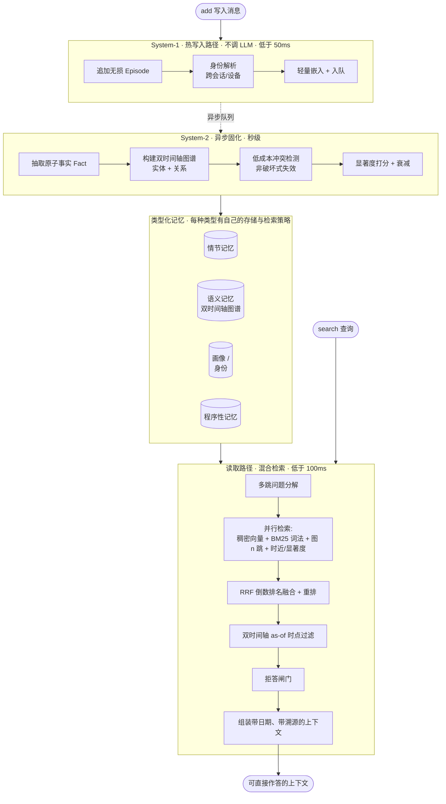

# Engram（印迹）

**[English](README.md) | 🌐 中文**

**一个面向 LLM 智能体的开源长期记忆引擎 —— 只围绕一个原则：我们公布的每一个数字，你都能自己复现。**

**🎬 [在线动画演示 →](https://ly-wang19.github.io/engram-memory/)** —— 60 秒看懂它怎么工作(小白友好)。

Engram 让 LLM 智能体拥有跨会话的、可查询的持久记忆：它记录发生过什么、提炼出原子事实、追踪这些事实
随时间的变化（双时间轴 bi-temporal）、在不丢历史的前提下解决矛盾，并用「语义 + 词法 + 图 + 时近」的
混合检索把最相关的上下文取出来。

> 状态：**alpha**。端到端流程**零配置**即可跑（不需要 API key，不需要任何服务）。下面的基准数字跑在真实
> 模型上，一行命令即可复现。完整项目纲领见 [`CLAUDE.md`](CLAUDE.md)，完整方法与原始日志见
> [`RESULTS.md`](RESULTS.md)。

## 为什么要再造一个记忆系统？

这个领域有两个真实的缺口，我们两个都打：

1. **大多数记忆系统在准确率上打不过"把全部历史塞进上下文"这个笨基线** —— 它们赢在成本，不赢在正确率。
   我们在每张结果表里**都列出 full-context 基线**，让你一眼看到我们到底处在什么位置。
2. **每家厂商的基准数字都跑在各自不同、不可复现的 harness 上。** Mem0 在不同来源里能查到 58% / 66% /
   92% 三个数字；三篇论文给出三种互相矛盾的排名。我们只提供**一套中立的 harness**，内置官方判分器，并
   公开每一题的原始日志。

在一个数字全靠自说自话的领域里，**「那个谁都能验证的记分牌」本身就是壁垒。**

## 结果 —— LongMemEval_S（500 题，官方判分）

在真实的 [LongMemEval_S](https://github.com/xiaowu0162/LongMemEval) 基准上测得（500 题，每题约 50 个
会话 / 约 11.5 万 token 的干扰上下文），用**官方分类判分 prompt**（gpt-5.5）评分，因此数字可与排行榜对标。

| 系统 | 总分 | 说明 |
|---|---:|---|
| **Engram**（`engram_full`，gemini-2.5-pro 作答） | **86.0%** | 全 500 题，官方判分，0 报错 |
| Hunyuan 混元记忆（闭源；自报） | 85.2% | — |
| Mem0-2026（自报） | 94.4% | — |
| OMEGA（自报） | 95.4% | — |

分项（Engram，全 500 题，0 报错）：

| 类别 | 得分 | 题数 |
|---|---:|---:|
| 单会话-助手 | 96.4% | 56 |
| 单会话-用户 | 95.3% | 64 |
| 知识更新 | 93.1% | 72 |
| 时间推理 | 87.4% | 127 |
| 多会话 | 83.5% | 121 |
| 拒答（信息不足应说不知道） | 70.0% | 30 |
| 单会话-偏好 | 50.0% | 30 |

**诚实定位：** Engram 越过了最接近的开源基线（Hunyuan，85.2），确实有竞争力，但**还没到排行榜顶端** ——
OMEGA（95.4）和 Mem0-2026（94.4）领先约 9 分。差距集中在两个**全行业公认难**的类别（偏好、多会话推理）；
偏好类即便前沿大模型在同类 PersonaMem 任务上也只有 37–48%。我们如实公布，不挑切片、不换宽松判分器。把这个
差距补上是我们公开进行中的路线图。

> 可比性说明：上面竞品数字都是各家**用自己的作答 + 判分流程**自报的。我们的数字用 gemini-2.5-pro 作答 +
> 官方 LongMemEval 判分 prompt。harness 对它跑的**每一个系统都用同一个作答器和判分器**（包括 full-context
> 基线），所以**本仓库内部的对比是严格同条件的**；跨论文对比则带有通常的「不同底座」注意事项。

## 工作原理

Engram 是一个**双过程（dual-process）**记忆系统，仿照人脑的 System-1 / System-2 分工：一条永不被 LLM
阻塞的快写入路径，和一条在离线做重型结构化的慢固化路径。



**写入路径（System-1）**：追加一条无损情节、跨会话/设备解析身份、嵌入并入队 —— 关键路径上不调 LLM，所以
能稳定低于约 50ms。**固化路径（System-2）**：异步运行，抽取原子的 `(主语, 谓语, 宾语)` 事实、构建知识图谱、
解决矛盾。**读取路径**：分解问题、并行走四条互补通道检索、融合重排、做时点过滤、组装出带日期与溯源的上下文。

### 它的独特之处

| # | 设计选择 | 为什么重要 |
|---|---|---|
| 1 | **双时间轴事实** —— 每个事实同时带*有效时间*（在现实中何时为真）**和**\*事务时间\*（我们何时得知） | 让"我们在 T 时刻知道什么？"（`as_of`）和知识更新成为**一等公民**，而非事后补丁。这就是知识更新拿 93%、时间推理拿 87% 的原因。 |
| 2 | **非破坏式冲突解决** —— 被推翻的事实是*失效*（`invalid_at` + `supersedes` 链），而非删除 | 没有静默的记忆损坏。每个事实都能回答"它从哪来？""它替换了谁？"—— 完整溯源 + 审计轨迹。 |
| 3 | **低成本冲突检测** —— 槽位匹配 + 嵌入/NLI 启发式，**仅在**模糊时才升级到 LLM | 拿到 Zep/Mem0 级别的时间正确性，**却不必每个事实都调一次 LLM** —— 规模化下的成本优势。 |
| 4 | **混合检索** —— 稠密语义 + BM25 词法 + 图邻近 + 时近/显著度，用 RRF 融合 | 没有单一检索器能赢遍所有场景。**已验证结论：事实 + 原始片段，强于任何单独一种** —— 事实补充冲突已解/时间信号，片段找回丢失的细节。 |
| 5 | **双过程分工** —— 快写入、异步固化 | 读取路径保持亚 100ms，而建图、去重、冲突解决都在关键路径之外进行。 |
| 6 | **一切可插拔** —— LLM / 嵌入器 / 向量库 / 图库都在接口背后，**带零依赖离线兜底** | `quickstart.py` 和 `pytest` **不需要任何 API key、任何服务**即可跑。一行配置即可换上 BGE / LanceDB / Kuzu / 任意 LLM。 |
| 7 | **可复现的 harness** —— 一套中立评测、内置官方判分、每张表都带 full-context 基线、公开原始日志 | 在一个人人数字都被质疑的领域里，**成为那个谁都能验证的记分牌**才是真正的护城河。 |

完整数据模型与冲突解决规则见 [`CLAUDE.md`](CLAUDE.md) §3。

## 快速开始（零配置，不需要 API key）

```bash
python examples/quickstart.py
```

用离线确定性兜底（哈希嵌入器、规则抽取器、内存存储）跑完整流程 —— 写入 → 固化 → 检索。真实后端
（LanceDB、Kuzu、LiteLLM、BGE）通过同一套接口接入：`pip install "engram-memory[all]"`。

```python
from engram import Memory

mem = Memory()
mem.add("My name is Wei and I work at Tencent.", user_id="u1")
mem.add("Actually I just switched jobs — I now work at Moonshot AI.", user_id="u1")
mem.consolidate()                      # System-2：抽取事实、建图、解决冲突

print(mem.search("Where does Wei work?", user_id="u1").answer())
# -> "Moonshot AI"（被推翻的旧事实是失效，而非删除 —— 历史被完整保留）
```

## 复现基准

```bash
# 1. 零依赖冒烟测试 + 单元测试
pytest

# 2. 在真实干扰集上测检索召回（不需要 LLM）
python eval/longmemeval.py --mode recall --data s --limit 500

# 3. 用官方判分跑完整 QA 基准（需要模型访问；provider 配置见 RESULTS.md）
python eval/bench.py --data s --limit 500 --systems engram_full,full_context \
    --answerer univibe:gemini-2.5-pro --judge univibe:gpt-5.5 --reasoning
```

头条 86.0% 那次跑的**每题原始日志已提交**在
[`results/longmemeval_s_engram_full_pro.jsonl`](results/longmemeval_s_engram_full_pro.jsonl)，500 行、
每题一行，含模型预测、标准答案、判分结果、token 数与延迟。自己重算：
`python eval/report.py results/longmemeval_s_engram_full_pro.jsonl`。**复现不出我们公布的数字，就是 bug
—— 请提 issue。**

## 许可证

Apache-2.0。
