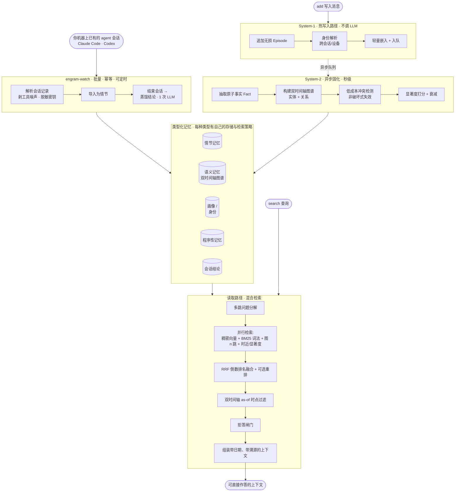

# Engram（印迹）

**[English](README.md) | 🌐 中文**

**一个面向 LLM 智能体的开源长期记忆引擎 —— 只围绕一个原则：我们公布的每一个数字，你都能自己复现。**

**📄 [论文 — arXiv:2606.09900 →](https://arxiv.org/abs/2606.09900)** —— 《Less Context, More Accuracy：面向 LLM 智能体的双时态记忆引擎》。

**🎬 [在线动画演示 →](https://ly-wang19.github.io/engram/)** —— 60 秒看懂它怎么工作(小白友好)。

**🔌 [在线控制台 →](http://42.193.220.197:8456/ui)** —— 打开后输入体验 key `1`,即可端到端浏览一份完整的公开记忆(画像、事实、时间线、图谱、问答)。这是公开演示，请勿提交隐私数据。

Engram 让 LLM 智能体拥有跨会话的、可查询的持久记忆：它记录发生过什么、提炼出原子事实、追踪这些事实
随时间的变化（双时间轴 bi-temporal）、在不丢历史的前提下解决矛盾，并用「语义 + 词法 + 图 + 时近」的
混合检索把最相关的上下文取出来。

> 状态：**0.1.0 beta · 单节点自托管交付版**。端到端流程**零配置**即可跑（不需要 API key，不需要任何
> 服务），生产部署则在未配置凭据时默认失败关闭。交付边界见
> [`docs/commercial-release-0.1.0.zh-CN.md`](docs/commercial-release-0.1.0.zh-CN.md)，安全策略见
> [`SECURITY.md`](SECURITY.md)，基准方法与原始日志见 [`RESULTS.md`](RESULTS.md)。

## 为什么要再造一个记忆系统？

这个领域有两个真实的缺口，我们两个都打：

1. **大多数记忆系统在准确率上打不过"把全部历史塞进上下文"这个笨基线** —— 它们赢在成本，不赢在正确率。
   我们在每张结果表里**都列出 full-context 基线**，让你一眼看到我们到底处在什么位置。
2. **每家厂商的基准数字都跑在各自不同、不可复现的 harness 上。** 同一个系统在不同来源里能查到 58% / 66% /
   92% 三个数字；不同论文给出互相矛盾的排名。我们只提供**一套中立的 harness**，内置官方判分器，并
   公开每一题的原始日志。

在一个数字全靠自说自话的领域里，**「那个谁都能验证的记分牌」本身就是壁垒。**

## 结果 —— LongMemEval_S（500 题，官方判分）

在真实的 [LongMemEval_S](https://github.com/xiaowu0162/LongMemEval) 基准上测得（500 题，每题约 50 个
会话 / 约 11.5 万 token 的干扰上下文），用**官方分类判分 prompt**评分。作答器 **doubao-seed-2.0-pro**、
判分器 **DeepSeek-V3.2** —— 标准、严格的判分器,所以这是公平的数字,不是挑个宽松的。

**头条系统是 `engram_lean`:它从检索到的一小片作答,从不读全部历史。** 这才是记忆系统的真正考验,
也是本项目的核心论点(用零头的 token 在准确率上打赢全文):

| 系统 | 总分 | 平均 token | 说明 |
|---|---:|---:|---|
| **Engram**（`engram_lean`） | **84.4%** | **7.9k** | 检索精简片;0 报错 / 500 |
| 裸塞全文基线(同作答器+判分器) | 78.8% | 79.2k | 把整个干扰集塞进 prompt |

**Engram 比裸全文高 +5.6 分,却用约 10 倍更少的 token**(7.9k vs 79.2k)—— 过滤后的精华片比嘈杂的
全窗口*更*准,6 类中赢下 4 类(当前 `main`,DeepSeek 官方判分器;日志已提交):

| 类别 | Engram | 裸全文 |
|---|---:|---:|
| 单会话-助手 | 94.6% | 94.6% |
| 单会话-用户 | **91.4%** | 82.9% |
| 知识更新 | 84.6% | **91.0%** |
| 时间推理 | **83.5%** | 81.2% |
| 单会话-偏好 | **80.0%** | 50.0% |
| 多会话 | **78.2%** | 66.9% |

更早一次在(现已下线的)火山版判分器上的运行得分 **83.6% vs 73.2%(+10.4)**——完整设置钉在
[`RESULTS.md`](RESULTS.md);仅判分器更换一项就把基线抬高了 4.4 分,两次运行是两把不同的尺子,
我们两个都如实公布、不互相折算。

**它的定位:** 精华片以约 1/10 的 token 打赢全窗口,赢得最狠的恰是长上下文淹没信号的类别
(偏好 +30.0、多会话 +11.3)。我们如实公布 —— 同一作答器、官方判分 prompt、每题留痕、不挑切片。
公开路线图:攻下全文仍占优的两类(知识更新、时间推理),并把同样的评测纪律扩展到更大语料。

## 工作原理

Engram 是一个**双过程（dual-process）**记忆系统，仿照人脑的 System-1 / System-2 分工：一条永不被 LLM
阻塞的快写入路径，和一条在离线做重型结构化的慢固化路径。



有两条路进来。**写入路径（System-1）**：追加一条无损情节、跨会话/设备解析身份、嵌入并入队 —— 关键路径上不调 LLM。
**会话路径（`engram-watch`）**：读取你磁盘上已有的 agent 会话记录，存下来，在会话结束时用一次 LLM 调用蒸馏出
*决定了什么、发现了什么、学到了什么、还有什么没解决* —— 对工作会话来说，记忆的单元是结论，不是传记式三元组。
**固化路径（System-2）**：异步运行，抽取原子的 `(主语, 谓语, 宾语)` 事实、构建知识图谱、
解决矛盾。**读取路径**：分解问题、并行走四条互补通道检索，把正证据信号用 RRF 融合，并把时近/显著度作为先验（可选重排），做时点过滤、组装出带日期与溯源的上下文。算法层契约见
[`docs/algorithm-architecture.md`](docs/algorithm-architecture.md)。

### 它的独特之处

| # | 设计选择 | 为什么重要 |
|---|---|---|
| 1 | **双时间轴事实** —— 每个事实同时带*有效时间*（在现实中何时为真）**和**\*事务时间\*（我们何时得知） | 让"我们在 T 时刻知道什么？"（`as_of`）和知识更新成为**一等公民**，而非事后补丁。这就是知识更新拿 87.5%、时间推理拿 81.1% 的原因。 |
| 2 | **非破坏式冲突解决** —— 被推翻的事实是*失效*（`invalid_at` + `supersedes` 链），而非删除 | 没有静默的记忆损坏。每个事实都能回答"它从哪来？""它替换了谁？"—— 完整溯源 + 审计轨迹。 |
| 3 | **低成本冲突检测** —— 槽位匹配 + 嵌入/NLI 启发式，**仅在**模糊时才升级到 LLM | 拿到生产级的时间正确性，**却不必每个事实都调一次 LLM** —— 规模化下的成本优势。 |
| 4 | **混合检索** —— 稠密语义 + BM25 词法 + 图邻近作为正证据融合，时近/显著度作为先验 | 没有单一检索器能赢遍所有场景。**已验证结论：事实 + 原始片段，强于任何单独一种** —— 事实补充冲突已解/时间信号，片段找回丢失的细节。 |
| 5 | **双过程分工** —— 快写入、异步固化 | 建图、去重、冲突解决都在关键路径之外进行；读取延迟要进 harness 测量后才公开宣称。 |
| 6 | **一切可插拔，且兜底宁可拒绝也不腐蚀** —— LLM / 嵌入器 / 向量库 / 图库都在接口背后，带零依赖离线兜底；兜底处理不了你的数据时会明说，而不是静默降级 | `python scripts/check_zero_setup.py` **不需要任何 API key、任何服务**即可跑。没有 LLM 时，agent 会话只存不做规则抽取（那在真实会话上产出的是垃圾）；体检页会报出哈希嵌入器切不动你存的文字（见 [`results/embedder_zh_2026-09-01.md`](results/embedder_zh_2026-09-01.md)）并给出修法。一行配置即可换上 BGE / LanceDB / Kuzu / 任意 LLM。 |
| 7 | **会话结论** —— 一次工作会话被蒸馏成决定、发现、教训、待决，作为普通的双时间轴事实存下 | 逐轮抽取给的是属性（"在 X 工作"），一次会话给的是*得出了什么结论*。两者同库，结论白拿 supersedes、溯源和检索；控制台的「会话结论」页读起来就像你本来会手写的那份笔记。 |
| 8 | **可复现的 harness** —— 一套中立评测、内置官方判分、每张表都带 full-context 基线、公开原始日志 | 在一个人人数字都被质疑的领域里，**成为那个谁都能验证的记分牌**才是真正的护城河。 |

完整数据模型与冲突解决规则见 [`engram/types.py`](engram/types.py) 与 [`engram/consolidate/`](engram/consolidate/)。

## 快速开始（零配置，不需要 API key）

```bash
python examples/quickstart.py
# 或者安装后：
engram-quickstart
```

用离线确定性兜底（哈希嵌入器、规则抽取器、内存存储）跑完整流程 —— 写入 → 固化 → 检索。真实后端
（LanceDB、Kuzu、LiteLLM、BGE）通过同一套接口接入：`pip install "engram-memory[all]"`。

```python
from engram import Memory

mem = Memory()
mem.add("My name is Wei and I work at Tencent.", user_id="u1")
mem.add("Actually I just switched jobs — I now work at Moonshot AI.", user_id="u1")
mem.consolidate()                      # System-2：抽取事实、建图、解决冲突

print(mem.search("Where does Wei work?", user_id="u1").answer())
# -> "Moonshot AI"（被推翻的旧事实是失效，而非删除 —— 历史被完整保留）
```

## 怎么调用 / 接入你的应用

Engram 自带完整**接入层**:HTTP API + MCP + JS/TS SDK + OpenAI 兼容,都走同一个多租户核心
（`MemoryService`）。生产模式下，配置的 API key 映射到稳定、互相隔离的租户命名空间；只有显式开发开放
模式才把 key 文本本身当作命名空间。
内置控制台 `/ui` 也体现同一条产品闭环：不含正文的 session status、带 `scope=auto|long|working`
的会话写入、结束会话、session report 审计、分页记忆管理、安全导出和显式确认清空 —— 另加一页**会话结论**（每次会话得出了什么）
和一页**记忆体检**（把抽取垃圾点名到"84 条塞在同一个槽里"，一步清掉）。
跨 Claude Code / Codex / Cursor / 自研 agent 的推荐生命周期见
[`docs/cross-agent-memory.md`](docs/cross-agent-memory.md) 与
[`docs/agent-adapters.md`](docs/agent-adapters.md)；单会话生命周期自测（本地零服务或 HTTP，包含
`agent_status`、`remember`、`close_session`、`session_report`）见
[`examples/cross_agent_lifecycle.py`](examples/cross_agent_lifecycle.py)，双 agent 交接自测见
[`examples/cross_agent_handoff.py`](examples/cross_agent_handoff.py)。如果 agent 需要用指定 Python
环境启动 MCP，可用 `engram-agent-setup --client codex --local --namespace me --python /path/to/python`
生成本地零服务配置，或用 `--api-url ... --api-key ...` 生成 HTTP 服务配置；最快本地路径是
先 `engram-agent-bootstrap --local --dry-run --namespace me --python /path/to/python` 预览，再
`engram-agent-bootstrap --local --namespace me --python /path/to/python` 安装 Codex + 项目 `.mcp.json`、
运行 doctor 验证已写入配置和 MCP runtime，并输出可粘贴进 AGENTS.md 的策略文本；
加 `--install-policy` 可把这段策略写入受管理的 AGENTS.md block，支持备份和卸载。Codex
也支持 `engram-agent-setup --install-codex --dry-run ...` 预览写入，`--install-codex --doctor`
备份后安装并立刻自检真实 MCP stdio 启动链路，`--uninstall-codex` 只移除 Engram 的 MCP 配置块。
Claude Code / Cursor / 项目级 MCP 客户端可用 `engram-agent-setup --install-mcp-json --doctor ...`
以同样的 dry-run、备份、卸载流程管理 `.mcp.json`。

### 直接调用托管 API（零搭建）

Bearer key 随便起一个，它就是你的私有命名空间。完整接口见 [`API.md`](API.md)；浏览器控制台:
**http://42.193.220.197:8456/ui**（体验 key `1`）。

```bash
B=http://42.193.220.197:8456 ; K=my-app          # 任意 key = 你自己的隔离空间

# 1) 灌一条记忆（自动抽取原子事实，按你输入的语言记录）
curl -s -X POST $B/v1/remember -H "Authorization: Bearer $K" -H "Content-Type: application/json" \
  -d '{"content":"我在字节跳动做后端，最喜欢周杰伦。"}'

# 2) 召回：一小片精炼上下文 + 答案 + 省 token 对比
curl -s -X POST $B/v1/recall -H "Authorization: Bearer $K" -H "Content-Type: application/json" \
  -d '{"query":"我最喜欢哪个歌手"}'
# -> {"answer":"你最喜欢周杰伦。","context":"…","tokens_est":120,"full_tokens":1400}
```

### MCP server（给 Claude Desktop / Cursor 加持久记忆）

```bash
pip install "engram-memory[mcp]"
python -m engram.mcp                 # 本地记忆，零外部服务
# 或代理一个运行中的服务： python -m engram.mcp --api-url http://42.193.220.197:8456 --api-key my-app
```
```jsonc
// claude_desktop_config.json
{ "mcpServers": { "engram": { "command": "python", "args": ["-m", "engram.mcp"] } } }
```

`engram_recall` 和 `engram_search` 也支持 `as_of`（epoch 秒）查询某个历史时刻的记忆视图，并支持
`redact_sensitive=true` 生成适合共享/安全注入的上下文。
`engram_agent_status` 适合 agent 开工前做不含正文的接线检查：当前 namespace、session、focus、计数和下一步建议。
`engram_stats` 返回不含内容的命名空间统计（episode backlog、事实/图谱/冲突计数），适合健康检查。
MCP 的 `engram_remember` 支持 `scope="long"|"auto"|"working"`：长期事实进长期记忆，当前任务临时状态
用 `working`。`engram_close_session` 用于线程结束或切换任务时整理该 session：补摘要、清 working memory、持久化。
用户要看哪些 Codex / Claude Code / app 会话写过记忆时，agent 可调用 `engram_list_sessions`；
它只返回 session id、时间和计数，不返回记忆正文。
用户要纠错或删除单条记忆时，agent 可先用 `engram_list_facts` 找到 fact id，再调用
`engram_update_fact` 或 `engram_delete_fact(confirm=true)` 精确处理，不需要清空整个命名空间。
用户要导出自己的记忆时，agent 可调用 `engram_export(response_format="json")`；默认是安全导出
（非敏感 facts + graph），用户明确要完整私有导出时再传 `include_sensitive=true`。
用户要“以后多关注某类信息 / 少召回某类信息”时，agent 可用 `engram_get_focus` 查看当前策略，再用
`engram_set_focus` 更新关注或屏蔽主题。

### JS/TS SDK + OpenAI 兼容（改一个 URL，你现有的 OpenAI 代码就有了记忆）

```ts
import { EngramClient } from 'engram-memory'                  // npm i engram-memory
const engram = new EngramClient({ baseUrl: 'http://42.193.220.197:8456', apiKey: 'my-app' })
await engram.agentStatus({ sessionId: 'app:my-product:conversation-123' }) // 不含正文的接线检查
await engram.remember('我在字节做后端，最喜欢周杰伦。')
const { context } = await engram.recall('我喜欢哪个歌手？')
await engram.closeSession('app:my-product:conversation-123')
const report = await engram.sessionReport('app:my-product:conversation-123') // 这一轮保存了什么

// 直接替换 OpenAI 的 base_url 即可（官方 openai SDK 也行）：
const out = await engram.chat.completions.create({ model: 'engram', messages: [
  { role: 'user', content: '提醒我一下我最喜欢的歌手' } ] })
```

OpenAI 兼容聊天也支持 Engram 扩展：`memory: { session_id: "codex:repo:thread", scope: "auto" }`
用于把轮次归到某个 agent 线程，`memory: { as_of: <epoch 秒> }` 用于查询某个历史时刻的记忆视图，
`memory: { redact_sensitive: true }` 用于在注入上下文时隐藏敏感事实；redacted 上下文只包含非敏感
结构化事实，不包含画像、摘要或原始片段。

数据导出也遵循同一语义：`/v1/export?include_sensitive=false` 只返回非敏感 facts 及其 graph，不包含画像、
摘要或原始对话。
TypeScript SDK 的 `engram.export()` 默认走这个安全导出；只有用户明确要完整私有导出时再传
`{ includeSensitive: true }`。
如果要做 C 端“我的记忆”管理页，SDK 也支持分页查看：
`engram.memories({ factsLimit, factsOffset, episodesLimit, status, query, includeSensitive })`。
独立关系图接口默认也是安全视图；只有明确要完整私有图谱时才传 `/v1/graph?include_sensitive=true`。

### 自部署（数据完全在你自己机器上）

```bash
cp deploy/.env.example deploy/.env              # 把示例 key 换成强随机密钥
docker compose --env-file deploy/.env -f deploy/docker-compose.yml up -d --build
curl -fsS http://127.0.0.1:8000/ready
```

标准容器以非 root 运行、根文件系统只读、只把 `/data` 作为持久卷、仅绑定本机端口且不默认开放访问。
TLS 网关、备份恢复、升级回滚和密钥轮换见 [`deploy/README.md`](deploy/README.md)。`GET /health` 用于
liveness/排错，`GET /ready` 在鉴权或存储未就绪时返回 503；两者都不暴露 key、路径或用户内容。

直接使用 Python 部署时，安装 `engram-memory[serve]`，设置
`ENGRAM_API_KEYS="tenant-a:<强随机密钥>"` 后运行 Uvicorn。`ENGRAM_OPEN=1` 仅用于显式本地开发。

批量导入见 [`examples/batch_import.py`](examples/batch_import.py)，完整接口文档见 [`API.md`](API.md)。

**4. 用你的 agent 会话喂它** —— Claude Code 和 Codex 已经写在磁盘上的会话记录，就是值得记住的东西。
`engram-watch` 吃掉已经安静下来的会话，逐个结束以便蒸馏成结论，并记住自己看过哪些，所以重复跑既便宜又幂等：

```bash
engram-watch --dry-run                                  # 看会吃哪些，什么都不存
engram-watch --once --url http://127.0.0.1:8000 --key me # 跑一次：最新的安静会话，每次 25 条
engram-watch --install --url http://127.0.0.1:8000 --key me --interval 30m   # launchd / systemd / cron
engram-watch --uninstall --purge                        # 把 ~/.engram 还原成安装前的样子
```

默认一次会话只花一次摘要调用和一次结论调用 —— 对整段长记录做逐轮事实抽取是显式开启的（`--extract-facts`）。
`--install` 会先在干净环境里 import `engram`，第一个 tick 就会失败的任务拒绝注册；key 放在 `0600` 文件里而不是
plist 里；`--uninstall` 会等调度器真正放手再报成功。

## 复现基准

```bash
# 1. 零依赖冒烟测试：quickstart + 离线 harness + 证据日志校验
python scripts/check_zero_setup.py

# 可选：安装测试依赖后跑完整单元测试
pytest

# 2. 在真实干扰集上测检索召回（不需要 LLM）
python eval/longmemeval.py --mode recall --data s --limit 500

# 3. 用官方判分跑完整 QA 基准（需要模型访问；provider 配置见 RESULTS.md）—— engram_lean vs 全文基线
#    注意：产出公开头条数字所用的 judge（volcano:deepseek-v3-2-251201）已被 provider 下线，
#    这里改用仍在服务的 judge。换 judge 会改变绝对分数，但同一次 run 内 engram_lean 与
#    full_context 仍是同一裁判、可比。溯源与说明见 RESULTS.md。
python eval/bench.py --data s --limit 500 --systems engram_lean,full_context \
    --answerer volcano:doubao-seed-2-0-pro-260215 --judge deepseek \
    --extractor volcano:doubao-seed-1-6-flash-250615 --reasoning --persona \
    --chunks 2 --topk 15 --extract-k 8 --summ-k 28 --n-summaries 28
```

头条数字的**每题原始日志**见 [`RESULTS.md`](RESULTS.md)，含模型预测、标准答案、判分结果、token 数与延迟，
以及这些数字当时所用（现已下线）的 judge。**在公布时所用的同一套设置下复现不出我们的数字，就是 bug —— 请提 issue。**

## 许可证

Engram 采用**双授权**，按你的用途任选其一：

- **开源 —— [GNU AGPL-3.0](LICENSE)。** 可自由使用、研究、修改、自部署。注意 AGPL 第 13 条：若你以**修改后
  的 Engram 对外提供网络服务**，须按 AGPL 向服务使用者公开该服务的完整源码。内部使用、科研、教学不受影响。
- **商业 —— 单独的付费授权。** 若要把 Engram 用于**闭源/专有**产品，或以 **SaaS / 托管**形式提供、且不愿承担
  AGPL 的源码公开义务，则需获得商业授权。详见 **[`COMMERCIAL-LICENSE.md`](COMMERCIAL-LICENSE.md)**。

一句话：**开源免费；不遵守 AGPL 的商业使用，需要授权。**
