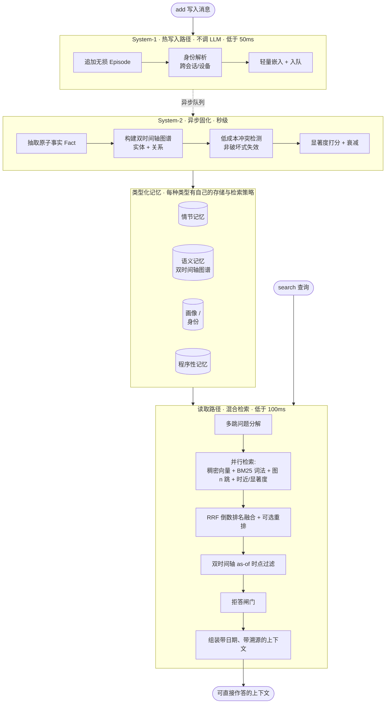

# Engram（印迹）

**[English](README.md) | 🌐 中文**

**一个面向 LLM 智能体的开源长期记忆引擎 —— 只围绕一个原则：我们公布的每一个数字，你都能自己复现。**

**📄 [论文 — arXiv:2606.09900 →](https://arxiv.org/abs/2606.09900)** —— 《Less Context, More Accuracy：面向 LLM 智能体的双时态记忆引擎》。

**🎬 [在线动画演示 →](https://ly-wang19.github.io/engram/)** —— 60 秒看懂它怎么工作(小白友好)。

**🔌 [在线控制台 →](http://42.193.220.197:8456/ui)** —— 打开后输入体验 key `1`,即可端到端浏览一份完整的公开记忆(画像、事实、时间线、图谱、问答)。

Engram 让 LLM 智能体拥有跨会话的、可查询的持久记忆：它记录发生过什么、提炼出原子事实、追踪这些事实
随时间的变化（双时间轴 bi-temporal）、在不丢历史的前提下解决矛盾，并用「语义 + 词法 + 图 + 时近」的
混合检索把最相关的上下文取出来。

> 状态：**alpha**。端到端流程**零配置**即可跑（不需要 API key，不需要任何服务）。下面的基准数字跑在真实
> 模型上，一行命令即可复现。完整方法与原始日志见 [`RESULTS.md`](RESULTS.md)。

## 为什么要再造一个记忆系统？

这个领域有两个真实的缺口，我们两个都打：

1. **大多数记忆系统在准确率上打不过"把全部历史塞进上下文"这个笨基线** —— 它们赢在成本，不赢在正确率。
   我们在每张结果表里**都列出 full-context 基线**，让你一眼看到我们到底处在什么位置。
2. **每家厂商的基准数字都跑在各自不同、不可复现的 harness 上。** 同一个系统在不同来源里能查到 58% / 66% /
   92% 三个数字；不同论文给出互相矛盾的排名。我们只提供**一套中立的 harness**，内置官方判分器，并
   公开每一题的原始日志。

在一个数字全靠自说自话的领域里，**「那个谁都能验证的记分牌」本身就是壁垒。**

## 结果 —— LongMemEval_S（500 题，官方判分）

在真实的 [LongMemEval_S](https://github.com/xiaowu0162/LongMemEval) 基准上测得（500 题，每题约 50 个
会话 / 约 11.5 万 token 的干扰上下文），用**官方分类判分 prompt**评分。作答器 **doubao-seed-2.0-pro**、
判分器 **DeepSeek-V3.2** —— 标准、严格的判分器,所以这是公平的数字,不是挑个宽松的。

**头条系统是 `engram_lean`:它从检索到的一小片作答,从不读全部历史。** 这才是记忆系统的真正考验,
也是本项目的核心论点(用零头的 token 在准确率上打赢全文):

| 系统 | 总分 | 平均 token | 说明 |
|---|---:|---:|---|
| **Engram**（`engram_lean`） | **83.6%** | **9.6k** | 检索精简片;0 报错 / 500 |
| 裸塞全文基线(同作答器+判分器) | 73.2% | 79k | 把整个干扰集塞进 prompt |

**Engram 比裸全文高 +10.4 分,却用约 8 倍更少的 token**(9.6k vs 79k)—— 过滤后的精华片比嘈杂的全窗口
*更*准,而且历史再长成本也不涨(全文做不到)。分项(`engram_lean`,全 500 题):

| 类别 | 得分 | 题数 |
|---|---:|---:|
| 单会话-助手 | 92.9% | 56 |
| 知识更新 | 87.5% | 72 |
| 单会话-用户 | 87.5% | 64 |
| 拒答 | 86.7% | 30 |
| 时间推理 | 81.1% | 127 |
| 多会话 | 79.3% | 121 |
| 单会话-偏好 | 73.3% | 30 |

**它的定位:** **83.6%** —— Engram 大幅超过裸全文(**+10.4**)且省约 8 倍 token,而且历史再长成本也不涨。我们
如实公布 —— 同一作答器、同一严格判分器、每题留痕、不挑切片。Engram 领先在 **token 效率、可扩展性、可复现性**;
最难的几类(多会话推理、时间聚合)仍有提升空间,是公开路线图。

## 工作原理

Engram 是一个**双过程（dual-process）**记忆系统，仿照人脑的 System-1 / System-2 分工：一条永不被 LLM
阻塞的快写入路径，和一条在离线做重型结构化的慢固化路径。



**写入路径（System-1）**：追加一条无损情节、跨会话/设备解析身份、嵌入并入队 —— 关键路径上不调 LLM，所以
能稳定低于约 50ms。**固化路径（System-2）**：异步运行，抽取原子的 `(主语, 谓语, 宾语)` 事实、构建知识图谱、
解决矛盾。**读取路径**：分解问题、并行走四条互补通道检索、RRF 融合（可选重排）、做时点过滤、组装出带日期与溯源的上下文。

### 它的独特之处

| # | 设计选择 | 为什么重要 |
|---|---|---|
| 1 | **双时间轴事实** —— 每个事实同时带*有效时间*（在现实中何时为真）**和**\*事务时间\*（我们何时得知） | 让"我们在 T 时刻知道什么？"（`as_of`）和知识更新成为**一等公民**，而非事后补丁。这就是知识更新拿 87.5%、时间推理拿 81.1% 的原因。 |
| 2 | **非破坏式冲突解决** —— 被推翻的事实是*失效*（`invalid_at` + `supersedes` 链），而非删除 | 没有静默的记忆损坏。每个事实都能回答"它从哪来？""它替换了谁？"—— 完整溯源 + 审计轨迹。 |
| 3 | **低成本冲突检测** —— 槽位匹配 + 嵌入/NLI 启发式，**仅在**模糊时才升级到 LLM | 拿到生产级的时间正确性，**却不必每个事实都调一次 LLM** —— 规模化下的成本优势。 |
| 4 | **混合检索** —— 稠密语义 + BM25 词法 + 图邻近 + 时近/显著度，用 RRF 融合 | 没有单一检索器能赢遍所有场景。**已验证结论：事实 + 原始片段，强于任何单独一种** —— 事实补充冲突已解/时间信号，片段找回丢失的细节。 |
| 5 | **双过程分工** —— 快写入、异步固化 | 读取路径保持亚 100ms，而建图、去重、冲突解决都在关键路径之外进行。 |
| 6 | **一切可插拔** —— LLM / 嵌入器 / 向量库 / 图库都在接口背后，**带零依赖离线兜底** | `quickstart.py` 和 `pytest` **不需要任何 API key、任何服务**即可跑。一行配置即可换上 BGE / LanceDB / Kuzu / 任意 LLM。 |
| 7 | **可复现的 harness** —— 一套中立评测、内置官方判分、每张表都带 full-context 基线、公开原始日志 | 在一个人人数字都被质疑的领域里，**成为那个谁都能验证的记分牌**才是真正的护城河。 |

完整数据模型与冲突解决规则见 [`engram/types.py`](engram/types.py) 与 [`engram/consolidate/`](engram/consolidate/)。

## 快速开始（零配置，不需要 API key）

```bash
python examples/quickstart.py
```

用离线确定性兜底（哈希嵌入器、规则抽取器、内存存储）跑完整流程 —— 写入 → 固化 → 检索。真实后端
（LanceDB、Kuzu、LiteLLM、BGE）通过同一套接口接入：`pip install "engram-memory[all]"`。

```python
from engram import Memory

mem = Memory()
mem.add("My name is Wei and I work at Tencent.", user_id="u1")
mem.add("Actually I just switched jobs — I now work at Moonshot AI.", user_id="u1")
mem.consolidate()                      # System-2：抽取事实、建图、解决冲突

print(mem.search("Where does Wei work?", user_id="u1").answer())
# -> "Moonshot AI"（被推翻的旧事实是失效，而非删除 —— 历史被完整保留）
```

## 怎么调用 / 接入你的应用

Engram 自带完整**接入层**:HTTP API + MCP + JS/TS SDK + OpenAI 兼容,都走同一个多租户核心
（`MemoryService`），**每个 API key 就是一个互相隔离的记忆空间**。

### 直接调用托管 API（零搭建）

Bearer key 随便起一个，它就是你的私有命名空间。完整接口见 [`API.md`](API.md)；浏览器控制台:
**http://42.193.220.197:8456/ui**（体验 key `1`）。

```bash
B=http://42.193.220.197:8456 ; K=my-app          # 任意 key = 你自己的隔离空间

# 1) 灌一条记忆（自动抽取原子事实，按你输入的语言记录）
curl -s -X POST $B/v1/remember -H "Authorization: Bearer $K" -H "Content-Type: application/json" \
  -d '{"content":"我在字节跳动做后端，最喜欢周杰伦。"}'

# 2) 召回：一小片精炼上下文 + 答案 + 省 token 对比
curl -s -X POST $B/v1/recall -H "Authorization: Bearer $K" -H "Content-Type: application/json" \
  -d '{"query":"我最喜欢哪个歌手"}'
# -> {"answer":"你最喜欢周杰伦。","context":"…","tokens_est":120,"full_tokens":1400}
```

### MCP server（给 Claude Desktop / Cursor 加持久记忆）

```bash
pip install "engram-memory[mcp]"
python -m engram.mcp                 # 本地记忆，零外部服务
# 或代理一个运行中的服务： python -m engram.mcp --api-url http://42.193.220.197:8456 --api-key my-app
```
```jsonc
// claude_desktop_config.json
{ "mcpServers": { "engram": { "command": "python", "args": ["-m", "engram.mcp"] } } }
```

### JS/TS SDK + OpenAI 兼容（改一个 URL，你现有的 OpenAI 代码就有了记忆）

```ts
import { EngramClient } from 'engram-memory'                  // npm i engram-memory
const engram = new EngramClient({ baseUrl: 'http://42.193.220.197:8456', apiKey: 'my-app' })
await engram.remember('我在字节做后端，最喜欢周杰伦。')
const { context } = await engram.recall('我喜欢哪个歌手？')

// 直接替换 OpenAI 的 base_url 即可（官方 openai SDK 也行）：
const out = await engram.chat.completions.create({ model: 'engram', messages: [
  { role: 'user', content: '提醒我一下我最喜欢的歌手' } ] })
```

### 自部署（数据完全在你自己机器上）

```bash
pip install "engram-memory[serve]"
export ENGRAM_OPEN=1                # 开发：bearer 文本即命名空间（生产用 ENGRAM_API_KEYS）
export ENGRAM_EMBEDDER=bge-small
export ENGRAM_LLM=deepseek          # 可选：启用 /v1/chat/completions 生成
uvicorn engram.server.app:app --port 8000        # HTTP API + 控制台在 /ui
```

批量导入见 [`examples/batch_import.py`](examples/batch_import.py)，完整接口文档见 [`API.md`](API.md)。

## 复现基准

```bash
# 1. 零依赖冒烟测试 + 单元测试
pytest

# 2. 在真实干扰集上测检索召回（不需要 LLM）
python eval/longmemeval.py --mode recall --data s --limit 500

# 3. 用官方判分跑完整 QA 基准（需要模型访问；provider 配置见 RESULTS.md）—— 头条 engram_lean + 全文基线
python eval/bench.py --data s --limit 500 --systems engram_lean,full_context \
    --answerer volcano:doubao-seed-2-0-pro-260215 --judge volcano:deepseek-v3-2-251201 \
    --extractor volcano:doubao-seed-1-6-flash-250615 --reasoning --persona \
    --chunks 2 --topk 15 --extract-k 8 --summ-k 28 --n-summaries 28
```

头条数字的**每题原始日志**见 [`RESULTS.md`](RESULTS.md)，含模型预测、标准答案、判分结果、token 数与延迟。
**复现不出我们公布的数字，就是 bug —— 请提 issue。**

## 许可证

Engram 采用**双授权**，按你的用途任选其一：

- **开源 —— [GNU AGPL-3.0](LICENSE)。** 可自由使用、研究、修改、自部署。注意 AGPL 第 13 条：若你以**修改后
  的 Engram 对外提供网络服务**，须按 AGPL 向服务使用者公开该服务的完整源码。内部使用、科研、教学不受影响。
- **商业 —— 单独的付费授权。** 若要把 Engram 用于**闭源/专有**产品，或以 **SaaS / 托管**形式提供、且不愿承担
  AGPL 的源码公开义务，则需获得商业授权。详见 **[`COMMERCIAL-LICENSE.md`](COMMERCIAL-LICENSE.md)**。

一句话：**开源免费；不遵守 AGPL 的商业使用，需要授权。**
