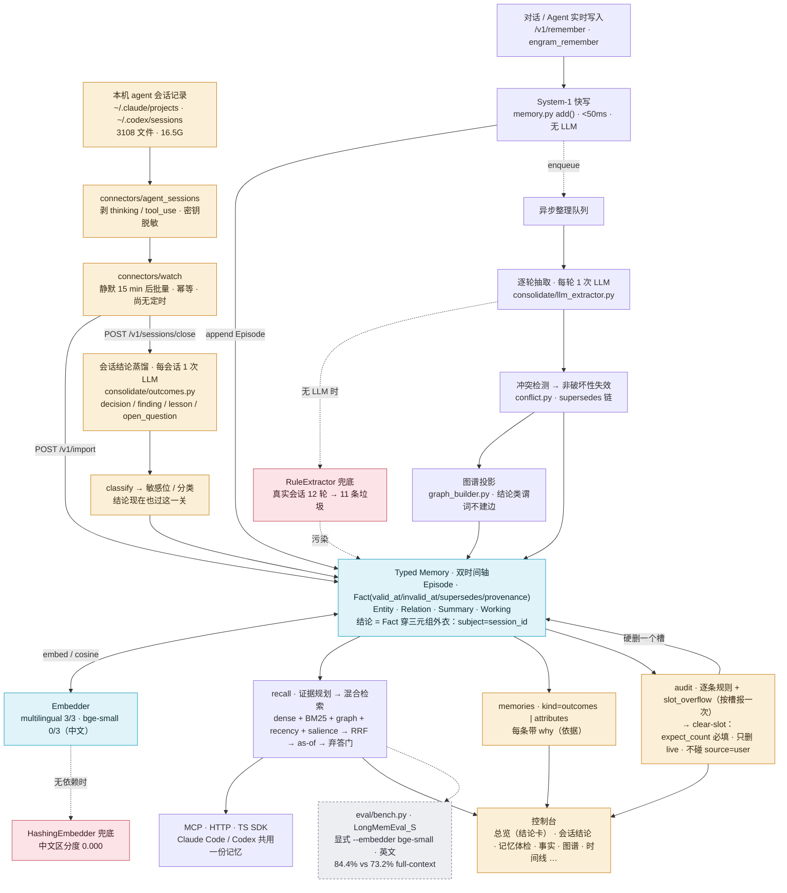

# Engram 架构优化地图

最后更新：2026-09-01

用途：这是给项目负责人和后续 AI/人类贡献者看的本地中文驾驶舱。它回答四个问题：

1. Engram 的记忆架构现在分几层。
2. 最近的 AI 改动落在架构的哪个位置。
3. 每个优化解决了什么问题，验收数据在哪里。
4. 下一步按计划应该优化哪个模块。

这不是公开营销稿。任何对外性能主张仍以 `RESULTS.md`、`README.md`、`README.zh-CN.md`
和已提交的 `results/*.jsonl` 原始日志为准。

## 如何使用这组架构文档

本文件是“驾驶舱”：看最近改了哪一层、为什么改、验收日志在哪里、下一步按计划做什么。

完整工程说明书见
[`docs/engram-full-architecture-report.zh-CN.md`](engram-full-architecture-report.zh-CN.md)。那份报告更细，
覆盖从消息写入、Episode/Fact/Graph 生成、读路径证据规划、上下文装配、服务接口到 eval harness 的全链路数据流。

建议阅读顺序：

1. 先读完整报告，掌握整个系统的数据流和模块边界。
2. 再回到本文件，看最近 AI/人类具体改了哪些架构层。
3. 做算法 PR 前检查“当前重点区域”和“验收分层规则”。
4. 合并后把改动、日志和下一步影响写回本文件；如果改了数据流或对象生命周期，也同步更新完整报告。

## 总览图

一套核心，两条写入路径，两个兜底坐在缝上。左路是原设计的对话流；右路是 2026-09-01 新增的 agent 会话路径。
虚线是条件分支：只有在没有 LLM / 没有依赖时才走到兜底。跑分路径从不经过 `/v1/sessions/close`。
可视化版本：见对话中发布的「Engram 双路径架构图」artifact；本文件是单一事实源。



## 算法流程与承重参数

总览图画的是数据流；每个箱子里面怎么算，按代码归纳为五块。绘制版见「Engram 双路径架构图」artifact 图 2–6；本表是参数的事实源。

| 算法 | 代码 | 流程要点 | 承重参数（`config.py`） |
| --- | --- | --- | --- |
| **search() 决策级联** | `memory.py::search()` | 固定顺序先命中先返回：① 多跳规划（≥2 谓词 + 已知锚点，LLM 只能从本用户真实谓词/实体表选链，无 LLM 走关键词表）→ ② supersedes 历史链问题 → ③ 规程类问题 → ④ 混合检索。空则冷层→规程→摘要→弃答。命中后做答案类型对齐（问 id/日期就要求 object 长得像），再过弃答判定 | `top_k=5` · `max_hops=2` · `abstain_threshold=0.45`（无非泛化属性词重叠 且 最高语义 < 0.45 才弃答；只匹配实体名不算） |
| **五路信号融合** | `retrieve/hybrid.py` · `fusion.py` | 候选集三道过滤（live → 单值槽只留槽头 → 图排除区）；五路各自排名：sem（cosine × 类型倍率，仅真 embedder）、lex（BM25 + 日期词）、graph（≤2 跳、每跳 ×0.65、多路径累加、关系词加权）、rec（exp 衰减）、sal；加权 RRF 合并名次不合并分数 | `w_sem 1.0 · w_lex 0.6 · w_graph 0.8 · w_rec 0.3 · w_sal 0.25` · `rrf_k=60` · `recency_tau_days=45` · 类型倍率 1.25/1.15。**w_graph 勿降**：0.4 时 dev recall@15 +4.1 但全集 multi-session −23 |
| **上下文装配** | `retrieve/evidence.py` · `memory.py::lean_context()` | `plan_evidence` 纯规则判证据形态（聚合/时间/时长/偏好/当前/历史/规程/多跳/精确/弃答敏感），据此定各层预算与子问题；层序 persona → working → L1 事实 → L2 摘要（排除已作 detail 的会话）→ detail 原文（provenance 提升合并，上限 max(1,k//2)）→ 聚合原始表 → 时间线 → 硬顶 | `n_facts 8/0` · `n_summaries 12/6/0` · `n_chunks 2/1/0` · `char_budget=60000` · `provenance_chunk_promotion` |
| **冲突消解阶梯** | `consolidate/engine.py` · `conflict.py` | 抽取两阶段（raw_items 并发 4，facts_from 按时间序 → 身份注册可复现）；逐条按时间序 reconcile：① 同槽同宾语 dup → ② 用户权威 → ③ 偏好反转 → ④ 内容包含 → ⑤ 单值槽：精确槽 supersede；语义路径同主语异槽 cosine ≥ 阈值 supersede，模糊带才问 LLM。跳过：同 episode 共述、new 是 user 写的、old 更新。永不硬删，`supersedes` 指向被替换中最新的 | `sim_threshold=0.80` · `ambiguous_band=0.12` · 单值为默认（`MULTI_VALUED` 白名单累加） |
| **遗忘与强化** | `consolidate/decay.py` · `engine.py::_decay_sweep` | 检索命中 top1 → `reinforce`（access_count++、重置时钟、salience += boost）；每次 consolidate 末尾 sweep：非 durable 且从未被访问的事实 `salience = max(0.3, exp(−rate·days))` | `salience_decay_per_day=0.02` · 地板 0.3 · durable 谓词（likes/works_at/lives_in/…）免疫 |
| **会话结论蒸馏**（2026-09-01） | `consolidate/outcomes.py` | 窗口化头 35% + 尾 65%（结论在尾部）→ `<session>` 围栏防续写 → 1 次 LLM/会话 → 4 类 kind、15–400 字、前 120 字去重 → classify 敏感位 → 落成 Fact（subject=session_id） | `max_chars=24000` · `session_outcomes=True` · `ENGRAM_SESSION_OUTCOMES=0` 总闸 |

## 架构层与代码位置

| 架构层 | 责任 | 主要代码 | 当前状态 |
| --- | --- | --- | --- |
| System-1 快写 | 低延迟追加原始 Episode，保留完整上下文 | `engram/memory.py`, `engram/ingest/` | 基础可用，保持无 LLM 阻塞 |
| System-2 consolidation | 抽取 facts、构建图谱、处理冲突、生成摘要/过程记忆 | `engram/consolidate/` | 已有规则抽取、LLM 抽取、冲突失效、summary/profile/procedural |
| Typed Memory | Episode / Fact / Entity / Relation / WorkingMemory 的统一数据模型 | `engram/types.py`, `engram/store/` | 双时间轴和 provenance 是核心不变量 |
| 证据规划 | 根据问题形态选择 facts、raw chunks、timeline、aggregation、multi-hop 等证据 | `engram/retrieve/evidence.py` | 已支持 aggregation、temporal、preference、procedural、multi-hop 子查询 |
| Hybrid retrieval | dense、BM25、graph proximity、recency、salience 融合 | `engram/retrieve/hybrid.py`, `fusion.py`, `lexical.py` | 已有多项图检索开关和 ablation |
| Graph / multi-hop | 根据实体关系做 n-hop 或链式查询 | `engram/retrieve/planner.py`, `memory.py::_graph_paths_block` | 初步可用，下一阶段重点强化 |
| Raw evidence fusion | 把源会话、summary、fact provenance 合成可读上下文 | `memory.py::lean_context`, `_provenance_detail_chunks`, `_aggregation_block` | 已证明 facts-only 不够，当前持续强化 hybrid |
| Aggregation evidence | 为 count/sum/page/hour/money 问题生成结构化候选表 | `engram/retrieve/aggregate.py` | 近期重点优化区，已连续合并 3 个小改动 |
| Evaluation harness | 用统一 answerer/judge/full-context baseline 验收 | `eval/bench.py`, `eval/ablate_features.py`, `eval/longmemeval.py` | 所有算法改动必须有日志和测试 |
| 商业交付与安全边界 | 鉴权、租户路径、请求边界、健康检查、容器、发布门禁 | `engram/server/app.py`, `engram/service.py`, `Dockerfile`, `deploy/`, `scripts/check_release.py` | 0.1.0 单节点自托管，默认失败关闭；不改变算法主链 |

## 已落地优化台账

| 日期 | 优化点 | 架构位置 | 解决的问题 | 验收证据 |
| --- | --- | --- | --- | --- |
| 2026-09-04 | `agent_session` 导入门 + `embedder_blind` 体检 + `engram-watch --install` 调度 | System-1 批量导入（`Memory.import_messages`）/ 服务层体检与状态（`MemoryService._embedder_blindness`、`stats.feed`）/ 连接器调度（`connectors/watch.py`、`connectors/watch_install.py`） | ① 无 LLM 时 `RuleExtractor` 把真实会话 12 轮抽成 11 条垃圾、owner 库 88 条事实 84 条 `occupation`：`source=agent_session` 的会话默认只存储+摘要并盖 `consolidated=True/extraction=outcomes_only`，逐轮抽取需 `consolidate=true` 且服务端有 LLM；② `HashingEmbedder` 对中文区分度 0.000 而产品不说：非 ASCII 占比 ≥20% 的库在 `/v1/audit` 出一条 `embedder_blind`（附迁移命令），`agent_status` 同步给 agent；③ 记忆没人喂（1909 个会话 0 次调用）：`engram-watch --install` 装 launchd/systemd 定时 tick，`stats.feed` 说明上次喂入时间；④ 首次回灌 3108×100 轮 ≈ 30 万次逐轮调用：watch 默认不传 `consolidate`，每会话只在 close 时 1 次 outcomes 调用 | `tests/test_agent_sessions.py::test_agent_session_import_without_llm_defers_per_turn_extraction`、`::test_records_import_still_rule_extracts`、`tests/test_service_paths.py::test_audit_embedder_blind_fires_on_hashing_non_ascii_store`、`tests/test_watch_install.py`、`tests/test_server.py::test_import_agent_sessions_defaults_to_outcomes_only_and_feed_stats`；本机 launchd 实装/卸载记录见 `HANDOFF.md` 2026-09-04 |
| 2026-06-30 | `explicit_preference_extraction` | System-2 facts 抽取 / Profile memory | 补齐 `I prefer/avoid/love/enjoy...` 等显式偏好事实 | `results/preference_extraction_experiments.md`, `results/preference_extraction_lme_s_context30.jsonl` |
| 2026-06-30 | `preference_object_filter` | System-2 facts 抽取 / Profile precision | 过滤 `it/these ideas/those suggestions` 等弱偏好对象，减少画像污染 | `results/preference_object_filter_experiments.md`, `results/preference_object_filter_lme_s_context30.jsonl` |
| 2026-06-30 | `preference_object_normalization` | System-2 facts 抽取 / Profile canonicalization | 把 `idea of X`、`sound of X` 规范化为更可检索的 `X` | `results/preference_object_normalization_experiments.md`, `results/preference_object_normalization_lme_s_context30.jsonl` |
| 2026-06-30 | `preference_reversal_extraction` | Conflict / supersedes chain | 抽取 `no longer like X`、`stopped enjoying X`，让旧偏好非破坏性失效 | `results/preference_reversal_extraction_experiments.md`, `results/preference_reversal_lme_s_pattern_scan.jsonl` |
| 2026-06-30 | `summary_fallback` | Derived memory / Search fallback | fact miss 时可回退到 source-backed session summary | `results/summary_fallback_experiments.md`, `results/summary_fallback_context50.jsonl` |
| 2026-06-30 | `provenance_chunk_promotion` | Raw evidence fusion | retrieved fact 的 provenance session 可提升为 full-detail raw chunk | `results/provenance_chunk_promotion_experiments.md`, `results/provenance_chunk_promotion_context50.jsonl` |
| 2026-06-30 | `procedural_memory` | Derived procedural layer | 将规则、流程、runbook 作为独立过程记忆读层 | `results/procedural_memory_experiments.md`, `results/procedural_memory_context50.jsonl` |
| 2026-06-30 | `procedural_extraction` | System-2 procedure extraction | 从显式 runbook/procedure/how-to 文本抽取过程事实，避免塞进普通 graph node | `results/procedural_extraction_experiments.md`, `results/procedural_extraction_context25.jsonl` |
| 2026-06-30 | `numeric_aggregation_candidates` | Aggregation evidence | 为金额、小时、页数生成 `AGGREGATION CANDIDATES` 结构化候选 | `results/numeric_aggregation_candidates_experiments.md`, `results/numeric_aggregation_lme_s_context30.jsonl` |
| 2026-06-30 | `aggregation_recall_expansion` | Evidence planner / Aggregation recall | 对 `how many/how much/total/sum` 生成高召回 subqueries，补回 jog/workshop/game 等证据 | `results/aggregation_recall_expansion_experiments.md`, `results/aggregation_recall_expansion_lme_s_context30.jsonl` |
| 2026-06-30 | `aggregation_constraint_filter` | Aggregation evidence / Query constraints | 当题面有月份约束时，排除局部上下文绑定到其他月份的数值候选 | `results/aggregation_constraint_filter_experiments.md`, `results/aggregation_constraint_filter_lme_s_context27.jsonl` |
| 2026-07-09 | `chain_provenance_promotion` | Chain-aware retrieval / Raw evidence fusion | previous-value 问题中，`supersedes` 链上的旧事实也能作为 provenance raw chunk promotion 的种子，优先提升旧值源会话 | `results/chain_provenance_promotion_experiments.md`, `results/chain_provenance_promotion_ablation.jsonl`, `results/chain_provenance_promotion_context_sample.jsonl` |
| 2026-07-14 | `commercial_release_0_1_0` | Service boundary / Namespace storage / Deployment / Release gate | 修复命名空间路径穿越与字符过滤碰撞；默认鉴权失败关闭；增加 request limits、liveness/readiness、非 root 容器和统一发布门禁 | `results/commercial_release_0_1_0_validation.jsonl`, `specs/003-commercial-release/` |
| 2026-08-27 | `provenance_promotion_semantic_floor` | Raw evidence fusion / chunk 预算合并 | promotion 可占满 chunk 预算，事实检索偏航时把携带答案的语义 chunk 全部挤出，single-session 塌陷为弃答（50 题 A/B：user 57%→14%）；改为 promotion 最多占一半预算、名额双向回流 | `results/readpath_ablation_report.md`（-provenance_chunk_promotion = 全场最大 +15.8pp）、`results/run50_prefix_deepseekjudge.jsonl`、`tests/test_lean.py::test_promotion_never_evicts_every_semantic_chunk` |
| 2026-08-28 | `verify_retry` 启用 + `chain_current_first` + `aggregation_pool_boost`（P1+P0-A+P0-B 合包） | 读路径弃答重试 / 证据呈现 / 抽取池 | 全 500 题验证：engram 407→**421 题**（81.4%→**84.4%**），full_context 387→394；差距 +4.0→**+5.6**；0 错误。最大赢家 temporal-reasoning 77.4%→83.5%（P1 兑现，该类原有 11 题弃答）；user 87.1%→91.4%、preference 76.7%→80.0% | `results/run500_v3_main_deepseekjudge.jsonl`（validate OK）、`results/run100_p1p0b_deepseekjudge.jsonl` |
| 2026-08-27 | `evidence_pool_main_query_majority` | bench 预整合抽取池选择 | 子查询与主查询等权轮转让弱子查询占走一半席位，主查询 #6 的 gold session 被挤出 8 席池（previous-occupation 弃答残留题根因）；改为每个子查询保底 1 席、主查询拿全部剩余 | `results/run50_round2_deepseekjudge.jsonl`（single-session 9/12 达标、增益类回吐 1 题在噪声内）、`tests/test_lean.py`（多跳小 limit 语义保留） |
| 2026-09-01 | `session_outcomes` 由 opt-in 转默认开启 + graph/audit 护栏 | System-2 consolidation（会话级结论抽取）/ 图谱投影 / 记忆体检 / `/v1/memories` 读列表 | 逐轮规则抽取只会产出传记式三元组：真实个人库里 88 条事实有 84 条 predicate=`occupation`，形如 `real occupation 借鉴大厂`，工作会话的「决定/结论/教训」一条都留不下。`consolidate/outcomes.py` 早已实现（会话关闭时一次 LLM 调用蒸馏 decision/finding/lesson/open_question，落成普通 Fact 因而白拿双时间轴、supersedes、provenance），但默认关闭且控制台与 MCP 都走服务端默认值，客户端根本够不到 —— 开关本身是死 UI，故直接改默认。同批补三个护栏：结论的 object 是整句、subject 是 session id，进图谱会凭空造节点，故并入 `_TEXTUAL_OBJECT_PREDICATES` 不建边；audit 跳过结论类事实（否则 `unreduced_claim`/`code_artifact` 会把绝大多数结论判成垃圾），并新增 `slot_overflow` 规则把「单值身份槽出现 ≥3 个 live 值」按槽报一次（边界取 `structured._BASIC` **减去** `_MULTI_VALUED_FIELDS = {children, language, education}`：`likes` 有 20 个值是正确的列表、三个孩子/三门语言/三个学位也是正确的，`occupation` 有 84 个不是）；配套新增**不可逆**的 `MemoryService.clear_slot` + `POST /v1/facts/clear-slot`（体检给出诊断后唯一的解药：硬删该槽全部 **live** 事实，被 supersede 的历史不在范围内；`expect_count` **必填**做乐观并发校验；删除集与 audit 的分组集必须描述同一批人群，故两侧都走 `resolver.resolve`、都只取 live、都排除 `source="user"`——任何一侧不一致，计数守卫就会在两个不同人群上比大小并放行一次删错对象的操作）；`update_fact` 修复结论改写后 text 退化成 `s1 lesson ...`、丢 `依据` 子句、`display` 不刷新三处缺陷 | **刻意无 LongMemEval 证据**：`eval/` 全目录 grep `close_session` 命中 0，harness 不走这条路径，任何在此处报的分数都不可复现（Bet D 明令禁止）。验收证据为 `tests/test_outcomes.py` 30 项（含 kind 分区互斥且并集等于全集、未知 kind 忽略不报错、重复关闭幂等、无 LLM 时产出 0 —— zero-setup 不破、结论不入图、10 值 occupation 槽只报一条 `slot_overflow`、结论编辑保形，以及 clear_slot 的四条破坏性护栏：只删本槽、计数不符整体拒绝、跨身份别名两侧一致、不碰 superseded 历史），以及结论与其他写入路径一样过 `classify()` 定敏感位（否则一条含口令/病情/薪资的结论会以 `sensitive=False` 出生，直接出现在 `/v1/memories`、`/v1/export` 的分享安全视图里，而且只有等用户手动编辑一次才会被隐藏 —— `update_fact` 是会 classify 的）+ 全量 pytest 528 passed / 1 skipped |
| 2026-08-28 | `chain_current_first` + `aggregation_pool_boost` + 启用 `verify_retry` | 读路径证据呈现 / 聚合抽取池 / 弃答重试 | 演化链平铺表格致 answerer 选中被 supersede 的旧值（Hawaii/Chicago）；聚合池对所有题一刀切致列举漏项（4 家航司答 3 家）；verify_retry 早已实现但从未在任何跑分中启用 | `results/run100_p1p0b_deepseekjudge.jsonl`：同 100 题 engram 80→87、full_context 76→77（对照组稳定）、差距 +4→+10、零类别回退、弃答 17→15 |

## 最近 PR 对架构的影响

| PR / merge | 改动 | 影响范围 | 风险控制 |
| --- | --- | --- | --- |
| #13 `preference_reversal_extraction` | 偏好反转抽取进入默认 System-2 | 影响 preference update、supersedes chain | 配置开关 + 离线 ablation + 真实模式扫描 |
| #14 `numeric_aggregation_candidates` | 增加结构化聚合候选表 | 影响 multi-session / temporal 数值聚合 | 配置开关 + LongMemEval_S 真实 numeric context30 |
| #15 `aggregation_recall_expansion` | 聚合问题增加召回子查询 | 影响 pre-consolidation 和 lean_context 证据覆盖 | 配置开关 + 真实 numeric context30 |
| #16 `aggregation_constraint_filter` | 候选值按题面月份约束标 EXCLUDE | 影响 aggregation candidate precision | 配置开关 + 真实 numeric context27 |
| 本次 `chain_provenance_promotion` | `supersedes` 链接入 provenance chunk promotion | 影响 previous/current-vs-past 问题的 raw source evidence | 复用 `chain_evidence` 开关 + 24/24 离线 ablation + LongMemEval sample context 0 errors |
| 本次 `commercial_release_0_1_0` | 服务安全、租户落盘、部署和发布门禁收束 | 不改变 extraction/retrieval/fusion；影响所有 HTTP 自托管入口和新命名空间目录 | 危险路径/跨租户/鉴权/请求测试 + 全量 pytest + zero-setup + SDK/frontend/package/container 验收 |
| 本次 `snapshot_restore_roundtrip` | `/v1/export` 快照可直接回灌 `/v1/import`：新增 `Memory.import_snapshot()`（facts 保留双时间轴与 supersedes 链、episodes 标记已消化不重复抽取），`sniff` 识别 `engram_export_version`，import 解析失败由 500 收敛为 400 | 影响数据可携权回路（HTTP `/v1/import` 与 MCP `engram_import` 共用 service 路径）；不改变 extraction/retrieval/fusion | `tests/test_import_snapshot.py` 8 项（含链重映射、幂等、安全导出无 episodes、HTTP 400/回环）+ 全量 pytest 绿 + 线上真实快照本地回灌验证 |
| 本次 `session_outcomes_default` | 会话结论蒸馏由 opt-in 转默认；`GET /v1/memories` 新增 `kind=outcomes|attributes` 过滤与 `counts.facts_outcomes`、fact_view 新增 `why`；`GET /v1/audit` 跳过结论并新增 `slot_overflow` 分组发现；新增 `POST /v1/facts/clear-slot`（服务层 `MemoryService.clear_slot`）——本仓第一个按槽批量硬删除的写接口 | 不改 extraction/retrieval/fusion 代码，不改 Fact schema。但要说清两件事：① 结论是普通 Fact，带 embedding 落进 `fact_store`，因此在开启 LLM 的命名空间里会参与 hybrid retrieval 和 `/v1/recall`，不是只影响控制台读列表；② `clear-slot` 是硬删除，与「矛盾事实只失效不删除」不冲突（它只清 live 的抽取碎片、显式跳过 supersedes 历史），但它是 `delete_fact` 之外第二条右删路径 | harness 不调用 `close_session`（grep 0 命中），已发布数字不可能移动；`service.py` 无 `ENGRAM_LLM` 时 `self.llm is None`，结论分支被 `self.llm is not None` 挡住，pytest/quickstart 零 LLM 调用；运维侧 `ENGRAM_SESSION_OUTCOMES=0` 是强制开关而不只是改默认值（`close_session` 里覆盖 `want`），否则 `connectors/watch.py` 这类在请求体里显式传 `outcomes: True` 的无人值守调用方会绕过成本上限；这是唯一一个每次关会话都花一次 LLM 调用的默认值 |
| 本次 `readpath_ablation` + `semantic_floor` | 25 特性消融基建（answer-in-context 指标+噪声带）+ provenance promotion 语义保底修复 + `planner_llm_decomposition` 开关 | 影响 lean_context chunk 组装与全部读路径特性的举证方式 | 消融噪声带 ±8.3pp 显式化；23/25 特性落噪声档=后续特性合并需先过此基线 |

## 未采用 / 回滚原因

| 日期 | 方向 | 为什么回滚 | 证据 |
| --- | --- | --- | --- |
| 2026-08-27 | `entity_normalization`（图谱实体守门 + 规范名折叠），commit 185e0ac，已由 60682c5 回滚 | 守门阈值（40 字符 / 8 词 / 从句标点）是照**中文**个人记忆语料标定的，用到 LongMemEval 的**英文**实体上误杀率约 27%（"wireless blood pressure monitor from Omron" 这类正常名词短语被判为句子）；且实现是主语或宾语任一不合格就丢弃**整条边**，这些事实彻底失去 graph proximity 信号 | 同 4 题、同 rig 的 A/B：带改动 engram_lean **25%**，回滚后 **75%**（knowledge-update 与 multi-session 均 0%→100%）。日志：`results/entity_normalization_regression_ab.md` |
| 2026-08-28 | `aggregation_pool_boost`（P0-B，commit 75406be，**默认开启但证据不足，待复议**） | 100 题混合切片上 multi-session +3 题看似最大单项收益，但在 60 题**纯 multi-session** 切片上复测：engram 44→43（-1）、full_context 46→43（-3），双方均在噪声内；71.7% 低于该类全 500 基线 76.7%，远未达预设 85% 判定线。原 +3 归因不成立（100 题里 multi-session 仅 27 道，+3 本就在噪声带内）。代价真实：该类抽取成本翻倍、p50 延迟 57.8s | `results/run60_multisession_p0b_deepseekjudge.jsonl` |
| 2026-08-28 | `stronger_answerer`（假设：换强作答器可破 82.4% 天花板） | 同 60 题同上下文换 `univibe:gpt-5.6-sol`：46/60=76.7% vs doubao 47/60=78.3%（且 gpt-5.6 用的是**已改进**代码），延迟 40s→84s（p95 250s）。与「multi-session 上 lean 71.7% = full_context 71.7%」及官方 Oracle GPT-4o 82.4% 交叉印证 | **瓶颈非检索亦非作答器，是 benchmark 结构性天花板；90% 在此 rig 不可达**。副产品：推理作答器下 full_context 基线 100 题需 10h+ 跑不完，10× token 优势升级为「可行性」差异 | `results/run60_gpt56sol_answerer_probe.jsonl` |

**教训（写给后续 AI）**：只在方便取到的语料上验证算法改动、然后宣布成功，是本仓库明令禁止的做法（§4）。任何触及 read path / graph / 检索排序的改动，合并前必须跑 harness 切片对照，不能只靠单测和个人语料的"看起来更干净"。

## 当前重点区域

| 优先级 | 模块 | 为什么重要 | 下一步形态 |
| --- | --- | --- | --- |
| P0 | Raw evidence fusion hardening | Engram 已验证 facts-only 会丢细节，hybrid 是 load-bearing 发现 | 已把 chain facts 接入 provenance promotion；下一步继续把 raw chunks、facts、graph paths、summary/provenance 证据类型化，减少重复和噪声 |
| P0 | Chain-aware retrieval | knowledge-update 强项还可以转化成更稳定的 temporal/current-vs-past 能力 | 已落地 previous-value 源会话提升；下一步扩展到多段属性演化和 profile-level chain |
| P1 | Graph proximity / multi-hop | multi-session、multi-hop 是长期记忆系统最难类别，也是差异化战场 | 轻量 n-hop/PPR-style expansion，先用真实错例切片验证 |
| P1 | Temporal interval reasoning | temporal-reasoning 仍低于 full-context，需要更强的区间和 duration 证据 | 显式 start/end pair、invalid_at span、date arithmetic block |
| P2 | Runtime profiles | 让用户选择 lite/standard/graph/consolidated，并用同一 harness 报三联表 | 在 `Config`/bench 层定义可测 profile，而不是手动组合开关 |

## 本轮暴露的架构缝隙（2026-09-01，个人记忆路径）

上表的重点区域全部来自 benchmark 路径。本轮把 owner 的真实数据（3108 个 agent 会话、16.5G）走了一遍，
暴露的不是组件缺陷，而是**两条使用路径共用一套配置、一套兜底、一种类型**时的缝隙。每条都附可观察的触发信号：
信号出现前不动，出现了再动。

| 缝隙 | 证据 | 为什么现在不重构 | 动手信号 |
| --- | --- | --- | --- |
| **兜底会腐蚀而非降级**：无 LLM 时 `RuleExtractor` 在真实会话上 12 轮产 11 条垃圾（`The \| occupation \| nearly empty`）；`HashingEmbedder` 对中文区分度 0.000。两者都由同一个"无依赖→兜底"逻辑选中，都对 owner 的真实输入静默出错 | `results/embedder_zh_2026-09-01.md`；真实库 88 条事实 84 条 `occupation` 全部来自兜底期 | zero-setup 不变量是产品资产，兜底在 demo 的简单英文句子上是对的 | **已触发，已修（2026-09-04）。** 修法不是删兜底，是给兜底加"这个输入我能不能处理"的门：agent 会话导入在无 LLM 时跳过抽取而不是污染；embedder 对非 ASCII 主导的语料拒绝用 hashing。已落地：`tests/test_agent_sessions.py::test_agent_session_import_without_llm_defers_per_turn_extraction`、`::test_agent_session_consolidate_true_without_llm_reports_no_llm`、`::test_records_import_still_rule_extracts`（demo 回归护栏）、`tests/test_service_paths.py::test_audit_embedder_blind_fires_on_hashing_non_ascii_store`、`::test_audit_no_embedder_blind_for_multilingual_embedder`。embedder 这一半选的是"体检报出+给命令"而非拒绝写入：写入拒绝会让 zero-setup 的中文 demo 直接 503 |
| **结论穿着三元组的外衣**：`OUTCOME_PREDICATES` 在 outcomes.py 之外有 11 处特判（service 7、memory 3、graph_builder 1），procedural 层同一招又有 10 处。subject 是 session id 不是实体，object 是 400 字整句 | `grep -rn OUTCOME_PREDICATES engram/` | 这层外衣白拿了双时间轴、supersedes、provenance、检索，收益真实；CLAUDE.md §8 禁止为假想未来加抽象 | 第 4 种东西要穿这件外衣时，或结论需要三元组没有的行为（跨会话按语义去重、同一教训重现时 salience 强化）时，拆出独立类型。**不要**在第 12 处特判上继续加 |
| **身份解析散落在每个调用点**：`resolver.resolve()` 在 service+memory 里 26 处独立调用，`user_id ==` 手写比较 15 处。本轮 `audit()` 用原始 handle、`clear_slot()` 用 canonical，两边看的是不相交的两批数据，计数守卫 3==3 放行后删错了 owner 亲手写的事实 | 对抗审查 `attack3.py`（已修，`tests/test_outcomes.py::…after_an_identity_link`） | 单点修复已落地并有回归测试 | **已触发一次，下一个按 user 读事实的功能必再踩。** 写入时统一盖 canonical，或提供唯一的 `facts_for(user)` 访问器让所有读取走同一条路，二选一 |
| **System-2 的成本模型假设的是聊天流，不是批量导入**：逐轮抽取 12 轮 = 12 次 LLM 调用；3108 会话 × ~100 轮 ≈ 30 万次。outcomes 是 1 次/会话。`/v1/import` 默认 `consolidate=True`，watch 没有传这个开关 | 本轮实测 12 轮 10s | 逐轮抽取在有 LLM 时产出是**干净有用的**（`EKOS \| backend_framework \| FastAPI`），不能一刀切关掉 | **已修（2026-09-04）**：对 `source=agent_session` 默认只跑 outcomes（`ImportReq.consolidate=None`），逐轮抽取要 `--extract-facts`（`consolidate=true`）且服务端有 LLM；无 LLM 时即使显式要求也只记 `deferred_reason=no_llm`，不落 RuleExtractor。已落地：`tests/test_agent_sessions.py::test_agent_session_import_with_llm_and_consolidate_true_extracts`、`::test_watcher_payload_carries_source_and_session_time`、`tests/test_server.py::test_import_agent_sessions_defaults_to_outcomes_only_and_feed_stats` |
| **benchmark 配置和实际使用配置已分叉，而 Config 不知道**：跑分用 `--embedder bge-small` + 英文；线上默认 `hashing`；owner 需要 `multilingual`。已发布的 84.4 测的是一套没有真实用户在跑的组合 | 见"Runtime profiles P2"一行 | 已在路线图，只是优先级和理由变了 | **理由已变：**不是 lite/standard/graph 的选择题，而是"被测的组合必须是被用的组合"。profile 要绑 embedder + extractor + 语言，让 harness 能按 profile 报三联表 |
| **控制台 12 页 = 12 张数据库视图**：按存储 schema 分页（Facts/Episodes/Graph/Timeline…），不按 owner 的问题分（"我决定过什么""还有什么没解决""里面有什么是错的"）。Journal 和 Health 是仅有的两个按问题组织的页，也是 owner 真正会打开的两个 | 本轮 grep：Journal 之前前端对 outcome 0 引用 | 先让 Journal 跑起来 | Journal 上线后看 owner 实际打开哪些页；连续两周没被打开的页并进按问题组织的页 |

**这一轮真正改变的认识**：CLAUDE.md §2 说"缝隙在组件之间"。本轮证据说缝隙**不在组件之间，在两条使用路径之间**。
组件本身组合得很好；组合不起来的是"benchmark-英文-聊天"和"个人-中文-agent 会话"走同一套默认值、同一套兜底、同一种类型。
架构缺的不是新组件，是"我现在是哪一种记忆"这个概念——今天它没有。

## 验收分层规则

小改动不默认跑完整 LongMemEval_S 500。按影响范围分层：

| 改动类型 | 必跑验收 | 何时跑完整 500 |
| --- | --- | --- |
| 抽取规则、过滤规则、候选表局部增强 | 目标单测 + `eval/ablate_features.py` + 真实相关切片 context JSONL | 多个相关改动合包，或可能影响 headline |
| read path / evidence planning / fusion 权重 | 目标单测 + 离线 ablation + 真实 miss/类别切片 + latency/tokens | 影响全局检索排序、context budget、public number |
| answerer/judge prompt 或 benchmark harness | 小样本 QA + validator + full-context baseline 对照 | 基本必须跑完整 500 或明确标记为探索 |
| public README / RESULTS 数字 | `eval/validate_results.py` + raw JSONL committed | 必须有完整、可验证日志 |

## 每次算法 PR 必须更新这里

后续 AI 或人类做算法/架构改动时，至少更新本文件的这些位置：

1. 如果新增 `Config` 开关或 ablation 系统，更新“已落地优化台账”。
2. 如果改动 read path、consolidation、graph、typed memory，更新“架构层与代码位置”或“当前重点区域”。
3. 如果产生新的验收日志，更新对应 `results/*.jsonl` 和 `results/*_experiments.md` 链接。
4. 如果某个方向被证明无效，新增“未采用/回滚原因”，不要只删掉。
5. 如果准备改公开数字，先更新 `RESULTS.md`，并在本文件只写指向 evidence 的内部说明。

## 快速定位

常用入口：

- 架构目标与原则：`AGENTS.md`, `CLAUDE.md`
- 外部参考雷达：`specs/002-memory-reference-radar/research.md`
- 当前商业交付规格：`specs/003-commercial-release/`
- 中文技术报告：`specs/002-memory-reference-radar/technical-report.zh-CN.md`
- 全链路架构报告：`docs/engram-full-architecture-report.zh-CN.md`
- 算法说明：`docs/algorithm-architecture.md`
- 结果日志规则：`results/README.md`
- 公开结果：`RESULTS.md`
- 当前 headline 原始日志：`results/headline_500.jsonl`

## 当前结论

Engram 的算法架构已经从单纯 RAG 走向：

```text
lossless episodes
  + atomic bi-temporal facts
  + non-destructive conflict chains
  + graph proximity / multi-hop planning
  + source-backed summaries and procedural memory
  + raw evidence fusion
  + structured aggregation candidates
  + secure tenant namespace and self-hosted release gate
  + reproducible harness
```

下一阶段不要散打。两条路径各自三步，互不挤占：

**benchmark 路径**（LongMemEval，英文，可复现日志验收）：
1. Raw evidence fusion hardening。
2. Chain-aware retrieval。
3. Graph proximity / multi-hop retriever。

**个人记忆路径**（owner 的 agent 会话，中文，用 owner 自己的库验收）：
1. ~~兜底加门：无 LLM 不抽取、非 ASCII 语料不用 hashing。~~ **已完成（2026-09-04）**：agent 会话导入默认 outcomes-only；`GET /v1/audit` 报 `embedder_blind` 并给 `ENGRAM_EMBEDDER=multilingual ENGRAM_REEMBED_ON_MISMATCH=1`。
2. ~~记忆自己长：watch 定时 + 批量导入的抽取成本上限。~~ **已完成（2026-09-04）**：`engram-watch --install --key <key>`（launchd / systemd；cron 只打印行并写 key 文件）、`engram-watch --status`、`engram-watch --uninstall --purge`；watch 默认不传 `consolidate`，每会话 1 次 close-time 调用。注意安装前置检查：目标解释器必须能在干净环境 `import engram.connectors.watch`（本机 editable 安装指向主检出，尚无此模块，安装会拒绝并给出 `pip install -e` 命令）。
3. 身份解析收口到一个边界。

每一步都必须留下可复现日志，不能只留下“感觉更好”。个人路径的“日志”是 owner 库上的前后对比
（`results/embedder_zh_2026-09-01.md` 是第一份）。
