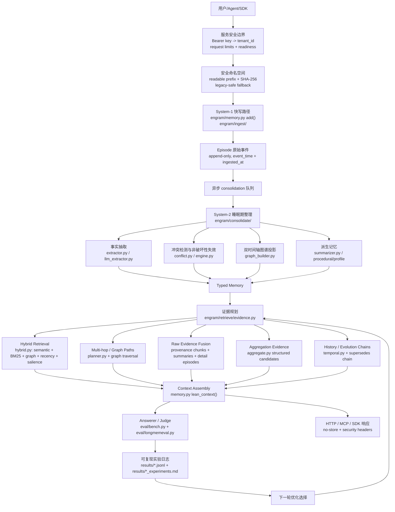

# Engram 架构优化地图

最后更新：2026-07-14

用途：这是给项目负责人和后续 AI/人类贡献者看的本地中文驾驶舱。它回答四个问题：

1. Engram 的记忆架构现在分几层。
2. 最近的 AI 改动落在架构的哪个位置。
3. 每个优化解决了什么问题，验收数据在哪里。
4. 下一步按计划应该优化哪个模块。

这不是公开营销稿。任何对外性能主张仍以 `RESULTS.md`、`README.md`、`README.zh-CN.md`
和已提交的 `results/*.jsonl` 原始日志为准。

## 如何使用这组架构文档

本文件是“驾驶舱”：看最近改了哪一层、为什么改、验收日志在哪里、下一步按计划做什么。

完整工程说明书见
[`docs/engram-full-architecture-report.zh-CN.md`](engram-full-architecture-report.zh-CN.md)。那份报告更细，
覆盖从消息写入、Episode/Fact/Graph 生成、读路径证据规划、上下文装配、服务接口到 eval harness 的全链路数据流。

建议阅读顺序：

1. 先读完整报告，掌握整个系统的数据流和模块边界。
2. 再回到本文件，看最近 AI/人类具体改了哪些架构层。
3. 做算法 PR 前检查“当前重点区域”和“验收分层规则”。
4. 合并后把改动、日志和下一步影响写回本文件；如果改了数据流或对象生命周期，也同步更新完整报告。

## 总览图



## 架构层与代码位置

| 架构层 | 责任 | 主要代码 | 当前状态 |
| --- | --- | --- | --- |
| System-1 快写 | 低延迟追加原始 Episode，保留完整上下文 | `engram/memory.py`, `engram/ingest/` | 基础可用，保持无 LLM 阻塞 |
| System-2 consolidation | 抽取 facts、构建图谱、处理冲突、生成摘要/过程记忆 | `engram/consolidate/` | 已有规则抽取、LLM 抽取、冲突失效、summary/profile/procedural |
| Typed Memory | Episode / Fact / Entity / Relation / WorkingMemory 的统一数据模型 | `engram/types.py`, `engram/store/` | 双时间轴和 provenance 是核心不变量 |
| 证据规划 | 根据问题形态选择 facts、raw chunks、timeline、aggregation、multi-hop 等证据 | `engram/retrieve/evidence.py` | 已支持 aggregation、temporal、preference、procedural、multi-hop 子查询 |
| Hybrid retrieval | dense、BM25、graph proximity、recency、salience 融合 | `engram/retrieve/hybrid.py`, `fusion.py`, `lexical.py` | 已有多项图检索开关和 ablation |
| Graph / multi-hop | 根据实体关系做 n-hop 或链式查询 | `engram/retrieve/planner.py`, `memory.py::_graph_paths_block` | 初步可用，下一阶段重点强化 |
| Raw evidence fusion | 把源会话、summary、fact provenance 合成可读上下文 | `memory.py::lean_context`, `_provenance_detail_chunks`, `_aggregation_block` | 已证明 facts-only 不够，当前持续强化 hybrid |
| Aggregation evidence | 为 count/sum/page/hour/money 问题生成结构化候选表 | `engram/retrieve/aggregate.py` | 近期重点优化区，已连续合并 3 个小改动 |
| Evaluation harness | 用统一 answerer/judge/full-context baseline 验收 | `eval/bench.py`, `eval/ablate_features.py`, `eval/longmemeval.py` | 所有算法改动必须有日志和测试 |
| 商业交付与安全边界 | 鉴权、租户路径、请求边界、健康检查、容器、发布门禁 | `engram/server/app.py`, `engram/service.py`, `Dockerfile`, `deploy/`, `scripts/check_release.py` | 0.1.0 单节点自托管，默认失败关闭；不改变算法主链 |

## 已落地优化台账

| 日期 | 优化点 | 架构位置 | 解决的问题 | 验收证据 |
| --- | --- | --- | --- | --- |
| 2026-06-30 | `explicit_preference_extraction` | System-2 facts 抽取 / Profile memory | 补齐 `I prefer/avoid/love/enjoy...` 等显式偏好事实 | `results/preference_extraction_experiments.md`, `results/preference_extraction_lme_s_context30.jsonl` |
| 2026-06-30 | `preference_object_filter` | System-2 facts 抽取 / Profile precision | 过滤 `it/these ideas/those suggestions` 等弱偏好对象，减少画像污染 | `results/preference_object_filter_experiments.md`, `results/preference_object_filter_lme_s_context30.jsonl` |
| 2026-06-30 | `preference_object_normalization` | System-2 facts 抽取 / Profile canonicalization | 把 `idea of X`、`sound of X` 规范化为更可检索的 `X` | `results/preference_object_normalization_experiments.md`, `results/preference_object_normalization_lme_s_context30.jsonl` |
| 2026-06-30 | `preference_reversal_extraction` | Conflict / supersedes chain | 抽取 `no longer like X`、`stopped enjoying X`，让旧偏好非破坏性失效 | `results/preference_reversal_extraction_experiments.md`, `results/preference_reversal_lme_s_pattern_scan.jsonl` |
| 2026-06-30 | `summary_fallback` | Derived memory / Search fallback | fact miss 时可回退到 source-backed session summary | `results/summary_fallback_experiments.md`, `results/summary_fallback_context50.jsonl` |
| 2026-06-30 | `provenance_chunk_promotion` | Raw evidence fusion | retrieved fact 的 provenance session 可提升为 full-detail raw chunk | `results/provenance_chunk_promotion_experiments.md`, `results/provenance_chunk_promotion_context50.jsonl` |
| 2026-06-30 | `procedural_memory` | Derived procedural layer | 将规则、流程、runbook 作为独立过程记忆读层 | `results/procedural_memory_experiments.md`, `results/procedural_memory_context50.jsonl` |
| 2026-06-30 | `procedural_extraction` | System-2 procedure extraction | 从显式 runbook/procedure/how-to 文本抽取过程事实，避免塞进普通 graph node | `results/procedural_extraction_experiments.md`, `results/procedural_extraction_context25.jsonl` |
| 2026-06-30 | `numeric_aggregation_candidates` | Aggregation evidence | 为金额、小时、页数生成 `AGGREGATION CANDIDATES` 结构化候选 | `results/numeric_aggregation_candidates_experiments.md`, `results/numeric_aggregation_lme_s_context30.jsonl` |
| 2026-06-30 | `aggregation_recall_expansion` | Evidence planner / Aggregation recall | 对 `how many/how much/total/sum` 生成高召回 subqueries，补回 jog/workshop/game 等证据 | `results/aggregation_recall_expansion_experiments.md`, `results/aggregation_recall_expansion_lme_s_context30.jsonl` |
| 2026-06-30 | `aggregation_constraint_filter` | Aggregation evidence / Query constraints | 当题面有月份约束时，排除局部上下文绑定到其他月份的数值候选 | `results/aggregation_constraint_filter_experiments.md`, `results/aggregation_constraint_filter_lme_s_context27.jsonl` |
| 2026-07-09 | `chain_provenance_promotion` | Chain-aware retrieval / Raw evidence fusion | previous-value 问题中，`supersedes` 链上的旧事实也能作为 provenance raw chunk promotion 的种子，优先提升旧值源会话 | `results/chain_provenance_promotion_experiments.md`, `results/chain_provenance_promotion_ablation.jsonl`, `results/chain_provenance_promotion_context_sample.jsonl` |
| 2026-07-14 | `commercial_release_0_1_0` | Service boundary / Namespace storage / Deployment / Release gate | 修复命名空间路径穿越与字符过滤碰撞；默认鉴权失败关闭；增加 request limits、liveness/readiness、非 root 容器和统一发布门禁 | `results/commercial_release_0_1_0_validation.jsonl`, `specs/003-commercial-release/` |
| 2026-08-27 | `provenance_promotion_semantic_floor` | Raw evidence fusion / chunk 预算合并 | promotion 可占满 chunk 预算，事实检索偏航时把携带答案的语义 chunk 全部挤出，single-session 塌陷为弃答（50 题 A/B：user 57%→14%）；改为 promotion 最多占一半预算、名额双向回流 | `results/readpath_ablation_report.md`（-provenance_chunk_promotion = 全场最大 +15.8pp）、`results/run50_prefix_deepseekjudge.jsonl`、`tests/test_lean.py::test_promotion_never_evicts_every_semantic_chunk` |
| 2026-08-28 | `verify_retry` 启用 + `chain_current_first` + `aggregation_pool_boost`（P1+P0-A+P0-B 合包） | 读路径弃答重试 / 证据呈现 / 抽取池 | 全 500 题验证：engram 407→**421 题**（81.4%→**84.4%**），full_context 387→394；差距 +4.0→**+5.6**；0 错误。最大赢家 temporal-reasoning 77.4%→83.5%（P1 兑现，该类原有 11 题弃答）；user 87.1%→91.4%、preference 76.7%→80.0% | `results/run500_v3_main_deepseekjudge.jsonl`（validate OK）、`results/run100_p1p0b_deepseekjudge.jsonl` |
| 2026-08-27 | `evidence_pool_main_query_majority` | bench 预整合抽取池选择 | 子查询与主查询等权轮转让弱子查询占走一半席位，主查询 #6 的 gold session 被挤出 8 席池（previous-occupation 弃答残留题根因）；改为每个子查询保底 1 席、主查询拿全部剩余 | `results/run50_round2_deepseekjudge.jsonl`（single-session 9/12 达标、增益类回吐 1 题在噪声内）、`tests/test_lean.py`（多跳小 limit 语义保留） |
| 2026-08-28 | `chain_current_first` + `aggregation_pool_boost` + 启用 `verify_retry` | 读路径证据呈现 / 聚合抽取池 / 弃答重试 | 演化链平铺表格致 answerer 选中被 supersede 的旧值（Hawaii/Chicago）；聚合池对所有题一刀切致列举漏项（4 家航司答 3 家）；verify_retry 早已实现但从未在任何跑分中启用 | `results/run100_p1p0b_deepseekjudge.jsonl`：同 100 题 engram 80→87、full_context 76→77（对照组稳定）、差距 +4→+10、零类别回退、弃答 17→15 |

## 最近 PR 对架构的影响

| PR / merge | 改动 | 影响范围 | 风险控制 |
| --- | --- | --- | --- |
| #13 `preference_reversal_extraction` | 偏好反转抽取进入默认 System-2 | 影响 preference update、supersedes chain | 配置开关 + 离线 ablation + 真实模式扫描 |
| #14 `numeric_aggregation_candidates` | 增加结构化聚合候选表 | 影响 multi-session / temporal 数值聚合 | 配置开关 + LongMemEval_S 真实 numeric context30 |
| #15 `aggregation_recall_expansion` | 聚合问题增加召回子查询 | 影响 pre-consolidation 和 lean_context 证据覆盖 | 配置开关 + 真实 numeric context30 |
| #16 `aggregation_constraint_filter` | 候选值按题面月份约束标 EXCLUDE | 影响 aggregation candidate precision | 配置开关 + 真实 numeric context27 |
| 本次 `chain_provenance_promotion` | `supersedes` 链接入 provenance chunk promotion | 影响 previous/current-vs-past 问题的 raw source evidence | 复用 `chain_evidence` 开关 + 24/24 离线 ablation + LongMemEval sample context 0 errors |
| 本次 `commercial_release_0_1_0` | 服务安全、租户落盘、部署和发布门禁收束 | 不改变 extraction/retrieval/fusion；影响所有 HTTP 自托管入口和新命名空间目录 | 危险路径/跨租户/鉴权/请求测试 + 全量 pytest + zero-setup + SDK/frontend/package/container 验收 |
| 本次 `snapshot_restore_roundtrip` | `/v1/export` 快照可直接回灌 `/v1/import`：新增 `Memory.import_snapshot()`（facts 保留双时间轴与 supersedes 链、episodes 标记已消化不重复抽取），`sniff` 识别 `engram_export_version`，import 解析失败由 500 收敛为 400 | 影响数据可携权回路（HTTP `/v1/import` 与 MCP `engram_import` 共用 service 路径）；不改变 extraction/retrieval/fusion | `tests/test_import_snapshot.py` 8 项（含链重映射、幂等、安全导出无 episodes、HTTP 400/回环）+ 全量 pytest 绿 + 线上真实快照本地回灌验证 |
| 本次 `readpath_ablation` + `semantic_floor` | 25 特性消融基建（answer-in-context 指标+噪声带）+ provenance promotion 语义保底修复 + `planner_llm_decomposition` 开关 | 影响 lean_context chunk 组装与全部读路径特性的举证方式 | 消融噪声带 ±8.3pp 显式化；23/25 特性落噪声档=后续特性合并需先过此基线 |

## 未采用 / 回滚原因

| 日期 | 方向 | 为什么回滚 | 证据 |
| --- | --- | --- | --- |
| 2026-08-27 | `entity_normalization`（图谱实体守门 + 规范名折叠），commit 185e0ac，已由 60682c5 回滚 | 守门阈值（40 字符 / 8 词 / 从句标点）是照**中文**个人记忆语料标定的，用到 LongMemEval 的**英文**实体上误杀率约 27%（"wireless blood pressure monitor from Omron" 这类正常名词短语被判为句子）；且实现是主语或宾语任一不合格就丢弃**整条边**，这些事实彻底失去 graph proximity 信号 | 同 4 题、同 rig 的 A/B：带改动 engram_lean **25%**，回滚后 **75%**（knowledge-update 与 multi-session 均 0%→100%）。日志：`results/entity_normalization_regression_ab.md` |
| 2026-08-28 | `aggregation_pool_boost`（P0-B，commit 75406be，**默认开启但证据不足，待复议**） | 100 题混合切片上 multi-session +3 题看似最大单项收益，但在 60 题**纯 multi-session** 切片上复测：engram 44→43（-1）、full_context 46→43（-3），双方均在噪声内；71.7% 低于该类全 500 基线 76.7%，远未达预设 85% 判定线。原 +3 归因不成立（100 题里 multi-session 仅 27 道，+3 本就在噪声带内）。代价真实：该类抽取成本翻倍、p50 延迟 57.8s | `results/run60_multisession_p0b_deepseekjudge.jsonl` |
| 2026-08-28 | `stronger_answerer`（假设：换强作答器可破 82.4% 天花板） | 同 60 题同上下文换 `univibe:gpt-5.6-sol`：46/60=76.7% vs doubao 47/60=78.3%（且 gpt-5.6 用的是**已改进**代码），延迟 40s→84s（p95 250s）。与「multi-session 上 lean 71.7% = full_context 71.7%」及官方 Oracle GPT-4o 82.4% 交叉印证 | **瓶颈非检索亦非作答器，是 benchmark 结构性天花板；90% 在此 rig 不可达**。副产品：推理作答器下 full_context 基线 100 题需 10h+ 跑不完，10× token 优势升级为「可行性」差异 | `results/run60_gpt56sol_answerer_probe.jsonl` |

**教训（写给后续 AI）**：只在方便取到的语料上验证算法改动、然后宣布成功，是本仓库明令禁止的做法（§4）。任何触及 read path / graph / 检索排序的改动，合并前必须跑 harness 切片对照，不能只靠单测和个人语料的"看起来更干净"。

## 当前重点区域

| 优先级 | 模块 | 为什么重要 | 下一步形态 |
| --- | --- | --- | --- |
| P0 | Raw evidence fusion hardening | Engram 已验证 facts-only 会丢细节，hybrid 是 load-bearing 发现 | 已把 chain facts 接入 provenance promotion；下一步继续把 raw chunks、facts、graph paths、summary/provenance 证据类型化，减少重复和噪声 |
| P0 | Chain-aware retrieval | knowledge-update 强项还可以转化成更稳定的 temporal/current-vs-past 能力 | 已落地 previous-value 源会话提升；下一步扩展到多段属性演化和 profile-level chain |
| P1 | Graph proximity / multi-hop | multi-session、multi-hop 是长期记忆系统最难类别，也是差异化战场 | 轻量 n-hop/PPR-style expansion，先用真实错例切片验证 |
| P1 | Temporal interval reasoning | temporal-reasoning 仍低于 full-context，需要更强的区间和 duration 证据 | 显式 start/end pair、invalid_at span、date arithmetic block |
| P2 | Runtime profiles | 让用户选择 lite/standard/graph/consolidated，并用同一 harness 报三联表 | 在 `Config`/bench 层定义可测 profile，而不是手动组合开关 |

## 验收分层规则

小改动不默认跑完整 LongMemEval_S 500。按影响范围分层：

| 改动类型 | 必跑验收 | 何时跑完整 500 |
| --- | --- | --- |
| 抽取规则、过滤规则、候选表局部增强 | 目标单测 + `eval/ablate_features.py` + 真实相关切片 context JSONL | 多个相关改动合包，或可能影响 headline |
| read path / evidence planning / fusion 权重 | 目标单测 + 离线 ablation + 真实 miss/类别切片 + latency/tokens | 影响全局检索排序、context budget、public number |
| answerer/judge prompt 或 benchmark harness | 小样本 QA + validator + full-context baseline 对照 | 基本必须跑完整 500 或明确标记为探索 |
| public README / RESULTS 数字 | `eval/validate_results.py` + raw JSONL committed | 必须有完整、可验证日志 |

## 每次算法 PR 必须更新这里

后续 AI 或人类做算法/架构改动时，至少更新本文件的这些位置：

1. 如果新增 `Config` 开关或 ablation 系统，更新“已落地优化台账”。
2. 如果改动 read path、consolidation、graph、typed memory，更新“架构层与代码位置”或“当前重点区域”。
3. 如果产生新的验收日志，更新对应 `results/*.jsonl` 和 `results/*_experiments.md` 链接。
4. 如果某个方向被证明无效，新增“未采用/回滚原因”，不要只删掉。
5. 如果准备改公开数字，先更新 `RESULTS.md`，并在本文件只写指向 evidence 的内部说明。

## 快速定位

常用入口：

- 架构目标与原则：`AGENTS.md`, `CLAUDE.md`
- 外部参考雷达：`specs/002-memory-reference-radar/research.md`
- 当前商业交付规格：`specs/003-commercial-release/`
- 中文技术报告：`specs/002-memory-reference-radar/technical-report.zh-CN.md`
- 全链路架构报告：`docs/engram-full-architecture-report.zh-CN.md`
- 算法说明：`docs/algorithm-architecture.md`
- 结果日志规则：`results/README.md`
- 公开结果：`RESULTS.md`
- 当前 headline 原始日志：`results/headline_500.jsonl`

## 当前结论

Engram 的算法架构已经从单纯 RAG 走向：

```text
lossless episodes
  + atomic bi-temporal facts
  + non-destructive conflict chains
  + graph proximity / multi-hop planning
  + source-backed summaries and procedural memory
  + raw evidence fusion
  + structured aggregation candidates
  + secure tenant namespace and self-hosted release gate
  + reproducible harness
```

下一阶段不要散打。按计划优先推进：

1. Raw evidence fusion hardening。
2. Chain-aware retrieval。
3. Graph proximity / multi-hop retriever。

每一步都必须留下可复现日志，不能只留下“感觉更好”。
