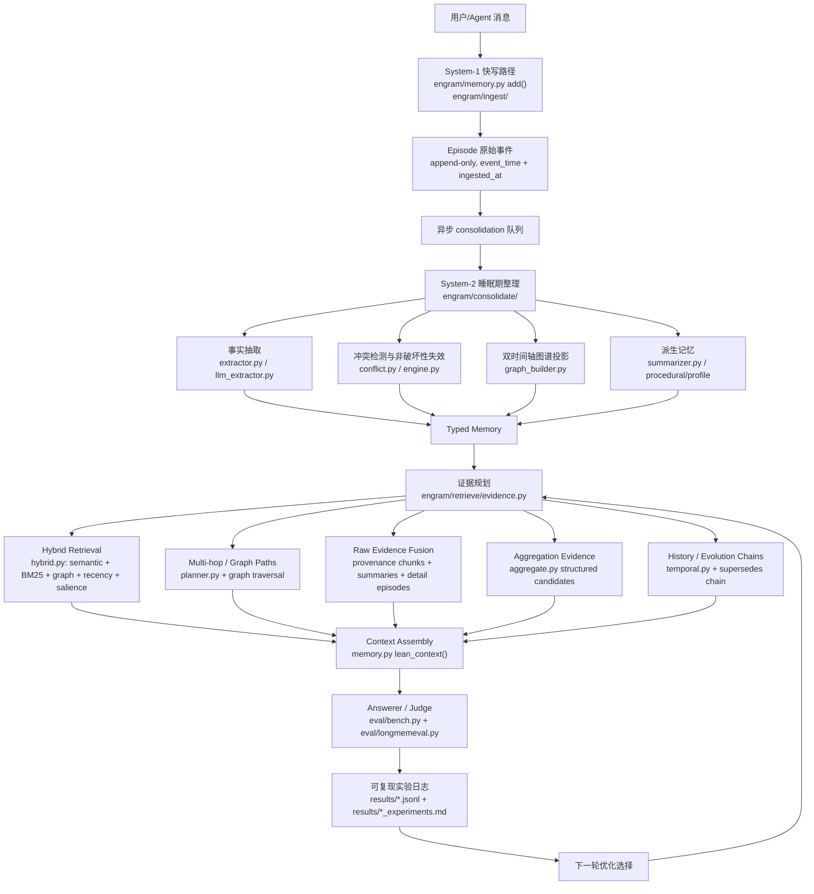

# Engram 架构优化地图

最后更新：2026-07-02

用途：这是给项目负责人和后续 AI/人类贡献者看的本地中文驾驶舱。它回答四个问题：

1. Engram 的记忆架构现在分几层。
2. 最近的 AI 改动落在架构的哪个位置。
3. 每个优化解决了什么问题，验收数据在哪里。
4. 下一步按计划应该优化哪个模块。

这不是公开营销稿。任何对外性能主张仍以 `RESULTS.md`、`README.md`、`README.zh-CN.md`
和已提交的 `results/*.jsonl` 原始日志为准。

## 总览图



## 架构层与代码位置

| 架构层 | 责任 | 主要代码 | 当前状态 |
| --- | --- | --- | --- |
| System-1 快写 | 低延迟追加原始 Episode，保留完整上下文 | `engram/memory.py`, `engram/ingest/` | 基础可用，保持无 LLM 阻塞 |
| System-2 consolidation | 抽取 facts、构建图谱、处理冲突、生成摘要/过程记忆 | `engram/consolidate/` | 已有规则抽取、LLM 抽取、冲突失效、summary/profile/procedural |
| Typed Memory | Episode / Fact / Entity / Relation / WorkingMemory 的统一数据模型 | `engram/types.py`, `engram/store/` | 双时间轴和 provenance 是核心不变量 |
| 证据规划 | 根据问题形态选择 facts、raw chunks、timeline、aggregation、multi-hop 等证据 | `engram/retrieve/evidence.py` | 已支持 aggregation、temporal、preference、procedural、multi-hop 子查询 |
| Hybrid retrieval | dense、BM25、graph proximity、recency、salience 融合 | `engram/retrieve/hybrid.py`, `fusion.py`, `lexical.py` | 已有多项图检索开关和 ablation |
| Graph / multi-hop | 根据实体关系做 n-hop 或链式查询 | `engram/retrieve/planner.py`, `memory.py::_graph_paths_block` | 初步可用，下一阶段重点强化 |
| Raw evidence fusion | 把源会话、summary、fact provenance 合成可读上下文 | `memory.py::lean_context`, `_provenance_detail_chunks`, `_aggregation_block` | 已证明 facts-only 不够，当前持续强化 hybrid |
| Aggregation evidence | 为 count/sum/page/hour/money 问题生成结构化候选表 | `engram/retrieve/aggregate.py` | 近期重点优化区，已连续合并 3 个小改动 |
| Evaluation harness | 用统一 answerer/judge/full-context baseline 验收 | `eval/bench.py`, `eval/ablate_features.py`, `eval/longmemeval.py` | 所有算法改动必须有日志和测试 |

## 已落地优化台账

| 日期 | 优化点 | 架构位置 | 解决的问题 | 验收证据 |
| --- | --- | --- | --- | --- |
| 2026-06-30 | `explicit_preference_extraction` | System-2 facts 抽取 / Profile memory | 补齐 `I prefer/avoid/love/enjoy...` 等显式偏好事实 | `results/preference_extraction_experiments.md`, `results/preference_extraction_lme_s_context30.jsonl` |
| 2026-06-30 | `preference_object_filter` | System-2 facts 抽取 / Profile precision | 过滤 `it/these ideas/those suggestions` 等弱偏好对象，减少画像污染 | `results/preference_object_filter_experiments.md`, `results/preference_object_filter_lme_s_context30.jsonl` |
| 2026-06-30 | `preference_object_normalization` | System-2 facts 抽取 / Profile canonicalization | 把 `idea of X`、`sound of X` 规范化为更可检索的 `X` | `results/preference_object_normalization_experiments.md`, `results/preference_object_normalization_lme_s_context30.jsonl` |
| 2026-06-30 | `preference_reversal_extraction` | Conflict / supersedes chain | 抽取 `no longer like X`、`stopped enjoying X`，让旧偏好非破坏性失效 | `results/preference_reversal_extraction_experiments.md`, `results/preference_reversal_lme_s_pattern_scan.jsonl` |
| 2026-06-30 | `summary_fallback` | Derived memory / Search fallback | fact miss 时可回退到 source-backed session summary | `results/summary_fallback_experiments.md`, `results/summary_fallback_context50.jsonl` |
| 2026-06-30 | `provenance_chunk_promotion` | Raw evidence fusion | retrieved fact 的 provenance session 可提升为 full-detail raw chunk | `results/provenance_chunk_promotion_experiments.md`, `results/provenance_chunk_promotion_context50.jsonl` |
| 2026-06-30 | `procedural_memory` | Derived procedural layer | 将规则、流程、runbook 作为独立过程记忆读层 | `results/procedural_memory_experiments.md`, `results/procedural_memory_context50.jsonl` |
| 2026-06-30 | `procedural_extraction` | System-2 procedure extraction | 从显式 runbook/procedure/how-to 文本抽取过程事实，避免塞进普通 graph node | `results/procedural_extraction_experiments.md`, `results/procedural_extraction_context25.jsonl` |
| 2026-06-30 | `numeric_aggregation_candidates` | Aggregation evidence | 为金额、小时、页数生成 `AGGREGATION CANDIDATES` 结构化候选 | `results/numeric_aggregation_candidates_experiments.md`, `results/numeric_aggregation_lme_s_context30.jsonl` |
| 2026-06-30 | `aggregation_recall_expansion` | Evidence planner / Aggregation recall | 对 `how many/how much/total/sum` 生成高召回 subqueries，补回 jog/workshop/game 等证据 | `results/aggregation_recall_expansion_experiments.md`, `results/aggregation_recall_expansion_lme_s_context30.jsonl` |
| 2026-06-30 | `aggregation_constraint_filter` | Aggregation evidence / Query constraints | 当题面有月份约束时，排除局部上下文绑定到其他月份的数值候选 | `results/aggregation_constraint_filter_experiments.md`, `results/aggregation_constraint_filter_lme_s_context27.jsonl` |

## 最近 PR 对架构的影响

| PR / merge | 改动 | 影响范围 | 风险控制 |
| --- | --- | --- | --- |
| #13 `preference_reversal_extraction` | 偏好反转抽取进入默认 System-2 | 影响 preference update、supersedes chain | 配置开关 + 离线 ablation + 真实模式扫描 |
| #14 `numeric_aggregation_candidates` | 增加结构化聚合候选表 | 影响 multi-session / temporal 数值聚合 | 配置开关 + LongMemEval_S 真实 numeric context30 |
| #15 `aggregation_recall_expansion` | 聚合问题增加召回子查询 | 影响 pre-consolidation 和 lean_context 证据覆盖 | 配置开关 + 真实 numeric context30 |
| #16 `aggregation_constraint_filter` | 候选值按题面月份约束标 EXCLUDE | 影响 aggregation candidate precision | 配置开关 + 真实 numeric context27 |

## 当前重点区域

| 优先级 | 模块 | 为什么重要 | 下一步形态 |
| --- | --- | --- | --- |
| P0 | Raw evidence fusion hardening | Engram 已验证 facts-only 会丢细节，hybrid 是 load-bearing 发现 | 把 raw chunks、facts、graph paths、summary/provenance 证据类型化，减少重复和噪声 |
| P0 | Chain-aware retrieval | knowledge-update 强项还可以转化成更稳定的 temporal/current-vs-past 能力 | 命中 fact/profile 时按预算展开 `supersedes` 链和来源 |
| P1 | Graph proximity / multi-hop | multi-session、multi-hop 是长期记忆系统最难类别，也是差异化战场 | 轻量 n-hop/PPR-style expansion，先用真实错例切片验证 |
| P1 | Temporal interval reasoning | temporal-reasoning 仍低于 full-context，需要更强的区间和 duration 证据 | 显式 start/end pair、invalid_at span、date arithmetic block |
| P2 | Runtime profiles | 让用户选择 lite/standard/graph/consolidated，并用同一 harness 报三联表 | 在 `Config`/bench 层定义可测 profile，而不是手动组合开关 |

## 验收分层规则

小改动不默认跑完整 LongMemEval_S 500。按影响范围分层：

| 改动类型 | 必跑验收 | 何时跑完整 500 |
| --- | --- | --- |
| 抽取规则、过滤规则、候选表局部增强 | 目标单测 + `eval/ablate_features.py` + 真实相关切片 context JSONL | 多个相关改动合包，或可能影响 headline |
| read path / evidence planning / fusion 权重 | 目标单测 + 离线 ablation + 真实 miss/类别切片 + latency/tokens | 影响全局检索排序、context budget、public number |
| answerer/judge prompt 或 benchmark harness | 小样本 QA + validator + full-context baseline 对照 | 基本必须跑完整 500 或明确标记为探索 |
| public README / RESULTS 数字 | `eval/validate_results.py` + raw JSONL committed | 必须有完整、可验证日志 |

## 每次算法 PR 必须更新这里

后续 AI 或人类做算法/架构改动时，至少更新本文件的这些位置：

1. 如果新增 `Config` 开关或 ablation 系统，更新“已落地优化台账”。
2. 如果改动 read path、consolidation、graph、typed memory，更新“架构层与代码位置”或“当前重点区域”。
3. 如果产生新的验收日志，更新对应 `results/*.jsonl` 和 `results/*_experiments.md` 链接。
4. 如果某个方向被证明无效，新增“未采用/回滚原因”，不要只删掉。
5. 如果准备改公开数字，先更新 `RESULTS.md`，并在本文件只写指向 evidence 的内部说明。

## 快速定位

常用入口：

- 架构目标与原则：`AGENTS.md`, `CLAUDE.md`
- 外部参考雷达：`specs/002-memory-reference-radar/research.md`
- 中文技术报告：`specs/002-memory-reference-radar/technical-report.zh-CN.md`
- 算法说明：`docs/algorithm-architecture.md`
- 结果日志规则：`results/README.md`
- 公开结果：`RESULTS.md`
- 当前 headline 原始日志：`results/headline_500.jsonl`

## 当前结论

Engram 的算法架构已经从单纯 RAG 走向：

```text
lossless episodes
  + atomic bi-temporal facts
  + non-destructive conflict chains
  + graph proximity / multi-hop planning
  + source-backed summaries and procedural memory
  + raw evidence fusion
  + structured aggregation candidates
  + reproducible harness
```

下一阶段不要散打。按计划优先推进：

1. Raw evidence fusion hardening。
2. Chain-aware retrieval。
3. Graph proximity / multi-hop retriever。

每一步都必须留下可复现日志，不能只留下“感觉更好”。
