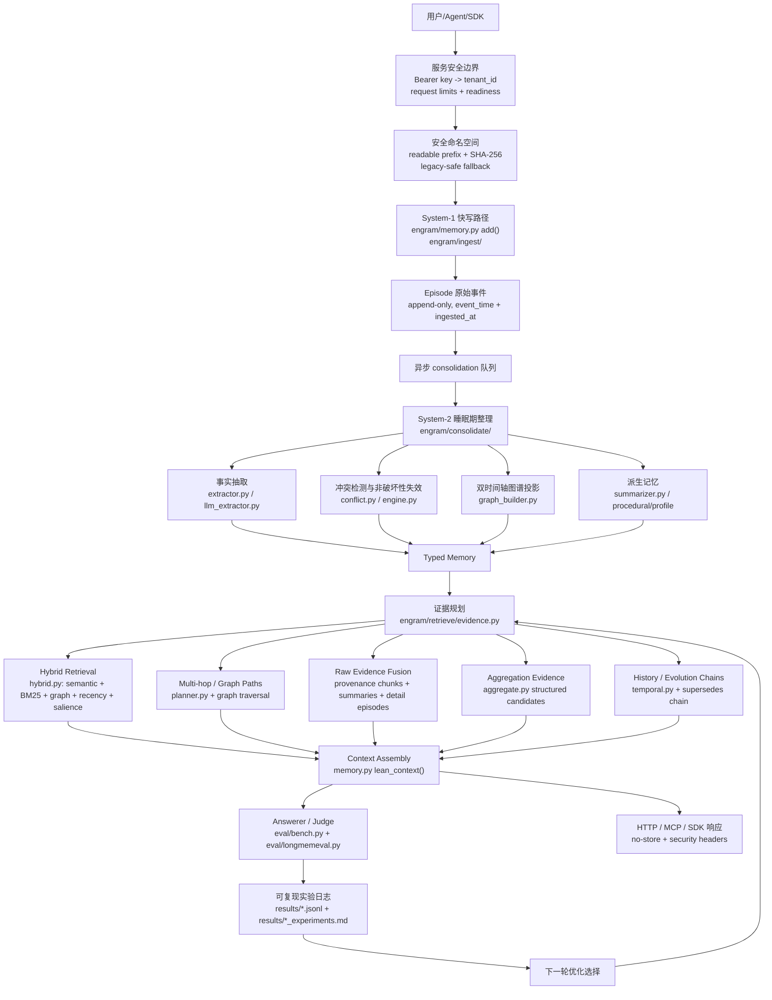

# Engram 架构优化地图

最后更新：2026-08-12

用途：这是给项目负责人和后续 AI/人类贡献者看的本地中文驾驶舱。它回答四个问题：

1. Engram 的记忆架构现在分几层。
2. 最近的 AI 改动落在架构的哪个位置。
3. 每个优化解决了什么问题，验收数据在哪里。
4. 下一步按计划应该优化哪个模块。

这不是公开营销稿。任何对外性能主张仍以 `RESULTS.md`、`README.md`、`README.zh-CN.md`
和已提交的 `results/*.jsonl` 原始日志为准。

## 如何使用这组架构文档

本文件是“驾驶舱”：看最近改了哪一层、为什么改、验收日志在哪里、下一步按计划做什么。

完整工程说明书见
[`docs/engram-full-architecture-report.zh-CN.md`](engram-full-architecture-report.zh-CN.md)。那份报告更细，
覆盖从消息写入、Episode/Fact/Graph 生成、读路径证据规划、上下文装配、服务接口到 eval harness 的全链路数据流。

建议阅读顺序：

1. 先读完整报告，掌握整个系统的数据流和模块边界。
2. 再回到本文件，看最近 AI/人类具体改了哪些架构层。
3. 做算法 PR 前检查“当前重点区域”和“验收分层规则”。
4. 合并后把改动、日志和下一步影响写回本文件；如果改了数据流或对象生命周期，也同步更新完整报告。

## 总览图



## 架构层与代码位置

| 架构层 | 责任 | 主要代码 | 当前状态 |
| --- | --- | --- | --- |
| System-1 快写 | 低延迟追加原始 Episode，保留完整上下文 | `engram/memory.py`, `engram/ingest/` | 基础可用，保持无 LLM 阻塞 |
| System-2 consolidation | 抽取 facts、构建图谱、处理冲突、生成摘要/过程记忆 | `engram/consolidate/` | 已有规则抽取、LLM 抽取、冲突失效、summary/profile/procedural |
| Typed Memory | Episode / Fact / Entity / Relation / WorkingMemory 的统一数据模型 | `engram/types.py`, `engram/store/` | 双时间轴和 provenance 是核心不变量 |
| 证据规划 | 根据问题形态选择 facts、raw chunks、timeline、aggregation、multi-hop 等证据 | `engram/retrieve/evidence.py` | 已支持 aggregation、temporal、preference、procedural、multi-hop 子查询 |
| Hybrid retrieval | dense、BM25、graph proximity、recency、salience 融合 | `engram/retrieve/hybrid.py`, `fusion.py`, `lexical.py` | 已有多项图检索开关和 ablation |
| Graph / multi-hop | 根据实体关系做 n-hop 或链式查询 | `engram/retrieve/planner.py`, `memory.py::_graph_paths_block` | 初步可用，下一阶段重点强化 |
| Raw evidence fusion | 把源会话、summary、fact provenance 合成可读上下文 | `memory.py::lean_context`, `_provenance_detail_chunks`, `_aggregation_block` | 已证明 facts-only 不够，当前持续强化 hybrid |
| Aggregation evidence | 为 count/sum/page/hour/money 问题生成结构化候选表 | `engram/retrieve/aggregate.py` | 近期重点优化区，已连续合并 3 个小改动 |
| Evaluation harness | 用统一 answerer/judge/full-context baseline 验收 | `eval/bench.py`, `eval/ablate_features.py`, `eval/longmemeval.py` | 所有算法改动必须有日志和测试 |
| 商业交付与安全边界 | 鉴权、租户路径、请求边界、健康检查、容器、发布门禁 | `engram/server/app.py`, `engram/service.py`, `Dockerfile`, `deploy/`, `scripts/check_release.py` | 0.1.0 单节点自托管，默认失败关闭；不改变算法主链 |

## 已落地优化台账

| 日期 | 优化点 | 架构位置 | 解决的问题 | 验收证据 |
| --- | --- | --- | --- | --- |
| 2026-06-30 | `explicit_preference_extraction` | System-2 facts 抽取 / Profile memory | 补齐 `I prefer/avoid/love/enjoy...` 等显式偏好事实 | `results/preference_extraction_experiments.md`, `results/preference_extraction_lme_s_context30.jsonl` |
| 2026-06-30 | `preference_object_filter` | System-2 facts 抽取 / Profile precision | 过滤 `it/these ideas/those suggestions` 等弱偏好对象，减少画像污染 | `results/preference_object_filter_experiments.md`, `results/preference_object_filter_lme_s_context30.jsonl` |
| 2026-06-30 | `preference_object_normalization` | System-2 facts 抽取 / Profile canonicalization | 把 `idea of X`、`sound of X` 规范化为更可检索的 `X` | `results/preference_object_normalization_experiments.md`, `results/preference_object_normalization_lme_s_context30.jsonl` |
| 2026-06-30 | `preference_reversal_extraction` | Conflict / supersedes chain | 抽取 `no longer like X`、`stopped enjoying X`，让旧偏好非破坏性失效 | `results/preference_reversal_extraction_experiments.md`, `results/preference_reversal_lme_s_pattern_scan.jsonl` |
| 2026-06-30 | `summary_fallback` | Derived memory / Search fallback | fact miss 时可回退到 source-backed session summary | `results/summary_fallback_experiments.md`, `results/summary_fallback_context50.jsonl` |
| 2026-06-30 | `provenance_chunk_promotion` | Raw evidence fusion | retrieved fact 的 provenance session 可提升为 full-detail raw chunk | `results/provenance_chunk_promotion_experiments.md`, `results/provenance_chunk_promotion_context50.jsonl` |
| 2026-06-30 | `procedural_memory` | Derived procedural layer | 将规则、流程、runbook 作为独立过程记忆读层 | `results/procedural_memory_experiments.md`, `results/procedural_memory_context50.jsonl` |
| 2026-06-30 | `procedural_extraction` | System-2 procedure extraction | 从显式 runbook/procedure/how-to 文本抽取过程事实，避免塞进普通 graph node | `results/procedural_extraction_experiments.md`, `results/procedural_extraction_context25.jsonl` |
| 2026-06-30 | `numeric_aggregation_candidates` | Aggregation evidence | 为金额、小时、页数生成 `AGGREGATION CANDIDATES` 结构化候选 | `results/numeric_aggregation_candidates_experiments.md`, `results/numeric_aggregation_lme_s_context30.jsonl` |
| 2026-06-30 | `aggregation_recall_expansion` | Evidence planner / Aggregation recall | 对 `how many/how much/total/sum` 生成高召回 subqueries，补回 jog/workshop/game 等证据 | `results/aggregation_recall_expansion_experiments.md`, `results/aggregation_recall_expansion_lme_s_context30.jsonl` |
| 2026-06-30 | `aggregation_constraint_filter` | Aggregation evidence / Query constraints | 当题面有月份约束时，排除局部上下文绑定到其他月份的数值候选 | `results/aggregation_constraint_filter_experiments.md`, `results/aggregation_constraint_filter_lme_s_context27.jsonl` |
| 2026-07-09 | `chain_provenance_promotion` | Chain-aware retrieval / Raw evidence fusion | previous-value 问题中，`supersedes` 链上的旧事实也能作为 provenance raw chunk promotion 的种子，优先提升旧值源会话 | `results/chain_provenance_promotion_experiments.md`, `results/chain_provenance_promotion_ablation.jsonl`, `results/chain_provenance_promotion_context_sample.jsonl` |
| 2026-07-14 | `commercial_release_0_1_0` | Service boundary / Namespace storage / Deployment / Release gate | 修复命名空间路径穿越与字符过滤碰撞；默认鉴权失败关闭；增加 request limits、liveness/readiness、非 root 容器和统一发布门禁 | `results/commercial_release_0_1_0_validation.jsonl`, `specs/003-commercial-release/` |
| 2026-08-16 | `bounded_candidates`（默认关） | Read path / Hybrid retrieval / Store 索引层 | 读路径此前对每次查询全量扫描存活事实（`hybrid.py` 的 `fact_store.values()`），实测为 O(n)：每千条事实耗时恒定 ~17–20ms，10000 条时单查询 177ms，已超宪章 <100ms 目标。新增倒排/槽位索引（`engram/store/indexed.py`）+ 存储装饰器，让融合阶段只对有界候选集打分 | `results/bounded_candidates_scaling.md`，`eval/scaling.py`，`tests/test_bounded_candidates.py`（8 测试，含逐位等价性） |
| 2026-08-16 | `layered_proxy_wiring`（opt-in） | 接入层 / OpenAI 兼容代理 | 代理此前把整个检索切片放进 system prompt，导致 system 块每轮都变、provider 的 prompt-cache 一个前缀都匹配不上（这也推翻了 `layered.py` 原docstring「调用方放进 user turn」的前提）。改为 stable 半置于 system 最前、本轮证据移入 user turn，system 块跨轮字节相同（去重数 5→1），稳定前缀 61 tokens。响应新增 `engram.cacheable_tokens_est` 让调用方不必猜。**同内容对比下 token −1.1%（中性）**，收益是「system 块不再每轮失效」这个此前不存在的性质，是否值得取决于 provider 的 cache-read 定价，本测量不计价格 | `results/layered_context_tokens.md`，`tests/test_layered_context.py`（+4 测试，含前缀稳定性与「拆分不丢证据」） |
| 2026-08-16 | `defence_counters` | 服务可观测层 | 限流、幂等、密钥解析三层防护此前是黑盒：运维无法判断它们是否在生效。`/metrics` 新增 `rate_limited` / `idempotent_replays` / `auth_rejected` / `auth_misconfigured` 四个聚合计数。**刻意不按租户分桶**——该端点不鉴权，分桶会暴露有哪些租户存在。埋点统一走 `_count()`，其中吞掉自身异常：埋点不得改变请求行为，而在异常处理器里构造服务失败会把一个精确的 401 换成笼统的 500，恰好丢掉计数本来要支撑的诊断 | `tests/test_metrics.py`（+4 测试，含首次调用不算重放、以及计数载荷不含租户名的隐私断言） |
| 2026-08-16 | `python_sdk` | 接入层 / 客户端 | 主干只有 TS 客户端，而 Agent 生态是 Python 优先的。新增 `engram/client.py`：零运行时依赖（stdlib urllib）、方法名对齐 TS SDK 避免两者漂移、覆盖今日全部端点（含新增的 `/metrics`、`/v1/admin/keys`、`Idempotency-Key`）。**transport 契约改为返回 `(status, headers, body)`**——最初只返回 `(status, body)`，导致 `EngramError.retry_after` 永远为 `None`，因为 `Retry-After` 在响应头里；发一个永远为空的字段比不发更糟 | `tests/test_client.py`（17 测试，全部通过可注入 transport 打到**真实 app**而非 mock——mock 只能证明 SDK 自洽，而客户端库的典型失效恰恰是与服务端漂移） |
| 2026-08-16 | `self_serve_api_keys` | 服务边界 / 鉴权（多租户） | 此前只能靠静态 `ENGRAM_API_KEYS`（改环境变量+重启）或开放模式。新增 `engram/server/keys.py`：运行时签发 `sk-engram-*`、**只落盘 SHA-256 摘要**（泄露的密钥文件不可重放）、立即吊销、可列出；`/v1/admin/keys` 由独立的 `ENGRAM_ADMIN_TOKEN` 把守，未设置即 403（开放模式部署不会被路人签发租户）。解析顺序为「运行时密钥 → 静态映射 → 开放模式」，密钥库不可读时返回 503 而非放行。**修正了保全版的一处数据丢失风险**：原实现在密钥文件损坏时静默以空状态启动，随后任一次签发都会 `_save()` 覆盖该文件、永久销毁全部已签发记录；改为拒绝启动并保持文件原样。另修掉锁外改 `last_used_at` 的数据竞争，并把密钥文件权限收紧为仅属主可读写 | `tests/test_api_keys.py`（20 测试，含失败关闭、吊销后拒绝、损坏文件不被覆盖、跨租户隔离用 bob 自己的密钥走 API 验证） |
| 2026-08-16 | `rate_limit` + `idempotency_key` | 服务边界 / 多租户防护 | 公开记忆 API 无限流等于开放滥用（LLM 路径接上后还是开放账单）；客户端超时重试会把同一 episode 存两遍并付两遍固化成本——首次请求其实成功了，丢的只是响应。新增 `engram/server/limits.py`：按租户滑动窗口限流（`ENGRAM_RATE_LIMIT_PER_MIN`，默认 0=关闭）+ `Idempotency-Key` 重放缓存（按「租户+key」隔离）。限流放在 `auth()` 里——那是每个受保护路由识别租户的必经点，新增端点不会漏配。**修正了保全版的一处泄漏**：租户命中表是 defaultdict 且从不回收，租户多了会无界增长，改为窗口清空即回收 | `tests/test_rate_limit_idempotency.py`（19 测试，含「被拒请求不得延长自身窗口」「缓存响应不得跨租户」「限流期间 /health 与 /metrics 仍可达」） |
| 2026-08-16 | `layered_context`（默认不接主路径） | Read path / 上下文装配（Bet A 的 tokens+latency 维度） | `lean_context` 拍平成单串放进 user turn，多轮会话每轮重发不变的画像与指引。新增 `engram/retrieve/layered.py` 把上下文拆成查询无关的 stable 半（进 system prompt，可被 provider prompt-cache 复用）与每轮变化的 dynamic 半。证据完全相同，准确率按构造不变。**实测收益温和且有下限**：长会话 +5%～+9%，5 轮以下净亏；导航图默认关闭（约 20 轮才回本） | `results/layered_context_tokens.md`，`tests/test_layered_context.py`（14 测试，含"stable 半跨查询字节相同"这一缓存前提，以及"拆分不丢证据"的守卫） |
| 2026-08-16 | `live_service_metrics` | 服务可观测层（Bet D 应用于线上） | 架构写明写路径 <50ms、读路径 <100ms，但服务侧没有任何实时观测，这两个目标一直是断言而非测量；token 节省比也只有离线基准，从未反映真实服务过的量。新增 `engram/metrics.py`（纯 stdlib、滑动窗口 p50/p95、单调计数器）+ `GET /metrics`，在 `remember`/`recall`/`import`/`close_session` 四个操作上埋点，并计数 `remember_degraded`（降级写入仍返回成功，不计数就完全不可见）。**修正了保全版的一个真实缺陷**：`savings_ratio` 原本用全部 context 总量做分母、只有部分调用的 full 总量做分子，两者样本集不同会系统性低估节省比；改为只在两侧都测量的配对样本上计算 | `tests/test_metrics.py`（11 测试，含配对样本回归、`/metrics` 无鉴权可访问、以及断言载荷不含租户名与内容的隐私边界测试） |
| 2026-08-16 | `entity_anchor_index` | Read path / 图锚定 + Graph store 索引层（Bet E） | `query_entity_ids()` 每次检索遍历全部实体做名称/别名匹配。`InMemoryGraphStore` 改为维护 `(user_id, 词干) -> 实体 id` 倒排索引，只查询查询自身的词。实体名有区分度时 10000 实体下 **4055x**，且耗时恒定 0.004ms 与库大小无关。**边界**：实体名共享高频词时倒排表长度等于全库、索引退化为扫描（仅 1.4x），真实人名/地名/机构名不属于该情形 | `results/entity_anchor_index.md`，`tests/test_entity_index.py`（7 测试；等价性用真实 retriever 对比"带索引"与"去掉索引查找"两条路径，要求结果完全一致） |
| 2026-08-16 | `segment_level_rerank` | Read path / 会话重排（Bet A） | cross-encoder 只读 ~512 token，而 LongMemEval 的 session 约 2000 token。`retrieve_episodes()` 把整篇 `ep.content` 交给 reranker，模型不会报错，只会**静默地只对开头四分之一打分**——答案落在后半段的 session 因此被判为无关（该回归此前已在 `lean_context` 的注释里被记录为已知问题，但会话路径一直没修，且**完全没有测试覆盖**）。改为按段落/句子边界切成 ≤`rerank_segment_words`（默认 300 词）的片段分别打分，每篇取其**最佳片段**得分（不是平均——长会话之所以该被检出，正是因为其中某一段命中） | `tests/test_rerank_segments.py`（13 测试，含先断言"整篇打分必然选错"再断言"分段打分选对"的回归用例，以及此前无人覆盖的 `Memory.retrieve_episodes` 接线） |
| 2026-08-16 | `exclusion_early_out` + `lance_key_pushdown` | Read path / 图排除区 + Store 按键读取 | 每次检索都经 `query_entity_ids()` → `graph_excluded_entity_ids()`，后者对每个实体名跑两遍正则，而多数查询无否定词。改为先用提示词必要条件判定，5000 实体时无否定词查询从 509ms 降到 0.0009ms。同时 `LanceDBVectorStore.get()` 改用纯过滤查询，不再全表物化后线性找 key | `results/bounded_candidates_scaling.md`，`tests/test_exclusion_shortcut.py`（含逐前缀验证的正则不变量，已抓到一个中文实体名下的静默漏排除缺陷），`tests/test_lancedb_tenant_filter.py` |
| 2026-08-16 | `tenant_filter_pushdown` | Store / 向量检索索引层（Bet E） | 多租户检索每次都必须按 user 过滤，而唯一的表达方式是 Python 谓词——后端看不进去，只能先物化全表再排序。于是"接了 LanceDB"从未换来任何 ANN 收益。现把 `user_id` 从 JSON payload 提升为真实列，`VectorStore.search()` 增加声明式 `user_id=` 参数，LanceDB 走 `prefilter=True` 在索引内收窄。40000 行时 **165x**，且延迟基本随行数不变 | `results/bounded_candidates_scaling.md`，`tests/test_lancedb_tenant_filter.py`（5 测试，含专门证伪"后置过滤"的用例 + 旧 schema 兼容） |
| 2026-08-12 | `cross_instance_portability` | Connectors / Memory facade / Service import 路由 / HTTP `/v1/import` | 导出无法导回（POST 导出 JSON 得到 500）——补上原生 `engram` 导入格式：事实保留原 id/双时间戳/supersedes 链/provenance，目标端用本地 embedder 重嵌入（即官方换 embedder 迁移路径），按 id 幂等；`/v1/import` 对坏 payload 返回 400 | `tests/test_cross_account_portability.py`, `tests/test_server_import_export.py`（工程验收，非算法实验） |
| 2026-08-12 | `mcp_http_bearer_gate` | MCP streamable-HTTP 传输边界 | MCP HTTP 模式此前无任何鉴权，仅靠默认 127.0.0.1；新增 `--http-token`/`ENGRAM_MCP_HTTP_TOKEN` Bearer 门，非回环绑定无 token 时启动即拒绝（失败关闭，与 REST 的 `ENGRAM_API_KEYS` 同哲学） | `tests/test_mcp_http_auth.py` |
| 2026-08-12 | `engram_storage_env` + 一致性修复 | Service 配置边界 / stats / import CLI | 服务器此前永远 `storage="memory"`（无环境变量可选 LanceDB）；新增 `ENGRAM_STORAGE`（非法值失败关闭）。`/v1/stats` 改按 canonical 身份过滤（与其它读路径一致）；import CLI 本地模式改走 `MemoryService`，目录命名与服务端统一 | `tests/test_cross_account_portability.py` |

## 最近 PR 对架构的影响

| PR / merge | 改动 | 影响范围 | 风险控制 |
| --- | --- | --- | --- |
| #13 `preference_reversal_extraction` | 偏好反转抽取进入默认 System-2 | 影响 preference update、supersedes chain | 配置开关 + 离线 ablation + 真实模式扫描 |
| #14 `numeric_aggregation_candidates` | 增加结构化聚合候选表 | 影响 multi-session / temporal 数值聚合 | 配置开关 + LongMemEval_S 真实 numeric context30 |
| #15 `aggregation_recall_expansion` | 聚合问题增加召回子查询 | 影响 pre-consolidation 和 lean_context 证据覆盖 | 配置开关 + 真实 numeric context30 |
| #16 `aggregation_constraint_filter` | 候选值按题面月份约束标 EXCLUDE | 影响 aggregation candidate precision | 配置开关 + 真实 numeric context27 |
| 本次 `chain_provenance_promotion` | `supersedes` 链接入 provenance chunk promotion | 影响 previous/current-vs-past 问题的 raw source evidence | 复用 `chain_evidence` 开关 + 24/24 离线 ablation + LongMemEval sample context 0 errors |
| 本次 `commercial_release_0_1_0` | 服务安全、租户落盘、部署和发布门禁收束 | 不改变 extraction/retrieval/fusion；影响所有 HTTP 自托管入口和新命名空间目录 | 危险路径/跨租户/鉴权/请求测试 + 全量 pytest + zero-setup + SDK/frontend/package/container 验收 |

## 算法迭代的前置条件（先读这条再决定跑什么）

`eval/significance.py` 量出了这套评测的分辨率：**500 题、22% 分歧率下，最小可检测增益 2.94 点**。

- 公开 headline（`engram_lean` 83.6% vs `full_context` 73.2%）**显著**：p<0.0001，
  95% 区间 [+6.4, +14.4]，81:29 的分歧比。声称成立。
- 但**到榜首的 +1.6 差距低于分辨率**——不是「还没追上」，是这套测量判定不了真假。
- 因此：**只做期望增益 > 3 点的改动**，并优先攻占比最大的弱类别 multi-session（121 题 70.2%）与
  temporal-reasoning（127 题 70.9%，合计 248/500）；单类别 +10 点才换来整体约 +2.5 点。
- **两个大类的失效形态不同，需要两种机制**（`results/error_modes_headline.md`）：
  multi-session 的错 **76% 是数值**（计数/聚合），temporal 的错 **63% 是弃答**（该答却说没有）。
  且数值误差**双向**（低估 16 / 高估 12），排除了"证据召回不足"这个解释——是计数本身失败。
- 单点机制打单个类别恰好卡在可测边缘（multi-session 数值 19 题 = +3.8；temporal 弃答 15 题 = +3.0）。
  **必须两条线一起做**（合计 34 题 = +6.8 点）才是舒服高于地板的实验。
- **瓶颈在上下文装配，不在检索**（`results/retrieval_diagnosis.md`）：检索层召回率 86%，
  但 58 道多会话错题里只有 14 道（24%）的答案会话**全部**进了全文窗口，平均覆盖率仅 48%。
  证据取回来了，装配时按相关度只渲染前 2 个全文、其余压成摘要——而计数需要的是**覆盖**不是**排序**。
  这解释了双向误差：压成摘要→漏数（低估 16），摘要表述模糊→重复计入（高估 12）。
- **唯一有证据支撑的机制方向**：对聚合类查询让全文窗口覆盖证据集合。触发条件已存在且正常工作
  （`plan_evidence().aggregation` 在计数错题上触发率 90%，对照答对题 79%），缺的是让它影响渲染
  多少全文块。与"无差别扩 `--chunks` 到 15"的区别是只在聚合类查询（约占 20%）上扩，成本不外溢。
  规模：44 道题缺完整覆盖，转化率一半即 +4.4 点，高于地板。**前提待离线证伪**：完整覆盖是否真能
  让这些题答对——已知 60 道题在全文条件下仍失败，转化率不是 1。
- 想分辨更小的增益，只能加分辨率（更多题目 / 更确定性的 answerer），那是测量投资，
  但它是所有算法投资的前置条件。

证据与复现命令：`results/significance_headline.md`。

## 当前重点区域

| 优先级 | 模块 | 为什么重要 | 下一步形态 |
| --- | --- | --- | --- |
| P0 | Raw evidence fusion hardening | Engram 已验证 facts-only 会丢细节，hybrid 是 load-bearing 发现 | 已把 chain facts 接入 provenance promotion；下一步继续把 raw chunks、facts、graph paths、summary/provenance 证据类型化，减少重复和噪声 |
| P0 | Chain-aware retrieval | knowledge-update 强项还可以转化成更稳定的 temporal/current-vs-past 能力 | 已落地 previous-value 源会话提升；下一步扩展到多段属性演化和 profile-level chain |
| ~~P1~~ **降级** | ~~Graph proximity / multi-hop（提升召回）~~ | **已被错例证据降级**：82 道错题里 79 道（96%）答案会话本来就被检索到了，其中 73% 还在前 2 名以全文展示。任何"多检索一点"的机制上限是 3 题 = +0.6 点，低于 2.94 分辨率地板——做了也测不出来 | 证据：`results/retrieval_diagnosis.md`。图能力本身仍可用于证据**组织**（如跨会话可数项的结构化），但不要以提升召回为目标 |
| P1 | Temporal interval reasoning | temporal-reasoning 仍低于 full-context，需要更强的区间和 duration 证据 | 显式 start/end pair、invalid_at span、date arithmetic block |
| P2 | Runtime profiles | 让用户选择 lite/standard/graph/consolidated，并用同一 harness 报三联表 | 在 `Config`/bench 层定义可测 profile，而不是手动组合开关 |
| ~~P0~~ 已落地 | ~~向量存储的过滤 ANN~~ | 已修复，见下方台账 `tenant_filter_pushdown` | 剩余：`InMemoryVectorStore` 仍是暴力扫描（参考实现，设计如此）；`query_entity_ids()` 仍扫 `graph.entities.values()`，需实体名索引；`LanceDBVectorStore.get()` 仍全表物化后线性找 key |

## 未采用/回滚原因

| 方向 | 结论 | 证据 |
| --- | --- | --- |
| 只把词汇/融合环节收敛为有界候选池（保留语义通道） | **净收益 ≈ 0**（10000 事实：177.03ms vs 全扫 177.88ms）。语义通道自身就是一次全量扫描，省下的又赔回去，还多付索引维护成本。不是候选池思路错，是缺 ANN 索引 | `results/bounded_candidates_scaling.md` |
| `candidate_vector_channel=False` 作为默认 | **不采用**。它确实快 14.5x 且次线性，但会丢"语义相关却无共享查询词"的事实，正是 M1 已验证 hybrid 论点依赖的召回。需真 ANN 后端或 keyed harness 证明召回损失可接受 | 同上 |
| 上下文拆分接进 `lean_context` 默认路径 | **不采用**。实测 5 轮以下是净亏（stable 半虽只计费一次，但扁平上下文本身小，首轮结构开销收不回），且已发布数字均由扁平路径产出。保留为独立方法 `Memory.layered_context()`，由调用方按会话长度选择 | `results/layered_context_tokens.md` |
| 上下文导航图（MEMORY MAP）默认开启 | **不采用**。它是扁平上下文里本来没有的新增内容，约 20 轮才回本；最初的对比实为"扁平 vs 扁平+导航图"，缓存收益被吃光还倒欠。改为 `map_limit=0` 默认关闭 | 同上 |
| 代理侧叠加 `RECALL_GUIDE` | **不采用**。代理已用 `_MEMORY_PREAMBLE` 框定记忆，再叠一层是同一条指令的第二份拷贝，实测 +14% prompt tokens 且不改变行为。代理显式传 `guide=False` | `results/layered_context_tokens.md` |
| 上下文拆分作为代理默认 | **不采用**，保持 opt-in（`{"memory":{"layered":true}}`）。同内容对比下 token 收益仅 −1.1%（噪声级），真实价值是 61 tokens 的可缓存稳定前缀，是否划算取决于 provider 的 cache-read 定价，尚未用真实计费验证 | 同上 |

> ⚠️ **同一个测量陷阱已踩两次**：把"扁平 vs 扁平+新增块"当作公平对比（第一次是 MEMORY MAP，第二次是
> RECALL_GUIDE），两次都先得出"拆分更贵"的错误结论。任何对比先确认两边内容集合相同，只有放置方式不同。

## 验收分层规则

小改动不默认跑完整 LongMemEval_S 500。按影响范围分层：

| 改动类型 | 必跑验收 | 何时跑完整 500 |
| --- | --- | --- |
| 抽取规则、过滤规则、候选表局部增强 | 目标单测 + `eval/ablate_features.py` + 真实相关切片 context JSONL | 多个相关改动合包，或可能影响 headline |
| read path / evidence planning / fusion 权重 | 目标单测 + 离线 ablation + 真实 miss/类别切片 + latency/tokens | 影响全局检索排序、context budget、public number |
| answerer/judge prompt 或 benchmark harness | 小样本 QA + validator + full-context baseline 对照 | 基本必须跑完整 500 或明确标记为探索 |
| public README / RESULTS 数字 | `eval/validate_results.py` + raw JSONL committed | 必须有完整、可验证日志 |

## 每次算法 PR 必须更新这里

后续 AI 或人类做算法/架构改动时，至少更新本文件的这些位置：

1. 如果新增 `Config` 开关或 ablation 系统，更新“已落地优化台账”。
2. 如果改动 read path、consolidation、graph、typed memory，更新“架构层与代码位置”或“当前重点区域”。
3. 如果产生新的验收日志，更新对应 `results/*.jsonl` 和 `results/*_experiments.md` 链接。
4. 如果某个方向被证明无效，新增“未采用/回滚原因”，不要只删掉。
5. 如果准备改公开数字，先更新 `RESULTS.md`，并在本文件只写指向 evidence 的内部说明。

## 快速定位

常用入口：

- 架构目标与原则：`AGENTS.md`, `CLAUDE.md`
- 外部参考雷达：`specs/002-memory-reference-radar/research.md`
- 当前商业交付规格：`specs/003-commercial-release/`
- 中文技术报告：`specs/002-memory-reference-radar/technical-report.zh-CN.md`
- 全链路架构报告：`docs/engram-full-architecture-report.zh-CN.md`
- 算法说明：`docs/algorithm-architecture.md`
- 结果日志规则：`results/README.md`
- 公开结果：`RESULTS.md`
- 当前 headline 原始日志（**两个数字来自两次运行**，同 answerer + judge、同 500 题）：
  - `engram_lean` 83.6% → `results/longmemeval_s_engram_lean_v2_final.jsonl`
  - `full_context` 73.2% → `results/longmemeval_s_volcano_doubao_deepseekjudge.jsonl`
    （同一份日志内还有严格同轮对照：`engram_full` 83.4% vs `full_context` 73.2%）
  - ⚠️ `results/headline_500.jsonl` **不是** headline 日志，它是另一次配置的运行（79.0% / 76.0%）。
    此处此前指向该文件，任何人照着复现都会对不上。

## 当前结论

Engram 的算法架构已经从单纯 RAG 走向：

```text
lossless episodes
  + atomic bi-temporal facts
  + non-destructive conflict chains
  + graph proximity / multi-hop planning
  + source-backed summaries and procedural memory
  + raw evidence fusion
  + structured aggregation candidates
  + secure tenant namespace and self-hosted release gate
  + reproducible harness
```

下一阶段不要散打。按计划优先推进：

1. Raw evidence fusion hardening。
2. Chain-aware retrieval。
3. Graph proximity / multi-hop retriever。

每一步都必须留下可复现日志，不能只留下“感觉更好”。
