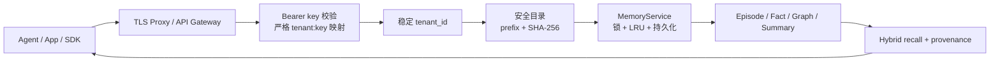

# Engram 0.1.0 阶段商业交付报告

日期：2026-07-14
状态：Beta / 单节点自托管商业交付版
规格：`specs/003-commercial-release/`

## 交付结论

0.1.0 把现有长期记忆算法、持久化、多租户服务、HTTP/MCP/SDK 和管理界面收束为一个可安装、可部署、
可验证、可授权的阶段版本。它可以给真实开发者和客户用于单节点自托管、内网服务、产品集成和商业授权评估。

这不是“所有企业能力均已完成”的声明。本版本不承诺多区域高可用、自动分片、在线分布式迁移、企业 SSO/RBAC、
计量计费、监管认证或托管云 SLA。TLS、WAF、互联网限流和集中秘密管理由部署边界提供。

## 本阶段改变了什么

| 交付面 | 0.1.0 状态 | 验收方式 |
| --- | --- | --- |
| 租户落盘 | 原始 ID 映射为可读前缀 + SHA-256 摘要，阻止穿越和碰撞 | 危险/Unicode/超长 ID 单测 |
| 旧数据 | 安全旧目录与可信 pickle 可继续读取和删除 | roundtrip/legacy 测试 |
| 鉴权 | 默认失败关闭；严格 key 配置；同租户多 key 轮换 | HTTP auth/readiness 测试 |
| 请求边界 | 声明长度与实际流式字节都受限，常用字段另有上限，超限在写入前拒绝 | 普通/分块 413 + episode 计数测试 |
| 健康检查 | `/health` 区分存活，`/ready` 只在可接流量时成功 | 200/503 状态测试 |
| 容器 | 非 root、只读根、持久卷、cap drop、本机端口绑定 | Docker build + 重启召回 |
| 版本 | Python/服务/SDK/管理界面/manifest 统一 0.1.0 | `scripts/check_release.py` |
| 发布 | CI、变更记录、安全策略、中文部署/备份/升级文档 | release gate + build checks |

## 没有改变什么

- 没有修改事实抽取、图构建、冲突算法、检索、融合、重排或上下文装配逻辑。
- 没有重跑新的 500 题算法实验，也没有新增算法提升结论。
- README 中既有 LongMemEval_S 数字继续只由已提交原始 JSONL 支撑。
- `facts + raw chunks`、双时间轴、`supersedes`、provenance 和 zero-setup 不变量保持不变。

## 生产数据流

请求密钥不会进入目录名、健康响应或导出。逻辑租户 ID 经过摘要映射后只落在 `ENGRAM_DATA_DIR` 的直接子目录；
删除前再次验证真实路径。容器只写 `/data`，其余文件系统只读。

## 商业使用路径

1. 开源、自托管并遵守 AGPL-3.0：可直接使用。
2. 闭源产品、SaaS 或不希望承担 AGPL 网络源码义务：联系版权方取得商业授权。
3. 质保、赔偿、响应时间、升级支持和专属功能：以单独商业合同为准。

部署入口：`deploy/README.md`。许可边界：`COMMERCIAL-LICENSE.md`。安全报告：`SECURITY.md`。

## 发布验收证据

最终命令、环境和结果保存在 `results/commercial_release_0_1_0_validation.jsonl`。该文件记录的是工程发布验收，
不是算法效果实验；算法指标仍以 `RESULTS.md` 和对应完整 benchmark JSONL 为准。

## 下一阶段

商业交付闭环后，算法路线继续遵循架构地图：raw evidence fusion、chain-aware retrieval、graph multi-hop、
temporal interval reasoning。每个算法改动仍需独立 ablation、真实数据切片和必要时完整 500 题验证，不能用
0.1.0 的工程发布成功替代算法提升证据。
