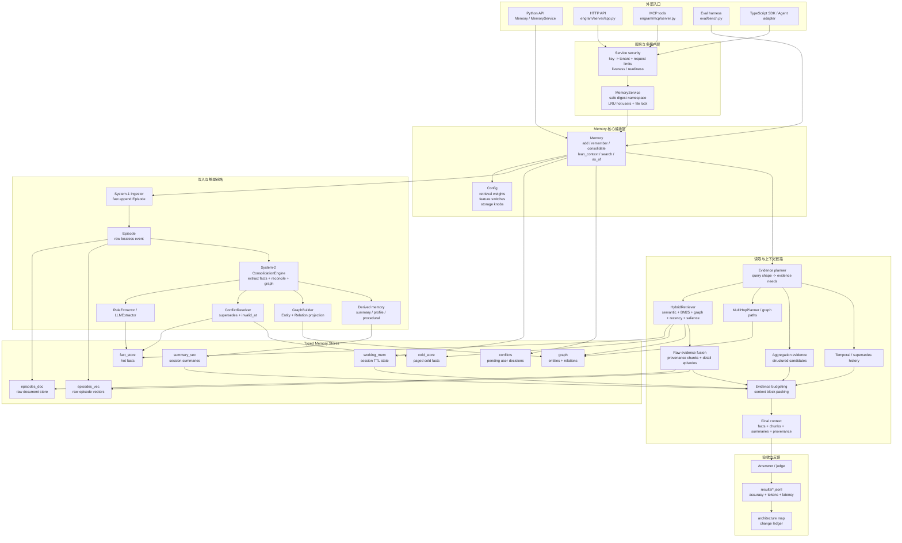
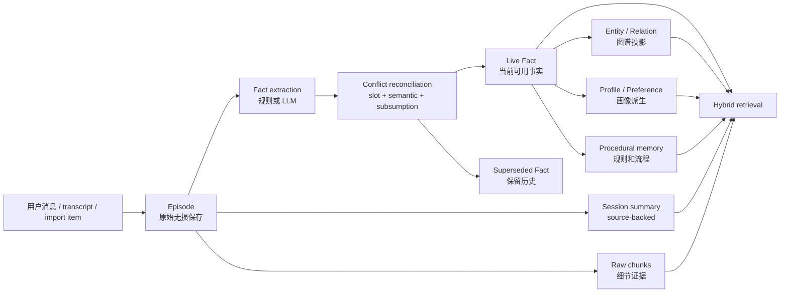
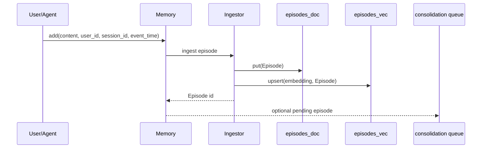
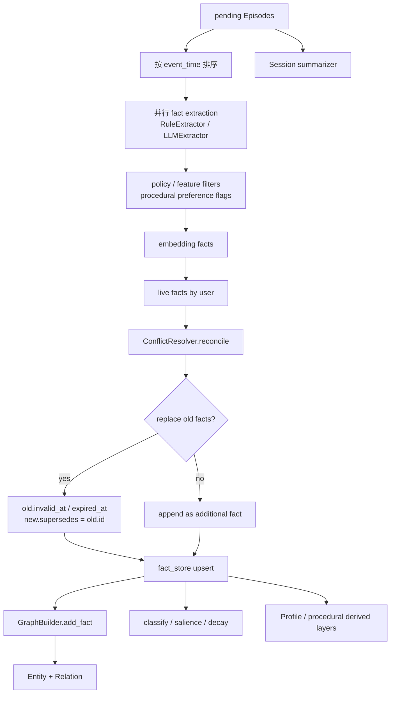
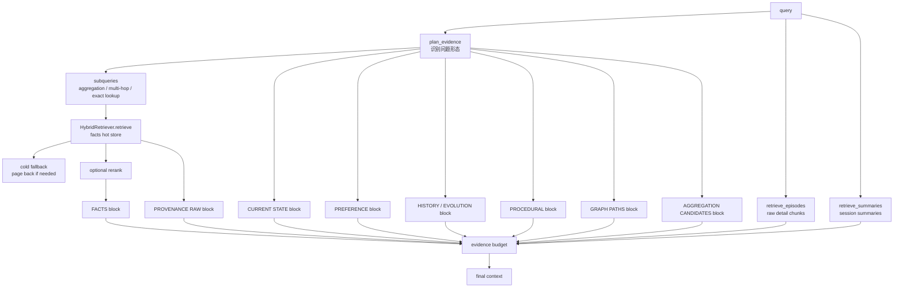
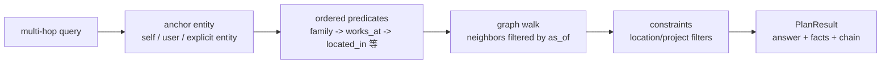
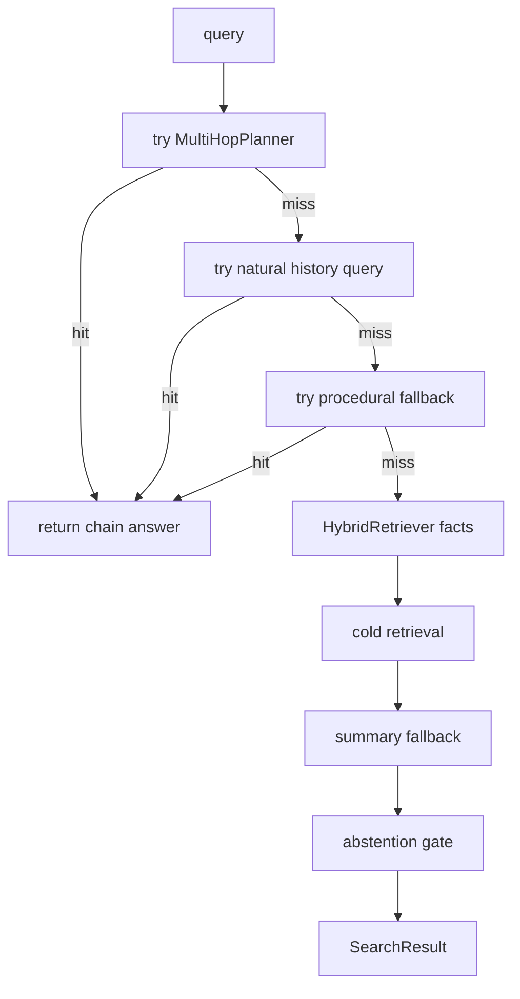
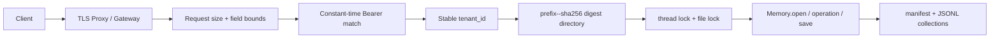
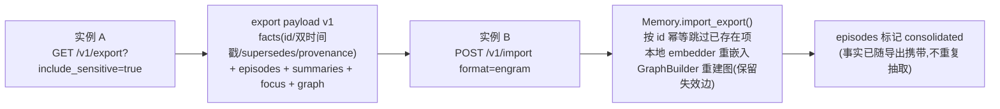
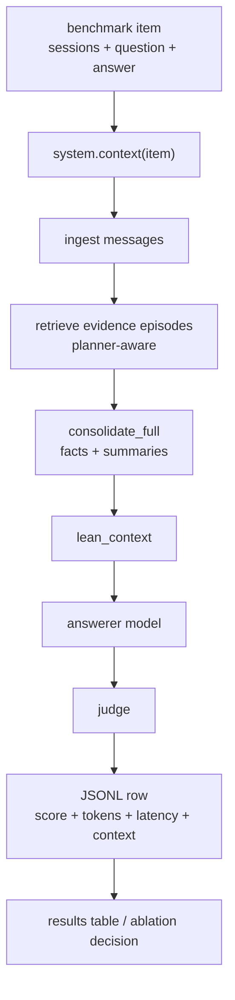

# Engram 全链路架构与数据流报告

最后更新：2026-07-14

本文是 Engram 当前实现的中文工程说明书，目标是让项目负责人不用逐行读代码，也能完整掌握：

1. 一条消息从写入到可检索证据的完整数据流。
2. 一次查询从问题理解到最终上下文/答案的完整流程。
3. Episode、Fact、Graph、Summary、WorkingMemory、Conflict 等对象各自在哪里产生、保存、消费。
4. 每个主要算法开关影响哪段链路，应该怎样用真实数据验收。
5. AI 或人类以后改动架构时，必须同步更新哪些文档。

本报告是内部工程文档，不是公开营销稿。所有公开数字仍以 `RESULTS.md`、`README.md`、`README.zh-CN.md`
和已提交的 `results/*.jsonl` 原始日志为准。

## 0. 阅读入口

| 你想看什么 | 入口 |
| --- | --- |
| 完整架构、数据流、流程 | 本文 |
| 每次算法/架构改动落在哪一层 | `docs/architecture-optimization-map.zh-CN.md` |
| 算法原则和不变量的英文概述 | `docs/algorithm-architecture.md` |
| 外部参考雷达和 Spec-Kit 规划 | `specs/002-memory-reference-radar/` |
| 实验日志和验收规则 | `results/README.md` |
| 对外结果表 | `RESULTS.md` |
| 项目使命和贡献约束 | `AGENTS.md`, `CLAUDE.md` |

建议阅读顺序：

1. 先读本文的 1 到 5 节，建立完整数据流。
2. 再读 `docs/architecture-optimization-map.zh-CN.md`，看最近 AI 改了哪里。
3. 做算法改动前读第 9 节和第 12 节，确认怎么开关、怎么验收、怎么留日志。

## 1. 当前架构一句话

Engram 不是单一 RAG，也不是只抽取事实的记忆库。它是一个双过程长期记忆引擎：

```text
lossless Episode 原始会话
  + bi-temporal Fact 原子事实
  + Entity/Relation 图谱
  + source-backed Summary 原始来源摘要
  + Procedural / Preference / Profile 派生记忆
  + WorkingMemory 会话态短期记忆
  + Evidence planner 问题形态规划
  + Hybrid retrieval 多信号融合
  + Raw evidence fusion 细节补回
  + Reproducible eval harness 真实数据验收
```

核心胜负手是：用更少、更准、带 provenance 的证据切片，击败 full-context 中的大量噪声。

## 2. 全局分层图



## 3. 核心数据对象

Engram 的数据模型在 `engram/types.py`。理解这些对象，就能理解所有数据流。

| 对象 | 产生位置 | 保存位置 | 被谁消费 | 关键字段/不变量 |
| --- | --- | --- | --- | --- |
| `Episode` | `Memory.add`, `Memory.remember`, import | `episodes_doc`, `episodes_vec`, persistence `episodes.jsonl` | consolidation、raw retrieval、summary、eval | 原始无损事件；`event_time` 是世界时间，`ingested_at` 是事务时间；不因抽取失败丢弃 |
| `Fact` | `RuleExtractor`, `LLMExtractor`, `add_fact` | `fact_store`, `cold_store`, persistence `facts.jsonl` | hybrid retrieval、graph、profile、history、context blocks | 原子 `(subject, predicate, object)`；双时间轴；contradiction 只失效不覆盖；保留 provenance |
| `Entity` | `GraphBuilder.add_fact` | `graph`, persistence `entities.jsonl` | graph retrieval、multi-hop、graph API | 以 `user_id + canonical name` 定位；可带 aliases |
| `Relation` | `GraphBuilder.add_fact` | `graph`, persistence `relations.jsonl` | graph proximity、multi-hop、graph visualization | 由 Fact 投影；携带 `fact_id` 和双时间过滤能力 |
| `WorkingMemory` | `remember_working`, ephemeral `remember` | `working_mem`, persistence `working.jsonl` | `lean_context`, agent status, session report | 会话/TTL 范围内生效，不自动变成长期 profile |
| `Conflict` | `_detect_conflicts`, manual conflict tools | `conflicts`, persistence `conflicts.jsonl` | conflict UI/API/MCP | 对高风险矛盾等待用户确认，不静默破坏记忆 |

### 3.1 双时间轴

每个事实有两组时间：

| 时间轴 | 字段 | 含义 | 用途 |
| --- | --- | --- | --- |
| valid time | `valid_at`, `invalid_at` | 事实在现实世界中什么时候为真 | `as_of`、历史问题、knowledge-update |
| transaction time | `created_at`, `expired_at` | 系统什么时候学到/撤回它 | 审计、回放、数据修复 |

规则：矛盾事实不要 hard-delete。旧事实设置 `invalid_at`/`expired_at`，新事实设置 `supersedes` 指向旧事实。

### 3.2 数据从 raw 到 typed 的生命周期



## 4. 写入链路

写入链路分两层：System-1 快写路径和 System-2 睡眠期整理路径。

### 4.1 写入入口

| 入口 | 文件/函数 | 适用场景 |
| --- | --- | --- |
| Python 直接写入 | `engram/memory.py::Memory.add` | 低层 API，追加 Episode，可选立即 consolidate |
| 用户语义写入 | `engram/memory.py::Memory.remember` | 自动判断长期/短期 scope，始终保留 raw Episode |
| 批量导入 | `Memory.import_messages`, `Memory.import_data` | ChatGPT export、OpenAI messages、JSONL、transcript |
| 服务层写入 | `engram/service.py::MemoryService.remember` | 多用户、多租户、持久化、锁 |
| HTTP 写入 | `engram/server/app.py::remember`, `import_history` | API 服务 |
| MCP 写入 | `engram/mcp/server.py` | 给外部 Agent 持久记忆工具 |

### 4.2 System-1 快写路径

目标：在热写路径上不依赖 LLM，不做重计算，先把原始证据可靠保存。



关键点：

| 设计点 | 当前实现 | 原因 |
| --- | --- | --- |
| 原始消息先保存 | `Episode` 写入 `episodes_doc` 和 `episodes_vec` | 抽取错了也能从 raw evidence 补回 |
| 写路径默认无 LLM | hashing embedder + rule extractor 可零 key 运行 | 保证 zero-setup 和稳定测试 |
| event/transaction 分离 | `event_time` 与 `ingested_at` 同时保存 | 支持真实历史时间和系统学习时间 |
| 可选立即整理 | `add(..., consolidate=True)` | 小 demo 可同步完成，大规模可异步 |

### 4.3 `remember` 的长期/短期分流

`Memory.remember` 总是保存 Episode，但会根据 scope 和文本判断是否写入 WorkingMemory：

| 路径 | 条件 | 结果 |
| --- | --- | --- |
| 长期记忆 | 默认 durable 内容 | Episode 等待 consolidation，后续产生 Fact/Summary/Graph |
| 短期/会话态 | scope 为 ephemeral 或命中临时表达 | 写入 `WorkingMemory`，仍保留 Episode metadata |
| 显式 working | `remember_working` | 直接写会话态记忆，可设置 TTL |

这样做避免“临时状态污染长期画像”，同时保留审计来源。

## 5. System-2 整理链路

System-2 由 `engram/consolidate/engine.py::ConsolidationEngine` 编排。



### 5.1 抽取层

| 模块 | 文件 | 作用 |
| --- | --- | --- |
| 规则抽取 | `engram/consolidate/extractor.py::RuleExtractor` | zero-key 默认抽取 names、location、preference、procedure、project rule 等 |
| LLM 抽取 | `engram/consolidate/llm_extractor.py::LLMExtractor` | 可选增强，不作为 zero-setup 必需项 |
| 分类 | `engram/consolidate/classify.py` | 给 fact 标 category/sensitive，用于 redaction 和 profile |
| 结构化画像 | `engram/consolidate/structured.py` | 把 live facts 组织为 profile |

当前已经落地的抽取优化包括显式偏好、偏好对象过滤/规范化、偏好反转、过程记忆、数值聚合候选等。详见
`docs/architecture-optimization-map.zh-CN.md` 的“已落地优化台账”。

### 5.2 冲突处理层

`engram/consolidate/conflict.py::ConflictResolver` 的原则是便宜判断优先，LLM 只处理模糊情况。

| 判断 | 例子 | 处理 |
| --- | --- | --- |
| exact slot | 同一 `subject + predicate` 出现新 object | 单值 predicate 下旧事实失效 |
| preference reversal | 先喜欢 X，后来不再喜欢 X | 新 fact supersedes 旧 preference |
| content subsumption | 新事实包含旧事实更多细节 | 可能作为 elaboration 或 replacement |
| embedding similarity | predicate 文本不同但语义同槽 | 仅在有真实 embedder 时使用 |
| protected/multi-valued guard | 家人、同事、多个项目等可多值 | 不误删可并存事实 |
| ambiguous LLM adjudication | 规则无法确定 | 可选 LLM 判断 |

冲突后的数据不变量：

```text
old.invalid_at = new.valid_at
old.expired_at = now
new.supersedes = old.id
old.provenance 保留
new.provenance 保留
graph relation for old fact 被 invalidate
```

### 5.3 图谱投影层

`engram/consolidate/graph_builder.py::GraphBuilder` 把适合图谱表达的事实投影成 Entity/Relation。

| 输入 fact | 图谱动作 |
| --- | --- |
| `self lives_in Beijing` | upsert entity `self` 和 `Beijing`，增加 `lives_in` relation |
| `sister works_at Acme` | upsert `sister` 和 `Acme`，增加 `works_at` relation |
| `procedure/how_to/routine` | 默认不投影为对象节点，留在 procedural memory |

图谱主要支持：

1. multi-hop planner，例如“我同事的公司在哪里”。
2. graph proximity scoring，让与 query 实体邻近的 fact 加分。
3. graph API/UI，让用户看到实体关系。
4. relation invalidation，让旧事实失效时图谱边也随之失效。

## 6. 存储与持久化

Engram 的 core 接口在 `engram/store/base.py`，默认实现是内存 store，可选后端在 extras 中扩展。

| Store | 默认实现 | 保存什么 | 读路径用途 |
| --- | --- | --- | --- |
| `episodes_doc` | `InMemoryDocStore` | 原始 Episode | raw chunks、session report、provenance |
| `episodes_vec` | `InMemoryVectorStore` | Episode embedding | raw retrieval、detail chunks |
| `fact_store` | `InMemoryVectorStore` | hot live/superseded facts | hybrid retrieval 主体 |
| `cold_store` | `InMemoryVectorStore` | 被分页的 cold facts | 大规模时补召回 |
| `summary_vec` | `InMemoryVectorStore` | session summaries | summary fallback、context blocks |
| `graph` | `InMemoryGraphStore` | entities/relations | multi-hop、graph proximity |
| `working_mem` | list/state | WorkingMemory | session context |
| `conflicts` | list/state | Conflict | 用户确认 |

持久化在 `engram/store/persist.py`：

```text
manifest.json
episodes.jsonl
facts.jsonl
entities.jsonl
relations.jsonl
working.jsonl
conflicts.jsonl
```

持久化约束：

1. embedder id/dim 会写入 manifest，避免向量维度不兼容。
2. `Memory.save(path)` 只保存状态，不保存 LLM/embedder 对象本身。
3. `Memory.open(path, **kwargs)` 用当前传入的后端能力恢复 store。
4. `MemoryService` 按 user/namespace 隔离路径，并用 file lock 避免并发写坏。

## 7. 读取链路总览

读取有三个主要入口：

| 入口 | 函数 | 返回 | 用途 |
| --- | --- | --- | --- |
| 直接搜索 | `Memory.search` | `SearchResult` | 简单 API，能返回 top facts 和 answer |
| 上下文装配 | `Memory.lean_context` | context string | benchmark/headline 主路径，给 answerer 读 |
| 兼容上下文 | `Memory.context_for` | context string | 更老/更通用的 context builder |

服务层 `MemoryService.recall` 会根据参数调用 `lean_context` 或 `search`，HTTP 和 MCP 最终也走这些入口。

### 7.1 `lean_context` 是当前主战场

`lean_context` 的目标不是直接回答，而是给下游 answerer/judge 组装一份高信噪比证据包。



### 7.2 Evidence planner

`engram/retrieve/evidence.py::plan_evidence` 先判断问题需要哪类证据。

| 识别类型 | 典型问题 | 会触发的证据 |
| --- | --- | --- |
| exact lookup | “我妹妹住哪里” | facts + graph + raw |
| current state | “我现在的地址是什么” | slot head/current-state block |
| temporal/history | “我以前喜欢什么” | supersedes chain/history block |
| aggregation | “我总共花了多少钱” | subqueries + aggregation candidates + raw chunks |
| duration | “我练了多久” | duration block |
| preference | “我喜欢什么咖啡” | preference facts/profile |
| procedural | “我说过要怎么部署” | procedural memory |
| multi-hop | “我同事的公司在哪里” | planner subqueries + graph paths |
| abstention-sensitive | “有没有证据证明...” | 更谨慎的 abstention |

规划结果会影响：

1. 检索子查询数量。
2. `n_facts`、`n_summaries`、`n_chunks` 预算。
3. 是否启用 agentic/cascade/raw/detail/provenance。
4. evidence block 的优先级和裁剪方式。

### 7.3 Hybrid retrieval

`engram/retrieve/hybrid.py::HybridRetriever` 是 fact 检索核心。

```text
score(item | query)
  = semantic similarity
  + lexical/BM25 evidence
  + graph proximity
  + recency prior
  + salience prior
  + type weights
```

注意：recency 和 salience 是 prior，不应该伪装成证据。当前架构原则要求“没有 lexical/semantic/graph 命中的项不能只靠 prior 被推上来”。

| 信号 | 代码位置 | 作用 |
| --- | --- | --- |
| dense semantic | `fact_store.search`, embedder | 召回语义相近事实 |
| lexical/BM25 | `engram/retrieve/lexical.py` | 精确词、日期、名称匹配 |
| graph proximity | `_graph_scores` | 根据实体 n-hop 邻近度加权 |
| relation relevance | `graph_relation_relevance` | query 与 relation predicate 对齐 |
| self/entity alias anchor | `query_entity_ids` | 把 “my/me/I/别名” 锚到用户实体 |
| negative constraints | `graph_exclusion_zone` | 避免“不包括 X”的实体污染 |
| slot heads | `_current_slot_heads` | 单值属性优先当前事实 |
| weighted RRF | `engram/retrieve/fusion.py` | 融合多路排名 |

### 7.4 Raw evidence fusion

这是 Engram 近期最重要的 load-bearing 发现：facts-only 会损失细节，必须把原始会话 chunks 补回来。

Raw evidence 来源：

| 来源 | 函数 | 用途 |
| --- | --- | --- |
| query 直接检索 Episode | `retrieve_episodes` | 找原始细节 |
| fact provenance | `_provenance_detail_chunks` | 命中 fact 后回到源会话补细节 |
| chain provenance | `_chain_facts_for_seeds` -> `_provenance_detail_chunks` | previous-value / current-vs-past 问题中，把 `supersedes` 链上的旧事实来源也纳入 raw chunk promotion |
| provenance raw block | `_provenance_raw_block` | 给 answerer 看事实来源上下文 |
| session summaries | `retrieve_summaries` | raw 太长时给 source-backed 摘要 |
| aggregation raw episodes | `_aggregation_block` | 数值/列表问题从源文本抽候选 |

当前原则：

1. Facts 给结构和 current-state。
2. Raw chunks 给细节和完整句子。
3. Summary 是补充，不替代 raw。
4. Provenance 让 answerer 能看到证据来自哪段会话。

### 7.5 Multi-hop 与图路径

`engram/retrieve/planner.py::MultiHopPlanner` 先做确定性链路推理：



`lean_context` 还会通过 `_graph_paths_block` 把相关 graph path 放进 context，帮助 answerer 处理多跳问题。

下一阶段重点是把 graph proximity 和 planner 从“可用”推进到“强项”，尤其是 multi-session 和多 bridge entity 问题。

### 7.6 Temporal / history / as-of

时间链路由三部分组成：

| 能力 | 函数 | 数据来源 |
| --- | --- | --- |
| 当前值 | `_current_state_block` | live facts + slot heads |
| 历史值 | `_history_block`, `_fact_evolution_block` | `supersedes` chain |
| as-of 查询 | `Memory.as_of`, temporal filters | `Fact.is_live(as_of)`, graph neighbors as-of |

典型问题：

| 问题 | 需要的证据 |
| --- | --- |
| “我现在住哪里” | current live fact |
| “我之前住哪里” | invalidated old fact |
| “我什么时候改了偏好” | supersedes chain + source timestamps |
| “在某天我们认为 X 是什么” | valid time + transaction time 过滤 |

### 7.7 Aggregation evidence

`engram/retrieve/aggregate.py` 负责 count/sum/money/hour/page 等聚合候选。

流程：

1. `plan_evidence` 识别 aggregation 问题。
2. 生成高召回 subqueries，例如把 “how many” 扩成相关动作/对象查询。
3. 从 facts、episodes、summaries 中抽 `AggregationCandidate`。
4. 对月份等题面约束做 local context filter。
5. 渲染 `AGGREGATION CANDIDATES` 表，交给 answerer。

近期 PR 已经连续优化：

| 开关 | 作用 |
| --- | --- |
| `numeric_aggregation_candidates` | 抽金额、小时、页数等数值候选 |
| `aggregation_recall_expansion` | 聚合问题增加高召回子查询 |
| `aggregation_constraint_filter` | 用题面月份等约束标记 EXCLUDE |

## 8. 直接搜索路径

`Memory.search` 是较轻的直接回答入口，流程和 `lean_context` 不完全相同。



适用理解：

1. `search` 适合简单 SDK 查询。
2. `lean_context` 是 benchmark/headline 的主路径，因为它能把多类证据一起交给 answerer。
3. `as_of` 是 `search` 的时间过滤包装。

## 9. 配置开关与算法影响面

所有核心开关在 `engram/config.py::Config`。任何新增开关都必须能被 eval harness ablate。

| 开关 | 默认 | 影响层 | 作用 |
| --- | --- | --- | --- |
| `w_sem`, `w_lex`, `w_graph`, `w_rec`, `w_sal` | numeric | Hybrid retrieval | 检索融合权重 |
| `top_k`, `candidate_k`, `rrf_k` | numeric | Retrieval | 候选池和 RRF 控制 |
| `max_hops` | numeric | Graph | 图扩展跳数 |
| `abstain_threshold` | numeric | Search | 证据不足时拒答 |
| `evidence_planner` | true | Read path | 按问题形态组织证据 |
| `evidence_budgeting` | true | Context packing | 按证据类型优先级裁剪 |
| `explicit_preference_extraction` | true | Extraction | 显式偏好事实抽取 |
| `preference_object_filter` | true | Extraction precision | 过滤弱对象偏好 |
| `preference_object_normalization` | true | Extraction canonicalization | 规范化偏好对象 |
| `preference_reversal_extraction` | true | Conflict/history | 抽取偏好反转并触发 supersedes |
| `procedural_extraction` | true | Extraction | 从 runbook/how-to 抽过程事实 |
| `procedural_memory` | true | Read path | 过程记忆独立读层 |
| `summary_fallback` | true | Search/read fallback | fact miss 时查 source-backed summaries |
| `chain_evidence` | true | Temporal/history + Raw evidence fusion | 展开 bounded supersedes chain，并让 chain facts 可作为 provenance raw chunk promotion 的种子 |
| `temporal_history_queries` | true | Temporal | 自然语言历史问题 |
| `provenance_chunk_promotion` | true | Raw evidence fusion | fact 命中后提升源 Episode chunk |
| `provenance_evidence` | true | Context | 带来源证据块 |
| `numeric_aggregation_candidates` | true | Aggregation | 数值候选表 |
| `aggregation_recall_expansion` | true | Evidence planner | 聚合高召回子查询 |
| `aggregation_constraint_filter` | true | Aggregation precision | 本地题面约束过滤 |
| `graph_proximity` | true | Hybrid retrieval | 图邻近度检索 |
| `graph_relation_awareness` | true | Graph scoring | relation 与 query 对齐 |
| `graph_path_reinforcement` | true | Graph scoring | path hit 强化 |
| `graph_self_anchor` | true | Entity anchoring | self/my/I 锚点 |
| `graph_entity_alias_anchor` | true | Entity anchoring | alias 锚点 |
| `graph_negative_constraints` | true | Graph filtering | 负约束排除 |
| `planner_location_chains` | true | Multi-hop planner | 地点链路 |
| `planner_project_chains` | true | Multi-hop planner | 项目链路 |

验收规则：

1. 新增开关必须在 `eval/bench.py::engram_config` 里能关闭。
2. 新增算法路径必须有目标单测或离线 ablation。
3. 影响 read path/fusion 的改动必须留下真实 benchmark 切片日志。
4. 准备影响公开数字时，必须跑完整或明确标注探索，不允许只凭小样本宣传。

## 10. 服务层与产品入口

`engram/service.py::MemoryService` 是多租户服务核心。

| 能力 | 服务函数 | HTTP/MCP 对应 |
| --- | --- | --- |
| 记住消息 | `remember` | `/v1/remember`, MCP remember |
| 批量导入 | `import_` | `/v1/import` |
| 回忆 | `recall` | `/v1/recall`, MCP recall/search |
| 用户事实增删改 | `add_fact`, `update_fact`, `delete_fact` | fact APIs |
| focus/policy | `set_focus`, `set_policy` | focus/policy APIs |
| working memory | `add_working`, `working_memory`, `clear_working` | working APIs |
| 冲突处理 | `conflicts`, `resolve_conflict` | conflicts APIs |
| 会话收尾 | `close_session`, `session_report`, `sessions` | session APIs |
| 图谱查看 | `graph` | graph API |
| 导出/统计 | `export`, `stats`, `memories` | export/stats APIs |

服务层职责：

1. API key 解析为稳定 tenant_id；生产无凭据时失败关闭。
2. tenant_id 通过“可读前缀 + 原始 UTF-8 SHA-256 摘要”映射到数据根目录直接子项，避免路径穿越和字符过滤碰撞。
3. 仅对完全安全、未被旧 sanitizer 改写的历史 ID 回退读取旧目录/pickle。
4. 删除前重新验证真实路径，绝不删除数据根目录、父目录或其他租户。
5. 懒加载 Memory，并用 LRU 控制 hot users。
6. 读写锁和文件锁避免同租户并发写坏。
7. 自动保存到用户数据目录。
8. 给 HTTP/MCP/TypeScript SDK 提供稳定管理面。

### 10.1 商业自托管请求与落盘数据流



| 环节 | 0.1.0 规则 | 失败行为 |
| --- | --- | --- |
| 鉴权配置 | `tenant:key`；同租户可多 key；同 key 不可多租户 | 配置歧义时业务 503、`/ready` 503 |
| 开放模式 | 仅显式 `ENGRAM_OPEN=1`；匿名还需第二个显式开关 | 默认所有 `/v1/*` 返回 401 |
| 请求体 | 默认 2 MiB，可配置正整数；同时校验声明长度并按实际流式字节计数，常用字符串与 `n_chunks` 另有字段边界 | 413/422，省略或伪造 `Content-Length` 也会在进入记忆写入前终止 |
| 命名空间目录 | 摘要决定唯一性，可读前缀只用于排障 | 路径不是数据根直接子项则拒绝 |
| 健康 | `/health` 是 liveness/诊断；`/ready` 是业务 readiness | 鉴权禁用、配置错误或目录不可写时 ready=false |
| 容器 | 非 root、只读根、cap drop、只写 `/data`、本机端口 | healthcheck 不通过，不接生产流量 |
| 发布 | 版本/许可/文档/证据/构建统一门禁 | 任一必需检查失败则不合并/不发布 |

这条链路没有改变 `Memory` 内部的抽取、冲突、图构建或检索算法。工程发布结果记录到
`results/commercial_release_0_1_0_validation.jsonl`，不能被当作算法效果提升证据。

### 10.2 跨实例迁移数据流（2026-08-12 新增）

记忆的所有权锚点是「服务器 + key + namespace」，与任何厂商账号无关。换服务器/换部署时，
`/v1/export` 的产物现在可以直接导回 `/v1/import`（原生 `engram` 格式，按 `engram_export_version` 自动嗅探）：



关键规则：

1. **幂等**：已存在的 fact/episode id 直接跳过、绝不覆盖（现有记忆优先），重复导入零副作用。
2. **重嵌入即迁移**：导出不携带向量；目标端用自己的 embedder 重算——这也是更换 embedder 的官方路径
   （此前 manifest 的 `embedder_id/embedding_dim` 硬校验导致换 embedder 等于存储报废）。
3. **历史以历史身份迁移**：GraphBuilder 把 `invalid_at` 一并写到关系边上，superseded 事实不会复活。
4. **share-safe 导出同样可导入**（只有非敏感 facts + graph），敏感内容不会经由默认导出泄漏到新实例。
5. 坏 payload 由 `/v1/import` 返回 400 + 解析原因（此前是裸 500）。

同时补齐的服务边界：`ENGRAM_STORAGE` 环境变量显式选择向量后端（非法值启动即失败）；MCP
streamable-HTTP 传输新增 `--http-token`/`ENGRAM_MCP_HTTP_TOKEN` Bearer 门，非回环绑定无 token 拒绝启动
（`ENGRAM_MCP_HTTP_OPEN=1` 才可显式豁免）；import CLI 本地模式改走 `MemoryService`，与服务端共用同一套
摘要目录和锁；`/v1/stats` 与其它读路径一致按 canonical 身份过滤。

## 11. Eval harness 数据流

评测不是附属品，是架构的一部分。Engram 的所有算法主张都应能走 `eval/bench.py`。



主要系统：

| 系统 | 类 | 用途 |
| --- | --- | --- |
| `full_context` | `FullContextSystem` | 必须对照的完整上下文 baseline |
| `rag` | `RAGSystem` | 简单向量检索 baseline |
| `mem0`, `zep`, `hipporag` | adapter classes | 对外部风格系统做可复现近似对照 |
| `engram_full` | `EngramFullSystem` | 更完整上下文路径 |
| `engram_lean` | `EngramLeanSystem` | 当前 headline 主系统 |
| `engram_lean_no_*` | ablation classes | 验证某个模块是否真的有贡献 |

每条日志应至少让维护者追踪：

1. qid / category / system / backbone。
2. answer 与 judge 结果。
3. context token 数。
4. latency。
5. 失败/错误。
6. 复现实验命令。

## 12. 改动验收分层

用户已经明确要求：算法变动必须有真实数据验收，实验要保存下来。但每次小改动不一定跑完整 500。

| 改动范围 | 必做 | 建议数据规模 |
| --- | --- | --- |
| 文档-only | `git diff --check` | 不需要 benchmark |
| 局部抽取规则 | 目标单测 + `eval/ablate_features.py` | 小切片 + 相关 qid |
| evidence planner / fusion | 单测 + 真实 benchmark 切片 JSONL | 相关类别 20 到 50 条起 |
| read path 大改 | 单测 + ablation + full-context 对照 | 100 条或完整 500 |
| public number | validator + raw logs committed | 完整 benchmark |

标准命令入口：

```bash
pytest
python eval/ablate_features.py
python eval/bench.py --help
python eval/validate_results.py
```

## 13. 当前架构已优化区域

目前已经落地并有台账的方向：

| 方向 | 解决的架构问题 | 证据入口 |
| --- | --- | --- |
| preference extraction/filter/normalization/reversal | 让画像偏好更准，并能处理“不再喜欢” | `docs/architecture-optimization-map.zh-CN.md` |
| summary fallback | fact miss 时不直接丢失 session 层证据 | `results/summary_fallback_experiments.md` |
| provenance chunk promotion | 命中 fact 后回源 Episode 补 raw detail | `results/provenance_chunk_promotion_experiments.md` |
| chain provenance promotion | previous-value 问题中，`supersedes` 链上的旧事实来源也能提升为 raw detail chunk | `results/chain_provenance_promotion_experiments.md` |
| procedural memory/extraction | 把规则、流程、runbook 从普通语义事实中分层 | `results/procedural_memory_experiments.md` |
| numeric aggregation candidates | 对金额/页数/小时等聚合问题给结构化候选 | `results/numeric_aggregation_candidates_experiments.md` |
| aggregation recall expansion | 提升聚合问题 raw/fact 召回 | `results/aggregation_recall_expansion_experiments.md` |
| aggregation constraint filter | 用题面月份等约束减少错误候选 | `results/aggregation_constraint_filter_experiments.md` |

本表只给方向。完整日期、PR、验收日志在 `docs/architecture-optimization-map.zh-CN.md`。

## 14. 下一阶段架构优化计划

按当前规划，不散打，优先级如下：

| 优先级 | 方向 | 主要代码 | 为什么是下一步 |
| --- | --- | --- | --- |
| P0 | Raw evidence fusion hardening | `Memory.lean_context`, `_provenance_detail_chunks`, `retrieve_episodes` | facts-only 已被真实数据证明不够；已开始把 chain facts 接入 raw promotion，下一步继续类型化和去重 |
| P0 | Chain-aware retrieval | `_chain_facts_for_seeds`, `_fact_evolution_block`, `HybridRetriever` | knowledge-update/current-vs-past 是 Engram 的差异化；下一步扩展多段演化链和 profile-level chain |
| P1 | Graph proximity / multi-hop retriever | `HybridRetriever._graph_scores`, `MultiHopPlanner`, `_graph_paths_block` | multi-hop/multi-session 是长期记忆系统最难类别 |
| P1 | Temporal interval reasoning | temporal/history blocks, aggregation/duration | duration 和区间问题仍需要更强结构化 |
| P2 | Runtime profiles | `Config`, `eval/bench.py` | 让用户按 lite/standard/graph 选择可测 tradeoff |

每一步都必须：

1. 在 `Config` 中可开关。
2. 在 `eval/bench.py` 中可 ablate。
3. 在 `results/` 留下实验日志。
4. 更新 `docs/architecture-optimization-map.zh-CN.md`。
5. 如果改动数据流、生命周期、服务接口或对象关系，同步更新本文。

## 15. 代码定位索引

| 问题 | 看哪里 |
| --- | --- |
| 一条消息怎么写进去 | `engram/memory.py::add`, `engram/ingest/` |
| 为什么 raw Episode 不能删 | `engram/types.py::Episode`, `AGENTS.md` mission |
| Fact 双时间轴在哪里 | `engram/types.py::Fact` |
| 冲突怎么变 supersedes | `engram/consolidate/conflict.py` |
| consolidation 主流程 | `engram/consolidate/engine.py::ConsolidationEngine.consolidate` |
| 图谱怎么建 | `engram/consolidate/graph_builder.py` |
| 问题怎么分类 | `engram/retrieve/evidence.py::plan_evidence` |
| 多信号检索 | `engram/retrieve/hybrid.py::HybridRetriever.retrieve` |
| 多跳规划 | `engram/retrieve/planner.py::MultiHopPlanner` |
| 聚合候选 | `engram/retrieve/aggregate.py` |
| context 怎么拼 | `engram/memory.py::lean_context` |
| direct search | `engram/memory.py::search` |
| as-of/history | `engram/memory.py::as_of`, `_history_block`, `_fact_evolution_block` |
| raw chunks | `engram/memory.py::retrieve_episodes`, `_provenance_detail_chunks` |
| summary | `summarize_episodes`, `retrieve_summaries` |
| 服务层 | `engram/service.py::MemoryService` |
| HTTP API | `engram/server/app.py` |
| MCP tools | `engram/mcp/server.py` |
| 持久化格式 | `engram/store/persist.py` |
| 命名空间安全映射 | `engram/service.py::_safe_user`, `_contained_child`, `_legacy_paths` |
| 容器与单节点部署 | `Dockerfile`, `deploy/docker-compose.yml`, `deploy/engram.service` |
| 版本与发布门禁 | `engram/__init__.py::__version__`, `scripts/check_release.py` |
| benchmark | `eval/bench.py` |

## 16. 架构不变量

这些是后续 AI 改代码不能破坏的底线：

1. 不删除 contradicted facts，必须非破坏性失效。
2. 不把 facts-only 当成默认 QA 主路径。
3. 不让 LLM 成为 zero-setup 必需依赖。
4. 不让 recency/salience 这种 prior 单独伪装成证据。
5. 不让 benchmark 分支读取数据集标签做投机。
6. 不发布没有 raw JSONL 的数字。
7. 不把 ephemeral/working memory 静默写成长期画像。
8. 不新增不可 ablate 的算法路径。
9. 不在公开文案里使用未经可复现验证的 “SOTA/#1/1M” 等主张。
10. 不把原始 tenant/user 文本直接拼进文件路径；删除目标必须是数据根目录的已验证子项。
11. 生产 HTTP 服务不默认开启 open/anonymous；liveness 不能替代 readiness。

## 17. 以后如何维护这份报告

以后做改动时按这个规则维护：

| 改动类型 | 必改文档 |
| --- | --- |
| 新增算法开关、实验、PR | `docs/architecture-optimization-map.zh-CN.md` |
| 改写写入/整理/读取数据流 | 本文 |
| 新增数据对象或 store | 本文第 3、6、15 节 |
| 新增服务/API/MCP 能力 | 本文第 10、15 节 |
| 修改鉴权、租户路径、部署或发布门禁 | 本文第 10.1、15、16 节 + `docs/commercial-release-0.1.0.zh-CN.md` |
| 新增 benchmark 系统或 ablation | 本文第 11、12 节 |
| 改公开数字 | `RESULTS.md`, `README.md`, `README.zh-CN.md`, 对应 `results/*.jsonl` |

这份报告的定位是“完整说明书”。`architecture-optimization-map.zh-CN.md` 的定位是“变更台账和当前驾驶舱”。
两份文档一起，才能让项目负责人看到：当前架构是什么、AI 具体改了哪里、改动有没有真实验收。
